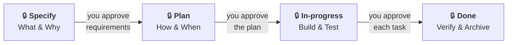
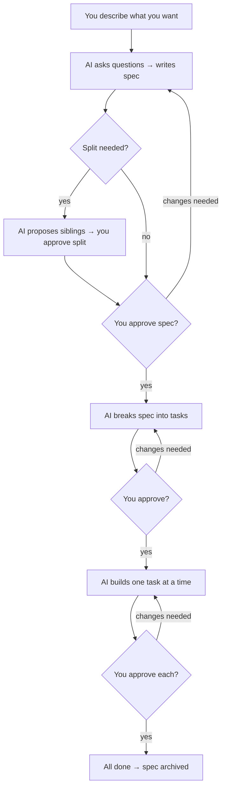

# Spec Workflow — How We Work

*Last updated: 2026-04-29*

Every change — feature, bug fix, or improvement — follows the same
four-status lifecycle. Each status transition ends with a **human gate**:
the AI agent stops, presents its work, and waits for your approval
before moving on. After `done`, the spec file is moved to
`docs/specs/archived/` (a directory move, not a separate status).

---

## Stage 1 — Specify

**Goal:** Understand what to build and why.

1. You describe what you want (a feature, a fix, an improvement).
2. The AI asks up to 10 clarifying questions. Two are always asked:
   - **Scope** — which modules / bounded contexts are affected
   - **Separability** — can any part ship and be verified on its own?
3. You answer. The AI writes a spec with:
   - **Problem Statement** — why this matters
   - **Requirements** — numbered, testable (FR-1, FR-2…)
   - **Acceptance Criteria** — Given/When/Then scenarios
   - **Out of Scope** — what we're NOT doing

4. **Split check** — the AI evaluates whether the requirements contain
   features that can be logically separated and tested independently.
   If yes, it proposes splitting the work into **sibling specs** and
   pauses for your decision. The outcome is recorded under
   `## Split Decision` in every resulting spec.

5. If the change affects architecture, database, or data flow → the AI
   draws **Mermaid diagrams** in an `## Architecture` section (per spec,
   after any split is resolved).

**🔒 Gate:** You read the spec(s) and approve. Nothing else happens until
you say "approved."

## Stage 2 — Plan

**Goal:** Break the approved spec into small, buildable tasks.

1. The AI decomposes requirements into **vertical-slice tasks** (each
   touches ≤ 5 files and includes its own tests).
2. Each task gets: description, files, dependencies, model tier, skills.
3. The tasks appear in a `## Tasks` table inside the spec.

**🔒 Gate:** You review the task breakdown. Adjust if needed. Approve when
ready.

## Stage 3 — In-progress

**Goal:** Build it, one task at a time.

For each task:

1. The AI announces which task it's starting (preflight proof).
2. It writes the code AND the tests together.
3. It runs build + test to verify.
4. It posts **"The Bottom Line"** — a summary of what changed, what was
   tested, and what to look for.

**🔒 Gate (per task):** You review. Say "continue" for the next task,
or request changes. "Continue" means **one task only** — the AI stops
again after each.

## Stage 4 — Done

**Goal:** Confirm all acceptance criteria are met.

1. The AI checks every AC has evidence (passing tests, screenshots, logs).
2. The spec status flips to `done` (4th and final status).
3. The spec file moves from `docs/specs/active/` to `docs/specs/archived/`
   (directory move — not a separate status).

**🔒 Gate:** You confirm closure. The spec is archived — never deleted.

---

## Visualize: when architecture diagrams are required

During Specify, diagrams are **mandatory** when any of the following is true:

- The change is medium or high risk
- A bounded context is added, removed, or reshaped
- Data flow between services changes
- A database schema or API contract changes
- A pipeline step is added or reordered

If none apply, the AI writes `Skipped — <reason>` under `## Architecture`.

---

## Split: when specs are divided into siblings

Specs stay together when they must ship together. Specs split when one
piece can ship on its own.

During Specify, the AI proposes a split when **any** of these is true:

- Two or more feature groups are **independently testable** (each has
  ACs that can be verified without the others being built, deployed, or
  seeded).
- Feature groups touch different bounded contexts with no shared AC.
- Feature groups touch different repos.
- Feature groups depend on different data entities with no shared schema
  change.
- One group is blocked by an external dependency while another is not.

The AI skips the split when any of these applies (recorded as an
exception):

- All ACs share a single data-write path.
- Feature groups overlap by more than half their FRs.
- Rollback requires reverting everything together.
- One group is a trivial ≤1-file extension of another.

When a split happens, each sibling spec gets:

- Its own file in `<project>/docs/specs/active/`
- `siblings:` and (if blocked) `depends-on:` in its front-matter
- Its own `## Split Decision` section explaining the outcome

The first sibling with no `depends-on:` advances to Plan first; the
others wait until their prerequisites reach `done`.

---

## Spec types

| Type | Prefix | Use when | Example |
|---|---|---|---|
| **Change Request** | `CR-` | New feature, schema change, pipeline step | `CR-20260420-footer-copyright.md` |
| **Bug** | `BUG-` | Something is broken | `BUG-20260418-viewport-overlap.md` |
| **Improvement** | `IMP-` | Refactor, performance, cleanup | `IMP-20260415-place-catalog-perf.md` |

All specs live in `<project>/docs/specs/active/` while in flight,
then move to `<project>/docs/specs/archived/` when done.

---

## Command list

Trigger phrases below map 1:1 to `<system>/prompts/*.prompt.md`.
Identical to [Getting Started](../README.md#3-start-working).

| What you want | What to say | What happens |
|---|---|---|
| Build a feature | `create CR`, `new feature`, `specify` | AI asks questions → writes spec → waits for approval |
| Improve / refactor | `create IMP`, `improve`, `refactor` | AI writes improvement spec → waits for approval |
| Fix a bug | `bug`, `triage`, `investigate issue` | AI investigates → writes bug spec → waits for approval |
| Visualize architecture | `visualize`, `architecture` | AI adds Mermaid diagrams to current spec |
| Plan an approved spec | `plan`, `break into tasks` | AI breaks the spec into vertical-slice tasks |
| Add a new project | `bootstrap project`, `new project` | AI scans the repo → scaffolds framework files |
| Refresh project framework | `update project framework`, `refresh docs` | AI re-bootstraps an existing project |
| Approve & advance | `continue` | Approves the current task; AI starts the next single task |

---

## The one-page summary

**You are always in control.** The AI never skips a gate, never writes
code before you approve the spec, and never moves to the next task
without your explicit "continue."

