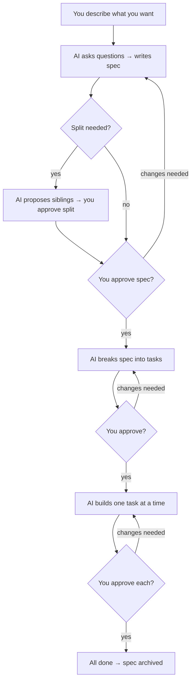

# Spec Workflow — How We Work

*Last updated: 2026-09-17*

Every change — feature, bug fix, or improvement — follows the same
four-status lifecycle. Each status transition ends with a **human gate**:
the AI agent stops, presents its work, and waits for your approval
before moving on. After `done`, the spec file is moved to
`docs/specs/archived/` (a directory move, not a separate status).


---

## Stage 1 — Specify

**Goal:** Understand what to build and why.

1. You describe what you want (a feature, a fix, an improvement).
2. The AI asks up to 10 clarifying questions. Two are always asked:
   - **Scope** — which modules / bounded contexts are affected
   - **Separability** — can any part ship and be verified on its own?
3. You answer. The AI writes a spec with:
   - **Problem Statement** — why this matters
   - **Requirements** — numbered, testable (FR-1, FR-2…)
   - **Acceptance Criteria** — Given/When/Then scenarios
   - **Out of Scope** — what we're NOT doing

4. **Split check** — the AI evaluates whether the requirements contain
   features that can be logically separated and tested independently.
   If yes, it proposes splitting the work into **sibling specs** and
   pauses for your decision. The outcome is recorded under
   `## Split Decision` in every resulting spec.

5. If the change affects architecture, database, or data flow → the AI
   draws **Mermaid diagrams** in a `## Design` section (per spec,
   after any split is resolved).

**🔒 Gate:** You read the spec(s) and approve. Nothing else happens until
you say "approved."

## Stage 2 — Plan

**Goal:** Break the approved spec into small, buildable tasks.

1. The AI decomposes requirements into **vertical-slice tasks** (each
   makes ≤ 5 decisions — a count that ignores extra files your project's
   conventions add automatically — and includes its own tests).
2. Each task gets: description, files, dependencies, model tier, skills.
3. The tasks appear in a `## Tasks` table inside the spec.

**🔒 Gate:** You review the task breakdown. Adjust if needed. Approve when
ready.

## Stage 3 — In-progress

**Goal:** Build it, one task at a time.

For each task:

1. The AI announces which task it's starting (preflight proof).
2. It writes the code AND the tests together.
3. It runs build + test to verify.
4. It posts **"The Bottom Line"** — a summary of what changed, what was
   tested, and what to look for.

**🔒 Gate (per task):** You review. Say "continue" for the next task,
or request changes. "Continue" means **one task only** — the AI stops
again after each.

## Stage 4 — Done

**Goal:** Confirm all acceptance criteria are met.

1. The AI checks every AC has evidence (passing tests, screenshots, logs).
2. The spec status flips to `done` (4th and final status).
3. The spec file moves from `docs/specs/active/` to `docs/specs/archived/`
   (directory move — not a separate status).

**🔒 Gate:** You confirm closure. The spec is archived — never deleted.
For `risk: low` specs this gate may run **review-after**: the agent
archives immediately once every AC has evidence and you review closures in
batch, with a defined revert path — see [`spec-lifecycle.md § Review-after closure`](../framework/spec-workflows/spec-lifecycle.md#review-after-closure).
Requirements and plan gates stay blocking in every lane.

## Direct lane: when even one gate is overkill

Owner-approved changes of **≤2 files and ≤30 lines** with no schema, prompt,
boundary, or cross-repo impact may ship without a spec at all — only a
Bottom Line post and an improvements-log entry. Eligibility and obligations:
[`spec-lifecycle.md § Direct lane`](../framework/spec-workflows/spec-lifecycle.md#direct-lane).
Two lanes, smallest first: **Direct** (no spec) → **Standard** (full gate
sequence). The Trivial lane was removed on 2026-09-17 — see
[`spec-lifecycle.md § Trivial lane`](../framework/spec-workflows/spec-lifecycle.md#trivial-lane).

## RES lane: iterative research / spike / POC

For work where you DON'T yet know what to build — a hypothesis to test, a spike to run, vibe-coding with a kill criterion — the RES lane provides an **iterative loop** between Specify and In-progress. Status transitions: `specify ⇄ in-progress → done`. Each backflip records why you're refining the hypothesis, in the spec's `## Iteration Log` section.

This is fundamentally different from CR/IMP/BUG, which are forward-only. The loop IS the lane's defining feature.

### When to use RES

- Hypothesis-driven investigation ("does Redis beat Mongo for hot-cache reads?")
- Time-boxed spike ("≤8 hours of exploration; decide go/no-go at the end")
- Proof-of-concept code in a sandbox (not production)
- Vibe-coding with a defined kill point (so it doesn't run forever)

### When NOT to use RES

- You know what to build → write a CR
- You know exactly what's broken → write a BUG
- The change is one-shot and verifiable with one AC → a CR/IMP at `risk: low`, or the Direct lane if it fits
- The work is purely a refactor or convention change → write an IMP

### Mandatory front-matter fields

RES specs add four required front-matter fields beyond the standard schema (full field constraints at [`spec-templates-guide.md § RES-only front-matter fields`](spec-templates-guide.md#res-only-front-matter-fields)):

```yaml
hypothesis: <one-sentence falsifiable claim>
kill-criteria: <single shape — time-box OR token-budget OR iteration-count>
code-location: research/<spec-id>/        # MUST be outside src/
outcome:                                   # filled at status: done
```

Note: RES specs do NOT carry `risk:` or `severity:`. The risk dimension is encoded in `kill-criteria:` itself.

### Worked example: Redis vs. Mongo for place-cache

Suppose you want to test whether Redis outperforms Mongo for the place-cache hot-read path. Walk-through:

**Birth.** Spec lands at `docs/specs/active/RES-20260520-redis-place-cache.md` from `RES-TEMPLATE.md`. Key front-matter:

```yaml
type: RES
hypothesis: Redis beats Mongo on cold-cache MRR@10 by ≥0.05 for high-traffic cities.
kill-criteria: ≤3 backflips
code-location: research/RES-20260520-redis-place-cache/
outcome:
```

5 questions answered (hypothesis, smallest experiment, kill criteria, sandbox path, deliverable shape).

**Iteration 1 — Specify → In-progress.** Set up Redis instance, mirror 1k recent lookups, run A/B against Mongo for 24h. Measurements come in: Redis wins on p99 latency by 40%, but MRR@10 delta is +0.02 — below the +0.05 target.

**Backflip 1 — In-progress → Specify.** Iteration Log row added:

```
| 1 | 2026-05-21 | MRR@10 delta below target (+0.02 vs ≥+0.05 needed) | Narrow hypothesis: limit to top-50 cities by traffic; investigate the cold mix specifically |
```

Hypothesis refined: "Redis beats Mongo on cold-cache MRR@10 by ≥0.05 for top-50 high-traffic cities."

**Iteration 2 — Specify → In-progress.** Re-run with narrowed scope. n=200 lookups, top-50 cities only. Result: MRR@10 delta +0.07 — above target. Latency win confirmed.

**Backflip 2 — In-progress → Specify.** Iteration Log row added:

```
| 2 | 2026-05-22 | Narrowed scope confirms hypothesis | Decide promotion path: a sibling CR for the Redis-cache productionization |
```

Decide to promote. Create sibling `CR-20260522-place-cache-redis.md` (standard track) to carry the real implementation.

**Iteration 3 — Specify → In-progress → Done.** Fill `## Decision` with the conclusion; set `outcome: promoted-to-CR-20260522-place-cache-redis`; close gate.

**Total backflips:** 2 (within the `≤3 backflips` kill criteria — the loop terminated by reaching a conclusion, not by running out of budget).

The sandboxed code in `research/RES-20260520-redis-place-cache/` stays as reference. Production code lives in the sibling CR.

### Critical rules for the lane

- Each `in-progress → specify` backflip MUST add a row to `## Iteration Log` BEFORE resuming work.
- `code-location:` MUST be outside `src/` of any repo. The validator enforces this mechanically.
- `outcome: promoted-to-<spec-id>` requires the referenced spec to exist. Throwaway research code MUST NOT merge into production without an explicit `done` sibling.
- Mixing kill-criteria shapes (`≤8 hours OR ≤3 backflips`) is rejected by the validator — pick ONE shape.

Full lifecycle rules at [`spec-lifecycle.md § RES exception`](../framework/spec-workflows/spec-lifecycle.md#res-exception). Entry-point prompt at [`framework/prompts/research-spec.prompt.md`](../framework/prompts/research-spec.prompt.md).

## Continuous validation

Every push and pull request runs `make validate-specs` via
`.github/workflows/validate.yml`. The validator covers front-matter
schema, dependency graph (siblings, depends-on, cycle detection,
rule #10), filename ↔ id parity, naming pattern, status invariants,
`*Last updated:*` freshness, relative-link integrity, and an
English-only check on file bodies. CI blocks merge when red.

Locally: `make validate-specs` or `make sync-agents-check`. Source:
`scripts/validate-specs.py`. Baseline: `tests/backtest-baseline.md`.

---

## Visualize: when architecture diagrams are required

During Specify, diagrams are **mandatory** when any of the following is true:

- The change is medium or high risk
- A bounded context is added, removed, or reshaped
- Data flow between services changes
- A database schema or API contract changes
- A pipeline step is added or reordered

If none apply, the AI writes `Skipped — <reason>` under `## Design`.

---

## Split: when specs are divided into siblings

Specs stay together when they must ship together. Specs split when one
piece can ship on its own.

During Specify, the AI proposes a split when **any** of these is true:

- Two or more feature groups are **independently testable** (each has
  ACs that can be verified without the others being built, deployed, or
  seeded).
- Feature groups touch different bounded contexts with no shared AC.
- Feature groups touch different repos.
- Feature groups depend on different data entities with no shared schema
  change.
- One group is blocked by an external dependency while another is not.

The AI skips the split when any of these applies (recorded as an
exception):

- All ACs share a single data-write path.
- Feature groups overlap by more than half their FRs.
- Rollback requires reverting everything together.
- One group is a trivial ≤1-file extension of another.

When a split happens, each sibling spec gets:

- Its own file in `<project>/docs/specs/active/`
- `siblings:` and (if blocked) `depends-on:` in its front-matter
- Its own `## Split Decision` section explaining the outcome

The first sibling with no `depends-on:` advances to Plan first; the
others wait until their prerequisites reach `done`.

---

## Spec types

| Type | Prefix | Use when | Example |
|---|---|---|---|
| **Change Request** | `CR-` | New feature, schema change, pipeline step | `CR-20260420-footer-copyright.md` |
| **Bug** | `BUG-` | Something is broken | `BUG-20260418-viewport-overlap.md` |
| **Improvement** | `IMP-` | Refactor, performance, cleanup | `IMP-20260415-place-catalog-perf.md` |

All specs live in `<project>/docs/specs/active/` while in flight,
then move to `<project>/docs/specs/archived/` when done.

---

## Command list

Trigger phrases below map 1:1 to `<system>/prompts/*.prompt.md`.
Identical to [Getting Started](../README.md#3-start-working).

| What you want | What to say | What happens |
|---|---|---|
| Think an idea through | `explore`, `think through`, `compare options` | AI reads and asks, writes nothing → hands off settled answers to create-spec |
| Build a feature | `create CR`, `new feature`, `specify` | AI asks questions → writes spec → waits for approval |
| Improve / refactor | `create IMP`, `improve`, `refactor` | AI writes improvement spec → waits for approval |
| Fix a bug | `bug`, `triage`, `investigate issue` | AI investigates → writes bug spec → waits for approval |
| Visualize architecture | `visualize`, `architecture` | AI adds Mermaid diagrams to current spec |
| Plan an approved spec | `plan`, `break into tasks` | AI breaks the spec into vertical-slice tasks |
| Add a new project | `bootstrap project`, `new project` | AI scans the repo → scaffolds framework files |
| Refresh project framework | `update project framework`, `refresh docs` | AI re-bootstraps an existing project |
| Approve & advance | `continue` | Approves the current task; AI starts the next single task |
| Resume after a break | `resume`, `where were we` | AI finds the spec's next task; re-asks approval for a task still `◐`, else posts preflight |

---

## The one-page summary



**You are always in control.** The AI never skips a gate, never writes
code before you approve the spec, and never moves to the next task
without your explicit "continue."
