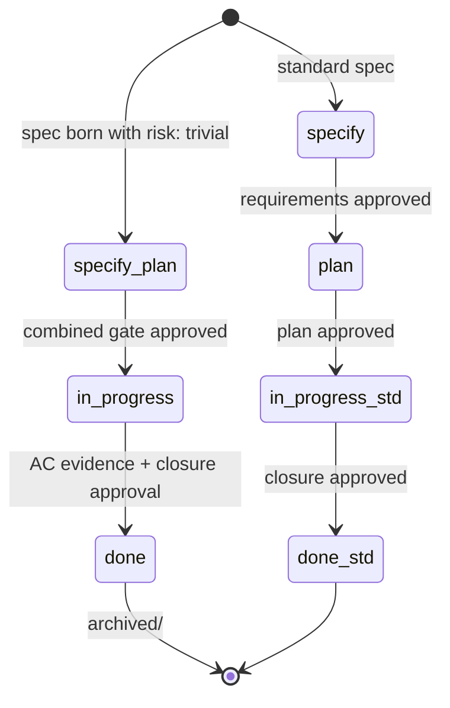

# IMP-20260514-trivial-lane

*Last updated: 2026-05-14*

## Summary

- **Goal:** Add a `risk: trivial` lane (CR/BUG/IMP) that collapses Specify + Plan into a single combined gate while preserving the in-progress → done discipline, so one-line / one-file changes don't bypass the framework.
- **Scope:** Front-matter schema extension (`risk` accepts `trivial`), new lifecycle short-circuit rule, eligibility criteria, single combined-gate format, template adjustment (single optional combined section), validator support.
- **Out of scope:** Removing or weakening any human gate (the combined gate still requires explicit approval); auto-approval; auto-classification of trivial vs. non-trivial (the user picks the lane, the framework verifies eligibility); applying the lane to existing archived specs.

## Cost Estimate

| Estimate | Value |
|---|---|
| Token range | 100k-180k |
| Human attention | 4 gates (specify + plan + 1 task + closure); ~10 min/gate; lifecycle schema change warrants close review |
| Re-Specify tripwire | Eligibility criteria cannot be encoded as a hard rule (signal: too subjective; user-judgment lane defeats the point); OR the combined-gate format ends up longer than the current 2-gate flow (signal: not a simplification) |

## Current State

The spec lifecycle (`spec-lifecycle.md § Status transitions`) requires 3 human gates for every spec: requirements approval (specify→plan), plan approval (plan→in-progress), closure approval (in-progress→done). For a one-line fix (e.g., a typo in a doc, a single-grep find-replace) this is theatre — the cost of running the framework exceeds the cost of the change. Concrete evidence:

- Two of yesterday's slim-* IMPs touched a single file with a single AC each (`IMP-20260513-compress-boundaries` produced 2 tasks for a single file).
- `boundaries.md § Never do #2` explicitly forbids skipping Specify "even for a one-line bug" — a sign that the rule is fighting user behavior.

`cites-reqs:` omitted — lifecycle convention change; no project requirements baselines.

## Proposed Improvement

Introduce `risk: trivial` as a fourth value (alongside `low | medium | high`) for CR/IMP, and a new BUG `severity: trivial`. When a spec is born with `risk: trivial`, the lifecycle short-circuits:

```
specify+plan → in-progress → done
```

The combined `specify+plan` gate requires:
- A one-line goal statement (no Summary, no Cost Estimate, no Visualize sub-step).
- ≤3 questions (not ≤10) drawn from a "trivial-eligibility" question list.
- One AC (not the usual multi-AC table).
- A `## Tasks` row with exactly one task.

Eligibility (hard, enforced by validator):
- `affected-code` + `affected-docs` total ≤2 files (E4-style trivial-extension boundary).
- No `affected-repos` cross-cutting (single repo).
- No schema change, no new bounded context, no AI-prompt change, no boundary change (would force `risk: medium+`).
- No `depends-on:` (autonomous by construction).

The Closure gate is unchanged — every AC still needs evidence; status flip still requires human approval.

**Measurable benefit:** Human-attention budget for an eligible spec drops from current 3 gates × ~10 min = ~30 min to 2 gates × ~5 min = ~10 min (≥66% reduction). Verified by running one real trivial change end-to-end at closure and recording wall-clock gate time.

## Requirements

- FR-1: `framework/spec-workflows/spec-lifecycle.md § Front-matter schema` MUST accept `risk: trivial` (CR / IMP) and `severity: trivial` (BUG).
- FR-2: A new section `spec-lifecycle.md § Trivial lane` MUST define the combined gate, eligibility criteria, and the short-circuited status sequence (`specify+plan → in-progress → done`).
- FR-3: All three templates (`CR-TEMPLATE.md`, `BUG-TEMPLATE.md`, `IMP-TEMPLATE.md`) MUST gain an optional "Trivial-lane shortcut" comment block describing how to use the lane (without adding fields to the default template body).
- FR-4: A new question list `framework/spec-workflows/questions/trivial-questions.md` MUST be added with exactly 3 questions covering: (a) scope ≤2 files, (b) no schema/boundary/prompt change, (c) one-AC sufficient.
- FR-5: `validate-specs.py` (from IMP-20260514-spec-validator) MUST be extended to enforce the trivial-lane eligibility criteria when `risk: trivial` is set; violation MUST emit a finding pointing the user to drop trivial and re-run Specify.
- FR-6: `boundaries.md § Never do #2` ("Never skip Specify") MUST be updated to clarify that the trivial lane is NOT a skip — Specify still runs, just combined with Plan.
- FR-7: `docs/spec-workflow-guide.md` MUST gain a "Trivial lane" subsection with one worked example.
- FR-8: No existing spec MUST be retroactively classified as trivial; the lane applies only to specs created after closure.

## Acceptance Criteria

### AC-1: Front-matter accepts trivial (FR-1)

Given `spec-lifecycle.md § Front-matter schema` at HEAD
When inspected
Then `risk:` enumerates `low | medium | high | trivial`
And `severity:` enumerates `low | medium | high | critical | trivial`

### AC-2: Trivial lane defined (FR-2)

Given `spec-lifecycle.md § Trivial lane` at HEAD
When inspected
Then it defines: eligibility criteria, combined gate format, short-circuited status sequence
And the rules section cross-references the canonical eligibility list

### AC-3: Templates carry the shortcut block (FR-3)

Given the three templates at HEAD
When grepped
Then each template includes a "Trivial-lane shortcut" comment block

### AC-4: Trivial question list exists (FR-4)

Given `framework/spec-workflows/questions/trivial-questions.md` at HEAD
When inspected
Then it contains exactly 3 numbered questions covering scope, schema/boundary/prompt change, AC count

### AC-5: Validator enforces eligibility (FR-5)

Given a spec with `risk: trivial` but `affected-code: [a.py, b.py, c.py]`
When `make validate-specs` runs
Then exit code is non-zero
And the finding cites the eligibility violation (file-count exceeded)

### AC-6: Boundary rule updated (FR-6)

Given `boundaries.md § Never do #2` at HEAD
When inspected
Then it clarifies trivial lane is not a Specify skip
And no rule's semantic intent is otherwise changed (consistency with IMP-20260514-dedup-rule-statements)

### AC-7: Worked example (FR-7)

Given `docs/spec-workflow-guide.md` at HEAD
When inspected
Then it includes a "Trivial lane" subsection with a complete one-file example spec walk-through

### AC-8: No retroactive reclassification (FR-8)

Given `docs/specs/archived/` at HEAD
When grepped
Then no archived spec has its `risk:` or `severity:` field changed to `trivial`

### AC-9: Measurable benefit (FR-2 + measurable benefit clause)

Given a real trivial change run end-to-end after closure (the change itself doesn't need to be in this spec; the dry-run is part of Closure Evidence)
When the wall-clock gate times are recorded
Then total gate time is ≤10 min
And the ≥66% reduction vs. baseline 30 min is documented

## Architecture



The trivial lane is a parallel short-circuit, not a replacement. Standard lifecycle is unchanged. Eligibility is validator-enforced (mechanical); the lane choice is user-elected (judgment).

Schema change: `risk:` enum gains `trivial`; `severity:` enum gains `trivial`. This is a forward-only extension — existing specs are valid under the new schema unchanged.

## Out of Scope

- OS-1: Auto-classification — the user picks `risk: trivial`; the framework validates.
- OS-2: Removing or weakening any human gate (the combined gate is still a hard stop).
- OS-3: Retroactive reclassification of archived specs (FR-8 forbids it).
- OS-4: A `risk: critical` tier (out of scope; this IMP only adds `trivial`).
- OS-5: Per-tool harness changes (e.g., a Claude Code slash command for trivial specs) — markdown convention only.

## Split Decision

Kept as one spec. § 2 trigger T4 (FR clusters depend on different data entities) does not fire — all FRs are tied to the single `risk: trivial` enum extension and its eligibility surface. Exception **E1** applies: all ACs share a single data-write path (the trivial-lane definition lives in `spec-lifecycle.md` and propagates to templates/questions/validator via direct references). Splitting would force two coordinated deploys for a schema change.

## Tasks

Pending — Plan stage only.

## Agent instructions

Per `<system>/skills/agent-protocol/SKILL.md`.

## Docs updates required

- `framework/spec-workflows/spec-lifecycle.md` — front-matter schema enum + new § Trivial lane.
- `framework/spec-workflows/spec-types.md` — note the lane is applicable to CR/BUG/IMP.
- All three templates — shortcut comment block.
- `framework/spec-workflows/questions/trivial-questions.md` — new file.
- `framework/boundaries.md § Never do #2` — clarification (semantic-equivalent edit; verify under IMP-20260514-dedup-rule-statements's lint-rules).
- `docs/spec-workflow-guide.md` — worked example.
- `docs/spec-format.md` — note the trivial combined-gate format.
- `scripts/validate-specs.py` — eligibility checks.

## Rollout / migration notes

- Depends on `IMP-20260514-framework-subagents` reaching `done` first so the prompts already delegate to `spec-author` — the trivial lane is handled by `spec-author`'s short-circuit branch, not the orchestrating prompt.
- Closure dry-run (AC-9) is the highest-attention step: pick a real one-line change (e.g., a typo fix in a doc) and walk it end-to-end as a `risk: trivial` spec, recording the wall-clock times.
- Boundary-rule edit (FR-6) MUST pass `make lint-rules` from sibling IMP-20260514-dedup-rule-statements — the rule's anchor target is preserved; only the body text changes.
