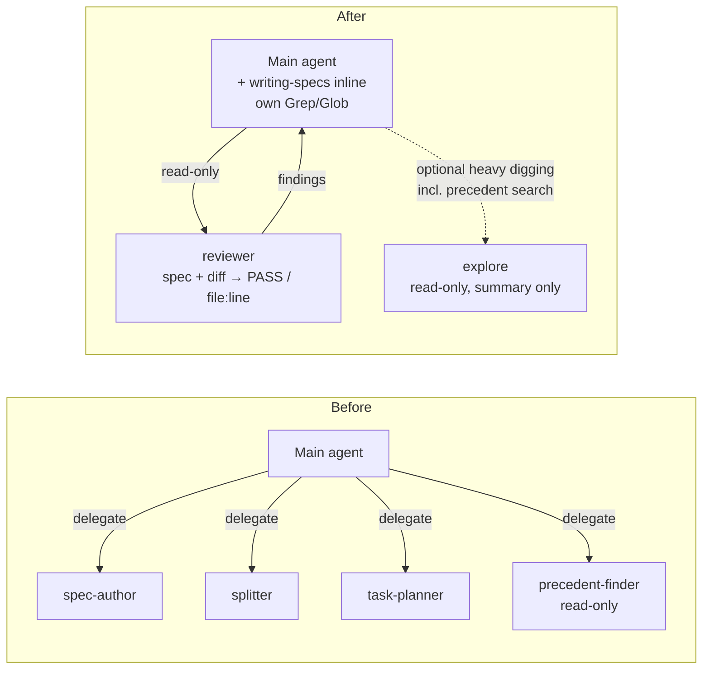

# IMP-20260605-solo-agent-workflow-realignment
*Last updated: 2026-06-05*
## Summary
- **Goal:** Realign the framework to the solo model — one main agent, context carried by artifacts (spec/plan), subagents only on mechanical need, with a read-only `reviewer` as the single bespoke subagent.
- **Scope:** Remove all four current bespoke subagents — fold the generators (`spec-author`, `splitter`, `task-planner`) into the `writing-specs` skill (run inline), and drop `precedent-finder` (precedent search → the generic read-only explore subagent or main-agent Grep/Glob); add a `reviewer` agent + `reviewing-changes` skill as a recommended non-blocking sub-step; document the base model.
- **Out of scope:** Figma-as-spec-layer mechanics — deferred to a separate IMP.
## Cost Estimate

| Estimate | Value |
|---|---|
| Token range | 250k–500k |
| Human attention | ~11 gates: Specify, Plan, 8 task approvals, Closure; ~5–10 min each |
| Re-Specify tripwire | Plan > 8 tasks, or any task adds runtime product code, or validator changes aren't git-revert reversible |
## Current State
Four bespoke subagents exist; three (`spec-author`, `splitter`, `task-planner`) are *generators* justified only by token reduction. This conflicts with the solo model: isolating author/architect roles serializes coupled decisions — the artifact (spec/plan) should carry context, not a role. `precedent-finder` passes the read-only gate but is redundant — precedent search is generic read-only digging the main agent's Grep/Glob (or the built-in explore subagent) already covers. Meanwhile the one subagent worth isolating — a **read-only reviewer** (spec + diff → `PASS` / `file:line`) — is absent, and the base model is stated nowhere.
## Proposed Improvement
Scope above lists what changes. **Measurable benefit:** bespoke subagents **4 → 1** (only `reviewer`), **100% read-only**; new `reviewing-changes` skill carries exactly 5 checklist dimensions; `make sync-agents-check` green.
## Requirements

**Theme A — Fold generators into main context**
- FR-1: Deprecate `spec-author`, `splitter`, `task-planner` as subagents; absorb their Steps + output contracts into the `writing-specs` skill, run inline.
- FR-2: `create-spec.prompt.md` and `plan-spec.prompt.md` MUST drop delegation/fallback to those three and reference the absorbed skill sections instead.
- FR-3: Remove `precedent-finder`; precedent search MUST route to the generic read-only explore subagent or the main agent's own Grep/Glob. `agents/README.md` MUST state the gate: a subagent is justified only by mechanical need (isolation / parallelism / read-only), never role decomposition or a search a generic read-only pass already covers.
- FR-4: `validate-specs.py` + `lint-rules.py` MUST stop requiring the removed agents and MUST NOT flag the absorbed inline Steps as restatement drift; `make sync-agents-check` MUST pass.

**Theme B — Reviewer subagent**
- FR-5: Add `framework/agents/reviewer.md`: read-only `tools-allowed` (no `Write`/`Edit`); inputs `spec_path` + diff (read by the agent); output `PASS` or `file:line → violated clause`; diagnoses only, applies no fixes.
- FR-6: Add a `reviewing-changes` skill carrying exactly five dimensions — coverage, scope, contract, bugs, minimality — and "ignore style". Both the `reviewer` agent and a non-Claude session load this one skill.
- FR-7: `spec-lifecycle.md` MUST document reviewer as a **recommended, non-blocking** sub-step in `in-progress` before closure (trigger: risk medium/high or on demand), ≤1–2 cycles, main agent as arbiter; not a status, not a replacement for the human gate.
- FR-8: `agents/README.md` MUST document the harness-independent fallback: on Codex/Copilot the reviewer runs as a separate empty-context session (inputs = spec + diff + `reviewing-changes`).

**Theme C — Operating-model principle**
- FR-9: `docs/ai-agent-framework.md` MUST state the base model: one main agent; artifact-carried context; skills as conditionally-relevant procedures and shared language; subagents on mechanical need only.
## Acceptance Criteria
### AC-1: Generators folded in (FR-1, FR-2)
Given the framework after this IMP, when I inspect `framework/agents/` and the two prompts, then the three generators are removed and the prompts reference the absorbed `writing-specs` sections — verified: `grep -rl 'spec-author\|task-planner\|splitter' framework/prompts framework/agents` returns no active delegation site.

### AC-2: Only reviewer remains; subagent gate stated (FR-3)
Given the framework after this IMP, when I inspect `framework/agents/` and `agents/README.md`, then `precedent-finder.md` is removed (and its preflight callers route precedent search to the explore pattern or Grep/Glob), `reviewer.md` is the only bespoke agent definition, and the README names mechanical need (isolation / parallelism / read-only) as the sole justification and role-decomposition as the anti-pattern.

### AC-3: Validators green (FR-4)
Given the reshaped framework, when I run `make sync-agents-check`, then it passes and neither the inline Steps nor the new skill is flagged as restatement drift.

### AC-4: Reviewer is read-only, diagnosis-only (FR-5)
Given `reviewer.md`, when I inspect it, then `tools-allowed` has no `Write`/`Edit`, inputs are `spec_path` + diff, output is `PASS` or `file:line → violated clause`, and the body states it applies no fixes.

### AC-5: Checklist skill (FR-6)
Given `reviewing-changes`, when I read it, then it lists exactly coverage / scope / contract / bugs / minimality, instructs to ignore style, and is the single source loaded by both the agent and a non-Claude session.

### AC-6: Reviewer sub-step is recommended, non-blocking (FR-7, FR-8)
Given `spec-lifecycle.md` and `agents/README.md`, when I read closure-adjacent guidance, then the reviewer is a recommended sub-step (risk medium/high or on demand), ≤1–2 cycles, main agent arbiter, not a status nor a gate replacement, and the Codex/Copilot empty-session fallback is documented as harness-independent.

### AC-7: Base model documented (FR-9)
Given `docs/ai-agent-framework.md`, when I read it, then the base model is stated: one main agent; artifact-carried context; skills as conditionally-relevant procedures and shared language; subagents on mechanical need only.
## Architecture
Visualize triggered (risk = medium). Delegation graph reshaped; data flow/schemas unchanged.

## Out of Scope
- OS-1: Figma-as-spec-layer mechanics (MCP node-pull, token materialization, explore flow for Figma) — separate IMP.
- OS-2: Project-specific operating guidance — context hygiene (`/compact` between phases) and the cross-cutting phase order (contract → backend → React+Figma → docs → reviewer) — belongs in a project's own instructions, not the system framework.
- OS-3: Per-project rollout / migrating in-flight specs to the reviewer sub-step.
- OS-4: Re-benchmarking the ~32% token figure — that target is retired, not re-measured.
## Split Decision
**Kept as one** — E1 + E3 ([`splitting-rules.md § 4`](../../../framework/skills/writing-specs/references/splitting-rules.md)) + explicit owner election. T1 fires (Themes B/C are independently testable vs A), but A and B rewrite the same write path (`agents/README.md`, `ai-agent-framework.md § Sub-agents`, both prompts, the two validators — **E1**) and partial application breaks the workflow, so rollback must be atomic (**E3**). Plan MUST keep FR-1…FR-4 in one contiguous, atomically-revertable task group.
## Tasks
> **Before starting Task T1, set status: in-progress in the front-matter above.**

| # | Description | Files | Source files (read-only) | Depends on | Skills | Model | Status |
|---|---|---|---|---|---|---|---|
| T1 | Absorb the three generators' Steps + output contracts into the `writing-specs` skill so the main agent runs spec authoring, the split check, and task decomposition inline (FR-1). | `framework/skills/writing-specs/SKILL.md`, `framework/skills/writing-specs/references/authoring-steps.md` *(new)* | `framework/agents/spec-author.md`, `framework/agents/splitter.md`, `framework/agents/task-planner.md` | — | writing-specs | deep | ☐ pending |
| T2 | Rewire `create-spec` + `plan-spec` prompts to run the absorbed sections inline; remove generator `Agent`-delegation + fallback paragraphs (FR-2). | `framework/prompts/create-spec.prompt.md`, `framework/prompts/plan-spec.prompt.md` | `framework/skills/writing-specs/SKILL.md` | T1 | writing-specs | default | ☐ pending |
| T3 | Delete the four bespoke agent files; rewrite `agents/README.md` to drop them and state the subagent-need gate (mechanical need only; reject role decomposition) (FR-1, FR-3). | `framework/agents/spec-author.md`, `framework/agents/splitter.md`, `framework/agents/task-planner.md`, `framework/agents/precedent-finder.md`, `framework/agents/README.md` | — | T2 | writing-specs | default | ☐ pending |
| T4 | Bring the rest of the framework into line with the removal: reroute the task-start preflight to Grep/Glob or the built-in explore subagent, update the delegation docs to inline authoring, and update both validators so `validate-specs` no longer assumes the removed agents and `lint-rules` no longer flags the absorbed inline Steps as drift; `make sync-agents-check` passes (FR-3, FR-4). | `framework/spec-workflows/spec-types.md`, `docs/agent-protocol.md`, `scripts/validate-specs.py`, `scripts/lint-rules.py` | `framework/agents/README.md`, `framework/boundaries.md` | T3 | writing-specs | default | ☐ pending |
| T5 | Add the `reviewing-changes` skill carrying the 5-dimension checklist — coverage / scope / contract / bugs / minimality — plus "ignore style", as the shared review language (FR-6). | `framework/skills/reviewing-changes/SKILL.md` *(new)* | `framework/skills/writing-specs/SKILL.md` | — | writing-specs | deep | ☐ pending |
| T6 | Add `framework/agents/reviewer.md`: read-only `tools-allowed`, inputs `spec_path` + diff, output `PASS` / `file:line → violated clause`, diagnosis-only; loads `reviewing-changes`. Set its model tier in `model-selection.md` (FR-5). | `framework/agents/reviewer.md` *(new)*, `docs/model-selection.md` | `framework/agents/README.md`, `framework/skills/reviewing-changes/SKILL.md` | T5 | writing-specs, model-selection | deep | ☐ pending |
| T7 | Wire the reviewer as a recommended, non-blocking sub-step in `spec-lifecycle.md` (trigger risk medium/high or on demand, ≤1–2 cycles, main agent arbiter) + harness-independent fallback in `agents/README.md` (FR-7, FR-8). | `framework/spec-workflows/spec-lifecycle.md`, `framework/agents/README.md` | `framework/agents/reviewer.md` | T3, T6 | writing-specs | default | ☐ pending |
| T8 | State the base model and reshape the "Sub-agents" section/table in `ai-agent-framework.md` to the reviewer-only surface; retire the token-reduction framing (FR-9). | `docs/ai-agent-framework.md` | `framework/agents/README.md` | T3, T7 | writing-specs | default | ☐ pending |
## Agent instructions
Per `<system>/boundaries.md` and `<system>/docs/agent-protocol.md`.
## Docs updates required
- `docs/ai-agent-framework.md` — base model; replace the "Sub-agents" section/table with the 2-read-only-agent surface; retire the token-reduction framing.
- `framework/agents/README.md` — subagent gate, reviewer contract, fallback; drop all four current agents.
- `framework/spec-workflows/spec-lifecycle.md` — recommended reviewer sub-step.
- `framework/spec-workflows/spec-types.md` + `docs/agent-protocol.md` — reword the task-start preflight: precedent search via explore pattern / Grep-Glob, not `precedent-finder`; Delegation contract reflects inline authoring + read-only reviewer.
- `docs/model-selection.md` — model tier for `reviewer`.
## Rollout / migration notes
- Theme A as one atomic commit so `make sync-agents-check` never sees an inconsistent state.
- Archived `IMP-20260514-framework-subagents` stays as-is; cite it as superseded in closure. No product code changes; revert = `git revert`.
