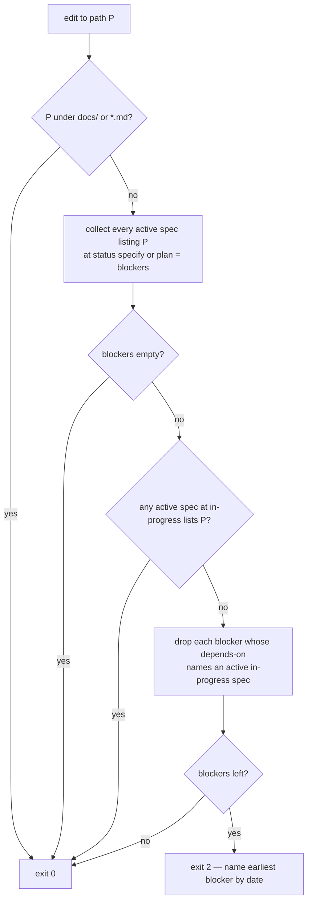

# IMP-20260826-spec-guard-and-validator-gaps
*Last updated: 2026-08-27*

## Summary
- **Goal:** Stop `spec-status-guard.sh` denying edits it has no legitimate claim to deny, and make the validator check the two fields it currently does not.
- **Scope:** Two allow conditions plus a collect-then-deny message in `spec-status-guard.sh`, with fixtures in `hooks.test.sh`; `affected-docs:` restored to `BUG-TEMPLATE.md`; `domain-refs` replacing `cites-reqs` in the validator's list-typed fields; a REQ-ID uniqueness check over `docs/domain/`.
- **Out of scope:** The Plan-gate inventory pre-check and the cross-cutting-spec lease model proposed in the same log entries.

## Current State
`improvements-log.md` records **eight** guard collisions in two days (2026-08-13 ×3, 2026-08-14 ×5). Three were `depends-on` deadlocks: a spec at `specify` blocked the very spec its own `depends-on:` named — a contradiction in the inventory, not a claim. All eight were resolved identically: the path commented out of the blocking spec's `affected-code` with a restoration note, so the workaround is now the pattern and each application leaves a debt item in Closure Evidence.

The guard denies on the first match. It never collects the other matching specs, never reads `depends-on:`, and never asks whether an `in-progress` spec already governs the path — although its own header comment already promises "spec in-progress" as an allow condition.

Two schema-conformance gaps found in the same sweep. `BUG-TEMPLATE.md` carries no `affected-docs:` while `_REQUIRED_FIELDS` in `validate-specs.py` requires it unconditionally, so a BUG spec starts invalid unless its author adds the field by hand — 8 of `tobevisit-content`'s 20 BUG specs did not, and fail `make validate-specs` today. CR, IMP and RES templates all carry it. `_LIST_FIELDS` still names `cites-reqs`, renamed to `domain-refs` on 2026-05-27 across templates, prompts, agents and docs — the field every spec now uses is type-checked nowhere. Nor is any inventory path checked against the form `spec-status-guard.sh` matches: the guard resolves paths from the project root that owns `docs/specs/active`, so a workspace-relative path silently leases nothing. Both forms are in use in this corpus.

## Proposed Improvement
The guard collects every matching blocker, then allows when either condition holds: an active spec at `in-progress` lists the path, or the blocker's `depends-on:` names an active spec at `in-progress`. The second is safe by construction — a spec with an unmet `depends-on:` cannot advance past `specify` ([Rule #10](../../../framework/spec-workflows/spec-lifecycle.md#depends-on-blocks-plan)), so it cannot hold a lease against the work it is waiting on. Otherwise deny, naming the earliest blocker by `date:`.

Measurable benefit: the eight logged collisions, replayed as fixtures, go from 8 denials to 0, while a genuine collision — blocker at `specify`, no governing `in-progress` spec, no dependency — still denies. Validator baselines: 8 of 20 BUG specs fail on a field their template never offered, target 0 for specs written after the fix; 0 of 22 `docs/domain/` files are checked for a REQ-ID collision today, target 22; 0 inventory paths are checked against the form the guard reads, although 24 of 28 archived `ai-dotfiles` specs use one form and the rest another.

## Requirements
- FR-1: `spec-status-guard.sh` MUST evaluate every active spec before deciding, rather than exiting on the first `affected-code` match.
- FR-2: The guard MUST allow the edit when any active spec at `in-progress` lists the edited path in `affected-code`.
- FR-3: The guard MUST ignore a blocker whose `depends-on:` names an active spec at `in-progress`.
- FR-4: A denial MUST name the blocker with the earliest `date:` and state both allow conditions from FR-2 and FR-3.
- FR-5: `framework/hooks/README.md` MUST state the guard's allow conditions as implemented, replacing the current "spec in-progress" shorthand.
- FR-6: `BUG-TEMPLATE.md` MUST carry `affected-docs:` in its front-matter, positioned as in `CR-TEMPLATE.md`.
- FR-7: `validate-specs.py` `_LIST_FIELDS` MUST name `domain-refs` and MUST NOT name `cites-reqs`.
- FR-8: `validate-specs.py` MUST report a REQ-ID that appears as a definition more than once within one `docs/domain/` baseline file, naming file and ID.
- FR-9: `validate-specs.py` MUST report an `affected-code:` or `affected-docs:` path that does not resolve from the spec's own project root, since `spec-status-guard.sh` matches paths in exactly that form and a path written any other way is a lease the guard cannot see.

## Acceptance Criteria
### AC-1: A dependent spec no longer blocks the spec it waits on (FR-1, FR-3)
Given spec B at `specify` lists `src/x.ts` in `affected-code` and its `depends-on:` names spec A
And spec A is active at `in-progress`
When the guard receives an edit to `src/x.ts`
Then it exits 0

### AC-2: A governing in-progress spec admits the edit (FR-1, FR-2)
Given spec B at `plan` lists `src/x.ts` and spec C at `in-progress` also lists `src/x.ts`
When the guard receives an edit to `src/x.ts`
Then it exits 0

### AC-3: A genuine collision still denies, naming the earliest blocker (FR-4)
Given two specs at `specify` dated 2026-08-01 and 2026-08-10 both list `src/x.ts`, and no active spec at `in-progress` lists it or is named by either `depends-on:`
When the guard receives an edit to `src/x.ts`
Then it exits 2 and stderr names the 2026-08-01 spec and both allow conditions

### AC-4: A BUG spec written from the template validates (FR-6)
Given a BUG spec created by copying `BUG-TEMPLATE.md` and filling its placeholders
When `make validate-specs` runs
Then no finding names a missing `affected-docs`

### AC-5: The renamed field is type-checked and baselines are checked for collisions (FR-7, FR-8)
Given a spec whose `domain-refs:` holds a bare string, and a `docs/domain/` file defining one REQ-ID twice
When `make validate-specs` runs
Then it reports both, and exits non-zero

### AC-6: An inventory the guard cannot read fails validation (FR-9)
Given a spec in `ai-dotfiles` listing `env/ai-dotfiles/framework/hooks/spec-status-guard.sh` — the workspace-relative form, which the guard resolves as `framework/hooks/spec-status-guard.sh`
When `make validate-specs` runs
Then it reports the path as unresolvable from the spec's project root, and exits non-zero

## Design

Nodes C, E and F are new; the rest is the guard as it stands. `docs/` and `*.md` short-circuit before any spec is read, unchanged.

## Out of Scope
- OS-1: Plan-gate inventory pre-check (proposed 2026-08-13) — it belongs to the Plan prompt, not the hook, and would land in the sibling procedures IMP.
- OS-2: A cross-cutting-spec lease model (proposed 2026-08-14) — needs a front-matter field this spec does not add.
- OS-3: Restoring the paths commented out of the eight blocking specs' inventories — those specs are archived; re-adding is a docs edit with no reader.
- OS-4: Ordering blockers by `risk`/`severity` (proposed 2026-08-13) — superseded by FR-2/FR-3, which resolve the recorded cases without a judgement call.

## Split Decision
`split-recommended` by **T1** — the guard cluster (FR-1…FR-5) and the schema-conformance cluster (FR-6…FR-9) are independently testable, share no AC, and touch disjoint files. No § 4 exception applies: E1 (no shared write path), E2 (no FR overlap), E3 (independent reverts), E4 (the second cluster is 4 FRs across 2 files), E5 (this spec ships code).

Recorded as an **override**: the human elected the four-spec shape at the Specify question round with both clusters named, which places them here. Reversing it costs one sibling stub — `imp-validator-schema-conformance` (FR-6…FR-9) — and the human confirms or reverses at the requirements gate.

## Tasks
Pending — Plan stage only.

## Agent instructions
Per `<system>/boundaries.md` and `<system>/docs/agent-protocol.md`.

## Docs updates required
- `framework/hooks/README.md` — allow conditions per FR-5.
- `framework/spec-workflows/templates/BUG-TEMPLATE.md` — `affected-docs:` per FR-6.

## Rollout / migration notes
- The guard relaxes rather than tightens: no spec currently allowed becomes blocked, so no coordination is needed.
- FR-9 lands on a corpus that already disagrees with itself; expect findings in `ai-dotfiles` on the first run and repair them in the same task.
- FR-8 runs over `docs/domain/` in whichever project the validator is pointed at; `tobevisit-content` is clean today (22 files, 0 collisions), so the check lands green there.
