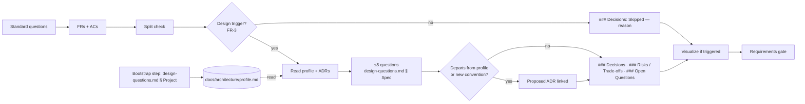

# CR-20260914-design-decisions-and-architecture-profile

*Last updated: 2026-09-16*

*Length: 146 lines, over the 120 budget — two clusters kept as one spec by human decision (§ Split Decision).*

## Summary

- **Goal:** Settle architecture once per project in a written profile, and ask design-approach questions in a spec
  only when the change touches architecture — recording decisions with their rejected alternatives before the
  requirements gate.
- **Scope:** A project architecture profile template and bootstrap questions; a triggered Design Decisions sub-step
  in Specify with its question list; `### Decisions`, `### Risks / Trade-offs`, `### Open Questions` under
  `## Design`; an ADR when a decision departs from the profile.
- **Out of scope:** Deciding any project's architecture — `tobevisit-content` compiles its profile in its own IMP.

## Problem Statement

Specify asks which bounded contexts a change touches (CR Q1) and Visualize draws the result, but nothing asks which
approaches were weighed. Decisions land informally — `CR-20260831-geo-availability-flag § Design` lists "three
decisions the frames settle" — and ADRs are written ad hoc (14 in `tobevisit-content`). The architecture itself is
nowhere stated as a whole: it lives across conventions docs, ADRs, a DDD skill and two lint checks, and project
bootstrap never asks for it. Asking "DDD or monolith?" on every spec would re-litigate settled choices; never asking
lets a spec diverge from them unseen. OpenSpec's `design.md` (Decisions with alternatives, Risks → Mitigation,
deferrable-only Open Questions) is the borrowed shape.

## Requirements

- FR-1: The project scaffold MUST include `docs/architecture/profile.md` stating architectural style, domain
  modelling approach, code organisation, programming style (paradigm, error model, immutability, concurrency), and
  integration style. Each item cites at least one source — an ADR, a conventions section, or an enforcing check — or
  reads `unrecorded` with an open question; the page carries a `Last src verified` row and a Contradictions section.
  Justification: one shape shared with `tobevisit-content IMP-20260914-architecture-profile`, which compiles into it.
- FR-2: The bootstrap workflow (`docs/bootstrapping-project.md`) MUST ask the profile questions from
  `design-questions.md § Project` after the scaffold step and fill the profile; `ai-project` itself stays a copier.
- FR-3: Specify MUST run a Design Decisions sub-step after the Split check and before Visualize when any trigger fires:
  a bounded context is added or reshaped; data flows between contexts change; a new architectural pattern or external
  dependency is introduced; a persistence or schema model changes; a choice departs from the profile or an ADR;
  risk is `high`. Justification: decide, then draw — Visualize depicts the chosen approach.
- FR-4: The sub-step MUST ask at most five questions from `design-questions.md § Spec`, and MUST NOT ask what the
  profile or an ADR already settles.
- FR-5: `## Design` MUST gain `### Decisions` (each decision with alternatives considered and why rejected),
  `### Risks / Trade-offs` (risk → mitigation) and `### Open Questions` (only questions answerable later without
  changing requirements, approach or task breakdown).
- FR-6: A decision that departs from the profile or sets a new project-wide convention MUST link a proposed ADR
  before the requirements gate is requested.
- FR-7: When no trigger fires, `### Decisions` MUST read `Skipped — <reason>` on one line.

## Acceptance Criteria

### AC-1: A new project states its architecture (FR-1, FR-2)

Given a scratch directory
When `ai-project` scaffolds a project
Then `docs/architecture/profile.md` exists with every FR-1 item seeded `unrecorded`, and the bootstrap workflow names
the step that asks `design-questions.md § Project`
Evidence: `scripts/test/ai-project.test.sh` + `docs/bootstrapping-project.md` diff

### AC-2: Architecture questions fire only on triggers (FR-3, FR-4, FR-7)

Given the lifecycle, templates and question lists after the change
When a spec adding a bounded context and a spec changing one label are each walked through Specify
Then the first runs the sub-step with ≤5 questions, none re-asking a profile item; the second records
`Skipped — <reason>`
Evidence: two worked examples in `docs/spec-templates-guide.md`

### AC-3: Departures leave a record (FR-5, FR-6)

Given a spec whose decision contradicts a profile item
When the requirements gate is requested
Then `### Decisions` names the rejected alternatives and links a proposed ADR, and `### Open Questions` holds nothing
that changes a requirement
Evidence: worked example + `docs/adr-conventions.md` diff

## Design

Visualize triggered: `risk: medium`; spec-format and project-scaffold schema change.

Profile shape — one row per FR-1 item: `Item | Stated style | Source (ADR / conventions § / check) or unrecorded
| Open question`; then `Last src verified` and `## Contradictions`.

### Decisions

- D1: Design Decisions is a sub-step of Specify, not a status — rejected: new `design` status (the lifecycle collapsed
  statuses deliberately, `spec-lifecycle.md § Deprecated: draft`); folding into Visualize (Visualize draws, it does
  not weigh alternatives, and fires at `medium` where re-asking settled choices is the cost FR-4 avoids).
- D2: Decisions live under `## Design` in the one spec file — rejected: OpenSpec's separate `design.md` (OS-3).
- D3: Kept as one spec over the T1 split — human decision 2026-09-16 (see § Split Decision).

### Risks / Trade-offs

- Trigger list drifts from Visualize's → FR-3 names its own triggers; `spec-lifecycle.md` states both side by side.
- Profiles left all-`unrecorded` → FR-4 then settles nothing; accepted — the list of `unrecorded` items is the backlog.

### Open Questions

None.

## Out of Scope

- OS-1: `tobevisit-content`'s profile — `IMP-20260914-architecture-profile` in that repository.
- OS-2: A validator check for the Decisions sub-section — deferred to `RES-20260914-declarative-lifecycle-schema`.
- OS-3: A separate `design.md` file per spec (OpenSpec's layout) — the one-file spec is kept.

- OS-4: A validator failing a profile still seeded `unrecorded` — unlike quality gates, `unrecorded` is a legitimate
  answer.

## Open Questions

- ~~Q1~~: "atc" meant "etc." — the FR-1 list stands. *(human, 2026-09-16)*
- ~~Q2~~: The profile stays structural; NFR targets live in `docs/domain/` baselines. *(human, 2026-09-16)*

## Split Decision

Kept as one spec — human decision 2026-09-16 over T1: C1 (FR-1, FR-2) and C2 (FR-3 – FR-7) each verify alone; the
nearest exception is E5 (templates, docs and one self-test, no behavioural code). T2 `unknown`; T3–T6 do not fire. A
Plan-stage P-signal on the same C1/C2 cluster is recorded here as an override, not re-run.

## Tasks

> **Before starting Task T1, set status: in-progress in the front-matter above.**

Requirements and Design approved by the human 2026-09-16. Plan-time re-check (2026-09-16): no archived spec closed
over this spec's paths since the § Rollout re-verification; active `IMP-20260914-explore-mode-and-lane-review`
(`specify`) also lists `spec-lifecycle.md` — T3 edits only the Visualize/Split sub-step region and Rules #8–#9.

| # | Description | Files | Source files (read-only) | Depends on | Skills | Model | Status |
|---|---|---|---|---|---|---|---|
| T1 | Profile template seeded `unrecorded` per FR-1 item, with `Last src verified` and `## Contradictions`; scaffold manifest row 12 and `SKILL.md` counts; project docs index links it; self-test asserts it — red first (FR-1; AC-1) | `framework/templates/project/docs/architecture/profile.md` *(new)*, `framework/skills/bootstrapping-project/references/scaffold-manifest.md`, `framework/skills/bootstrapping-project/SKILL.md`, `framework/templates/project/docs/README.md`, `scripts/test/ai-project.test.sh` | `scripts/ai-project.sh`, `docs/adr-conventions.md`, `tobevisit-content/docs/specs/active/IMP-20260914-architecture-profile.md` | — | bootstrapping-project, writing-docs | default | ☑ done |
| T2 | `design-questions.md` with `§ Project` (one question per profile item) and `§ Spec` (≤5, never re-asking the profile); bootstrap workflow step that asks `§ Project` after scaffolding (FR-2, FR-4; AC-1) | `framework/spec-workflows/questions/design-questions.md` *(new)*, `docs/bootstrapping-project.md` | `framework/spec-workflows/questions/cr-questions.md`, profile template from T1 | T1 | writing-specs, bootstrapping-project | deep | ☑ done |
| T3 | Design Decisions sub-step in the lifecycle — triggers, order after Split and before Visualize, `Skipped — <reason>`; `## Design` gains `### Decisions` / `### Risks / Trade-offs` / `### Open Questions` in CR and IMP templates; CR / IMP question lists point at `design-questions.md` (FR-3, FR-5, FR-7; AC-2) | `framework/spec-workflows/spec-lifecycle.md`, `framework/spec-workflows/templates/CR-TEMPLATE.md`, `framework/spec-workflows/templates/IMP-TEMPLATE.md`, `framework/spec-workflows/questions/cr-questions.md`, `framework/spec-workflows/questions/imp-questions.md`, `framework/prompts/create-spec.prompt.md` (added at T3 — the Specify workflow must run the sub-step) | `design-questions.md` from T2, `scripts/validate-specs.py` § `_design_section` | T2 | writing-specs | deep | ☑ done |
| T4 | ADR link rule for departures and new conventions; `spec-templates-guide § Design` sub-sections plus two worked examples — a bounded-context spec (≤5 questions, one departure with proposed ADR) and a label change (`Skipped`) (FR-6; AC-2, AC-3) | `docs/adr-conventions.md`, `docs/spec-templates-guide.md` | `spec-lifecycle.md` from T3, this spec's `## Design` | T3 | writing-docs, writing-specs | default | ☑ done |
| T5 | Verification and closure: `make tests`, `make check`, `make validate-specs`, anchor check; reviewer run recommended (`risk: medium`); evidence per AC; add `depends-on:` note to the `tobevisit-content` IMP only on human approval; status → done, move to `archived/` | this spec | all files above | T1, T4 | writing-specs, reviewing-changes | default | ☑ done |

## Closure Evidence

| AC | Evidence |
|---|---|
| AC-1 | `scripts/test/ai-project.test.sh` (in `make tests`): red before the template — `FAIL: docs/architecture/profile.md not scaffolded`; green after — `ai-project.test: OK`, asserting all 8 FR-1 rows seeded `unrecorded`, `Last src verified` and `## Contradictions`. `docs/bootstrapping-project.md` § Workflow step 5 asks `design-questions.md § Project` |
| AC-2 | `spec-lifecycle.md § Design Decisions sub-step` — six triggers, order Split → Design Decisions → Visualize, ≤5 questions never re-asking the profile, `Skipped — <reason>`; `docs/spec-templates-guide.md § Design` worked example 1 (bounded context, 3 questions, *Domain modelling* not re-asked) and example 2 (label change, `Skipped`) |
| AC-3 | Worked example 1 — D2 names the rejected alternative and links proposed ADR-0015, `### Open Questions` holds only a tunable; `docs/adr-conventions.md § When a spec must write one` + lifecycle anchor `design-departure-adr` |

Closure approved by the human 2026-09-16 (synchronous, `risk: medium`); reviewer run not requested.
`make check` exits 0 (links, validate-specs, lint-rules, anchors — 108 fragments); `make tests` exits 0.

## Agent instructions

Per `<system>/boundaries.md` and `<system>/docs/agent-protocol.md`. Changes spec templates, workflow definitions and
the scaffold — `boundaries.md § Ask first #3/#4` applies at every gate.

## Docs updates required

- `spec-lifecycle.md` — Design Decisions sub-step beside Visualize, triggers.
- CR / IMP templates — `## Design` sub-sections; CR / IMP question lists — pointer to `design-questions.md`.
- `scaffold-manifest.md` (required artifacts 11 → 12), `SKILL.md` (stale counts "(10)"/"(6)" → 12/7),
  `docs/bootstrapping-project.md` (profile-questions step), project `docs/README.md` template (profile link).
- `docs/adr-conventions.md`, `docs/spec-templates-guide.md § Design` — ADR link rule, sub-sections, two examples.

## Rollout / migration notes

- Shares the CR / IMP templates with `IMP-20260914-baseline-deltas-and-merge` and the scaffold with
  `IMP-20260914-quality-gates-contract`; sequence after both to avoid concurrent template edits. **Satisfied** — both
  `done` 2026-09-16.
- Re-verified 2026-09-16 (`spec-lifecycle.md § 10`): `## Baseline Deltas` now follows `## Design` — no conflict;
  `ai-project.sh` is a pure copier, so FR-2 moved to the bootstrap workflow; `validate-specs.py` bounds `## Design` at
  `## ` only, so `###` sub-sections keep the Figma-ID check intact.
- `tobevisit-content IMP-20260914-architecture-profile` should declare `depends-on:` this CR.
