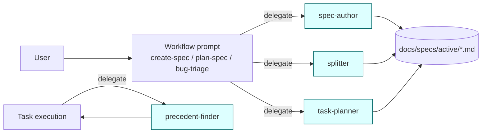

# IMP-20260514-framework-subagents

*Last updated: 2026-05-14*

## Summary

- **Goal:** Introduce four declarative sub-agent definitions under `framework/agents/` and update the four workflow prompts to delegate to them, moving Specify/Plan-stage work off the main context.
- **Scope:** Four new agent definitions (`spec-author`, `splitter`, `task-planner`, `precedent-finder`) plus a `README.md` describing the agents/ contract; four prompts edited to delegate; documentation added under `docs/agent-protocol.md`.
- **Out of scope:** Runtime telemetry / context-token measurement infrastructure (the ≥30% reduction is measured ad-hoc during closure, not continuously); Claude Code plugin packaging; project-scope sub-agents under `<project>/.github/copilot/agents/`; non-Claude harnesses (Copilot Chat, Codex CLI) — those tools don't support the Agent sub-call contract today and will use the prompts directly without delegation.

## Cost Estimate

| Estimate | Value |
|---|---|
| Token range | 200k-400k |
| Human attention | 5 gates (specify + plan + 2-3 task gates + closure); ~20 min/gate; new framework subsystem warrants close review |
| Re-Specify tripwire | Token-reduction measurement on a real Specify walk-through shows <30% improvement (signal: delegation overhead exceeds context savings); OR Codex/Copilot users hit a hard regression because their tools can't see agent definitions |

## Current State

`framework/agents/` exists but is empty. Workflow prompts (`create-spec`, `plan-spec`, `bug-triage`, `visualize-spec`) inline every step of Specify/Plan into the main thread:

- The Specify stage runs the question round, drafts spec body, runs Split check, and writes the gate summary all in the main context.
- Plan stage decomposes a spec into vertical-slice tasks in the main context.
- Precedent file lookup (`task-start checklist` requires nearest precedent for each task's files) is done by the main thread.

Concrete impact: a single Specify walk-through can pull 15-25k tokens of framework docs into main before the first spec character is written. Tools like Claude Code expose a structured Agent sub-call mechanism (`Agent` tool) but the framework doesn't use it.

`cites-reqs:` omitted — new framework subsystem, no project requirements baselines.

## Proposed Improvement

Define four declarative sub-agents as markdown files with YAML front-matter under `framework/agents/`:

| Agent | Trigger | Input | Output | Allowed tools |
|---|---|---|---|---|
| `spec-author` | Specify stage (CR/IMP) | question answers + project context paths | drafted spec body (YAML + sections) | Read, Write to `docs/specs/active/` |
| `splitter` | Specify stage after FRs+ACs | spec path | `## Split Decision` block | Read |
| `task-planner` | Plan stage | approved spec path | `## Tasks` table rows | Read |
| `precedent-finder` | Task-start checklist | file list from task | nearest-precedent paths | Read, Bash (grep/find) |

Each agent ships as one markdown file with `name`, `description`, `model-suggestion`, `tools-allowed`, and an inline system prompt. Workflow prompts update to delegate (e.g., `create-spec.prompt.md` § Steps #3 becomes "Delegate to `<system>/agents/spec-author.md` with the answers from step 2"). The delegation contract is documented in `framework/agents/README.md`.

For tools without sub-agent support (Copilot Chat, Codex CLI), the prompts include a fallback section: "If your tool does not support sub-agent delegation, inline the agent's instructions instead." This preserves multi-agent support.

**Measurable benefit:** Main-context token load for a fresh Specify walk-through (CR template, 3 questions, no prior context) drops by ≥30%. Baseline captured manually by running the existing flow once on a tobevisit-docs throwaway CR before the change. Target captured by running the new flow once after. Both numbers recorded in Closure Evidence.

## Requirements

- FR-1: `framework/agents/` MUST contain four agent definitions: `spec-author.md`, `splitter.md`, `task-planner.md`, `precedent-finder.md`.
- FR-2: Each agent definition MUST include YAML front-matter with: `name`, `description`, `model-suggestion`, `tools-allowed`, plus an inline system prompt body describing the agent's contract (preconditions, expected output, error modes).
- FR-3: `framework/agents/README.md` MUST describe the agents/ contract: how prompts delegate, the fallback for tools without sub-agent support, and the agent-front-matter schema.
- FR-4: All four workflow prompts MUST be updated to delegate the relevant step to the corresponding agent, with a fallback note for tools that don't support sub-agent delegation.
- FR-5: A baseline Specify walk-through (existing flow) MUST be recorded before the change; a target walk-through (new flow) MUST be recorded after; the delta MUST show ≥30% main-context token reduction.
- FR-6: `validate-specs.py` (from IMP-20260514-spec-validator) MUST be extended to validate `framework/agents/*.md` front-matter shape; running it MUST stay green.
- FR-7: `make lint-rules` (from IMP-20260514-dedup-rule-statements) MUST be extended so any inline restatement of an agent's contract outside `framework/agents/` triggers a finding.

## Acceptance Criteria

### AC-1: Four agent definitions present (FR-1, FR-2)

Given HEAD after closure
When `ls framework/agents/*.md` runs
Then `spec-author.md`, `splitter.md`, `task-planner.md`, `precedent-finder.md`, `README.md` are present
And each agent definition has front-matter with `name`, `description`, `model-suggestion`, `tools-allowed`

### AC-2: README documents the contract (FR-3)

Given `framework/agents/README.md` at HEAD
When inspected
Then it describes: how prompts delegate, the fallback for non-supporting tools, the front-matter schema

### AC-3: Prompts delegate (FR-4)

Given the four updated prompts at HEAD
When inspected
Then each prompt references at least one agent under `<system>/agents/` via a delegation block
And each delegation block has a fallback paragraph for non-supporting tools

### AC-4: ≥30% main-context token reduction (FR-5)

Given the baseline and target walk-throughs recorded in Closure Evidence
When the deltas are inspected
Then main-context token count drops by ≥30% on the Specify stage
And the measurable benefit is verified

### AC-5: Validator extended (FR-6)

Given a deliberately-broken agent definition (missing front-matter field)
When `make validate-specs` runs
Then exit code is non-zero
And the offending file:line is named in the output

### AC-6: Lint-rules extended (FR-7)

Given a deliberately-introduced inline agent-contract restatement in a prompt
When `make lint-rules` runs
Then exit code is non-zero

## Design

Bounded contexts:
- **framework/agents/** *(new)* — declarative sub-agent definitions; one-file-per-agent; YAML front-matter + system prompt body.
- **framework/prompts/** *(existing, edited)* — workflow entry-points; now delegate steps to agents.
- **framework/skills/** *(existing, untouched)* — knowledge modules; orthogonal to agents.

Data flow change: workflow prompts no longer carry every Specify/Plan instruction inline; they orchestrate sub-agents that own their own context budgets. For non-supporting tools (Copilot, Codex), the fallback inlines the agent body, preserving the multi-agent contract.

Risk surface: tools that do not implement Anthropic's `Agent` tool sub-call contract (Copilot Chat, Codex CLI today) MUST receive the fallback inlined-content. Validator AC-5 covers front-matter shape; AC-3 covers fallback presence.

## Out of Scope

- OS-1: Building a runtime telemetry / token-counter harness (one-off manual measurement at closure is enough).
- OS-2: Project-scope sub-agents under `<project>/.github/copilot/agents/` (system scope only in this IMP).
- OS-3: Packaging ai-dotfiles as a Claude Code plugin (separate concern).
- OS-4: Migrating the agent contract to a different format (MCP, OpenAI Assistants, etc.) — markdown + YAML front-matter only.
- OS-5: Adding sub-agents beyond the four listed (e.g., closure-evidence-collector, ac-verifier) — defer to follow-up IMP if measurable benefit is realized.

## Split Decision

Kept as one spec. § 2 trigger T1 (≥2 independently testable FR clusters) fires on the surface — each sub-agent is independently definable. Exception **E1** applies: all four agents share a single data-write path (workflow prompts delegate to them, the prompts are edited in a single closure gate), and rollback requires atomic revert of the prompts + agent set together (E3). Splitting per-agent would force the prompts into a half-delegated, half-inlined state across multiple closures, which is exactly the failure mode E1/E3 protect against.

## Tasks

> **Before starting Task S1, set `status: in-progress` in the front-matter above.**

| # | Description | Files | Source files (read-only) | Depends on | Skills | Model | Status |
|---|---|---|---|---|---|---|---|
| S1 | Baseline measurement (FR-5): run the existing Specify walk-through (`create-spec.prompt.md` with 3 typical questions) on a throwaway CR in `tobevisit-docs`; record main-context token count to `tests/subagents-baseline.md`. **This MUST happen before any framework/agents/ or prompt edits — the baseline captures pre-change behavior.** | `tests/subagents-baseline.md` *(new)* | `framework/prompts/create-spec.prompt.md` *(current HEAD)*; `tobevisit-docs/.github/copilot-instructions.md` *(target project)* | — | writing-specs | deep | ☑ done |
| S2 | Agent contract definition + README (FR-2, FR-3): design the YAML front-matter schema for sub-agents (`name`, `description`, `model-suggestion`, `tools-allowed`, body) and write `framework/agents/README.md` documenting the contract: delegation mechanism, fallback for tools without sub-agent support (Copilot/Codex), front-matter schema reference, an inline example. | `framework/agents/README.md` *(new)* | `framework/skills/*/SKILL.md` *(precedent for front-matter shape)*; `docs/agent-protocol.md` | S1 | writing-docs | deep | ☑ done |
| S3 | Sub-agents batch 1 — Specify-stage (FR-1, FR-2): `framework/agents/spec-author.md` (drafts spec body from question answers) and `framework/agents/splitter.md` (runs Split check, produces `## Split Decision` block). Each is one markdown file with YAML front-matter + system-prompt body (preconditions, expected output, error modes). | `framework/agents/spec-author.md` *(new)*; `framework/agents/splitter.md` *(new)* | `framework/skills/writing-specs/SKILL.md`; `framework/skills/writing-specs/references/splitting-rules.md`; `framework/spec-workflows/templates/*.md` | S2 | writing-specs | deep | ☑ done |
| S4 | Sub-agents batch 2 — Plan-stage + Task (FR-1, FR-2): `framework/agents/task-planner.md` (decomposes approved spec into vertical-slice tasks) and `framework/agents/precedent-finder.md` (finds nearest precedent files for a task's Files column). | `framework/agents/task-planner.md` *(new)*; `framework/agents/precedent-finder.md` *(new)* | `framework/skills/model-selection/SKILL.md`; `docs/agent-protocol.md`; `framework/spec-workflows/templates/*.md` | S2 | writing-specs | deep | ☑ done |
| S5 | Wire prompts to delegate (FR-4): edit all 4 `framework/prompts/*.prompt.md` — add a delegation block referencing the appropriate sub-agent + a fallback paragraph for tools without sub-agent support. Prompts remain functional under non-Claude harnesses (Copilot, Codex) via the fallback. | `framework/prompts/bug-triage.prompt.md`; `framework/prompts/create-spec.prompt.md`; `framework/prompts/plan-spec.prompt.md`; `framework/prompts/visualize-spec.prompt.md` | agents from S3+S4; `docs/rule-canonical-map.md` *(from sibling IMP for anchor links)* | S3; S4 | writing-docs | default | ☑ done |
| S6 | Validator + lint extensions (FR-6, FR-7): extend `scripts/validate-specs.py` with a check class for agent front-matter shape (each `framework/agents/*.md` has `name`, `description`, `model-suggestion`, `tools-allowed`); extend `scripts/lint-rules.py` so any inline restatement of an agent's contract outside `framework/agents/` is flagged. Fixtures for both. | `scripts/validate-specs.py`; `scripts/lint-rules.py` | `framework/agents/*.md` post-S3+S4 | S4 | writing-specs | default | ☑ done |
| S7 | Target measurement + closure (FR-5, AC-4): run the new (delegating) flow on the same throwaway CR from S1; record main-context token count to `tests/subagents-target.md`; confirm ≥30% reduction vs. S1 baseline; docs updates: `docs/ai-agent-framework.md § Sub-agents` (new section), `docs/agent-protocol.md § delegation contract` (new subsection). | `tests/subagents-target.md` *(new)*; `docs/ai-agent-framework.md`; `docs/agent-protocol.md` | `tests/subagents-baseline.md` *(from S1)* | S5; S6 | writing-docs | deep | ☑ done |

## Agent instructions

Per `<system>/skills/agent-protocol/SKILL.md`. Note recursive irony: this IMP introduces sub-agents but is itself executed without them — the agent-protocol skill applies to the orchestrating main thread.

## Docs updates required

- `docs/ai-agent-framework.md` — add a "Sub-agents" section under § Skills with the four agent table.
- `docs/agent-protocol.md` — add a delegation-contract subsection.
- All four `framework/prompts/*.prompt.md` — delegate the relevant step.

## Rollout / migration notes

- Depends on `IMP-20260514-dedup-rule-statements` reaching `done` first so the prompts are already in their slimmed/linked form before delegation is wired.
- Closure walk-through measurement is the highest-attention step (FR-5 / AC-4); record both runs verbatim.
- For Copilot / Codex users: the fallback inlines the agent body, so no functional regression. Verify by running the create-spec prompt under each tool at closure (or note explicitly in Closure Evidence which tools were verified).
