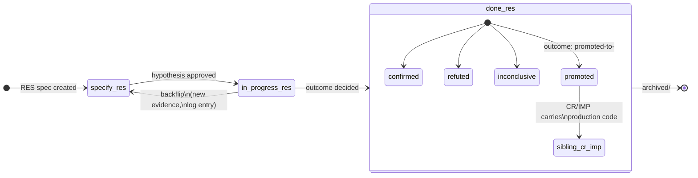

# IMP-20260514-research-lane

*Last updated: 2026-05-14*

## Summary

- **Goal:** Implement the previously-reserved `RES` spec type (Research / Spike / POC / Vibe coding) with an iterative `specify ⇄ in-progress → done` lifecycle, sandboxed code location under `research/<spec-id>/`, hypothesis-based front-matter, and a hard promote-to-CR/IMP gate before any code reaches `src/`.
- **Scope:** New `RES-TEMPLATE.md`, new `res-questions.md`, new `research-spec.prompt.md`, lifecycle extension allowing in-progress→specify backflip for RES only, new front-matter fields (`hypothesis:`, `kill-criteria:`, `code-location:`, `outcome:`), validator support, `.gitignore` rules for research artifacts, documentation.
- **Out of scope:** Migrating any existing exploratory code into the new lane; making RES specs auto-promote to CR/IMP (the promotion is a deliberate human gate); enforcing RES at the project level (system-scope only — projects opt in via their own conventions); deleting the existing workspace-root `research/` directory or its current contents.

## Cost Estimate

| Estimate | Value |
|---|---|
| Token range | 180k-350k |
| Human attention | 5 gates (specify + plan + 2-3 task gates + closure); ~20 min/gate; new spec type + lifecycle exception warrants close review |
| Re-Specify tripwire | Iterative loop semantics cannot be made deterministic for the validator (signal: subjective lane); OR the kill-criteria mechanism is unenforceable (signal: lane becomes a no-loop-limit escape hatch); OR research/<spec-id>/ sandboxing conflicts with the existing workspace-root research/ directory |

## Current State

The framework reserves `RES` in `spec-types.md` (Spike / investigation / proof of concept) but marks every column `*(future)*`. The reservation has stayed empty since the framework's inception. Concrete impact:

- Exploratory work has no home. Devs either (a) write a CR for something they don't yet understand (then violate "no gold-plating" when reality diverges from FRs), or (b) write code without a spec (violating "specs before code"), or (c) abandon the framework for the exploration phase entirely.
- `boundaries.md § Never do` rules — *"Never skip Specify"* + *"No status is revisited in place"* — explicitly forbid the iterative loop that exploration requires.
- The workspace root has an existing `research/` directory (used ad-hoc; uncategorized content). No convention says what goes there.
- `spec-lifecycle.md § Status transitions`: *"No status is skipped. No status is revisited in place"* — applies to all current types (CR/BUG/IMP) and would forbid the RES loop unless explicitly excepted.

`cites-reqs:` omitted — new spec type; no project requirements baselines.

## Proposed Improvement

**A. New spec type `RES`** with these distinct properties:

1. **Lifecycle exception** — `RES` specs may transition `in-progress → specify` an unlimited number of times until reaching `done`. Every other type remains forward-only.
2. **New front-matter fields (RES-only):**
   - `hypothesis:` — one-sentence statement of what is being tested.
   - `kill-criteria:` — when to stop iterating. Required shape: time-box OR token-budget OR iteration-count.
   - `code-location:` — where throwaway code lives. Default: `research/<spec-id>/`. Must not be inside `src/`.
   - `outcome:` (filled at `done`) — one of: `confirmed | refuted | inconclusive | promoted-to-<spec-id>`.
3. **Different question list (~5 Qs)** focused on: hypothesis, smallest experiment, kill criteria, code sandbox path, deliverable shape (memo / code / decision).
4. **Acceptance criteria shape change** — RES ACs phrase as "hypothesis tested + result documented + decision recorded" rather than "feature works".
5. **Promote-to-CR/IMP gate** — RES code MUST NOT be merged into `src/` directly. To ship findings, the closure either (a) records `outcome: refuted | inconclusive` (no code ships) or (b) records `outcome: promoted-to-<spec-id>` referencing a sibling CR/IMP that carries the productionizable implementation.

**B. New artifacts:**

1. `framework/spec-workflows/templates/RES-TEMPLATE.md` — template body with hypothesis, kill-criteria, sandbox, decision sections.
2. `framework/spec-workflows/questions/res-questions.md` — 5 questions.
3. `framework/prompts/research-spec.prompt.md` — workflow entry point; delegates to `spec-author` sub-agent (from IMP-20260514-framework-subagents) in research mode.
4. New `## Iteration Log` section in the RES template — records each `in-progress → specify` backflip with date + cause + decision (audit trail for the loop).

**C. Validator extension** — enforce:
- `hypothesis:` non-empty.
- `kill-criteria:` matches one of the required shapes.
- `code-location:` is not inside `src/` of any repo.
- At `done`, `outcome:` is filled with a valid value; if `promoted-to-<spec-id>`, the referenced spec exists.

**D. `.gitignore` rule** for transient research artifacts (e.g., notebook checkpoints, dataset dumps under `research/<spec-id>/.tmp/`).

**Measurable benefit:** Three concrete metrics:
1. RES specs successfully completing the iterative loop (≥2 backflips) without violating any other lifecycle rule — verified by running one real RES dry-run end-to-end at closure.
2. Validator catches a deliberately-malformed RES spec (missing kill-criteria, code-location inside src/, etc.) — backtest evidence in Closure Evidence.
3. Promote-to-CR/IMP gate prevents direct merge: a test branch attempting to merge `research/<spec-id>/` code into `src/` without a sibling CR/IMP MUST be caught by the validator + a CI check.

## Requirements

- FR-1: `framework/spec-workflows/spec-types.md` MUST list `RES` as implemented (no `*(future)*` markers in the RES row).
- FR-2: `framework/spec-workflows/templates/RES-TEMPLATE.md` MUST exist with: front-matter (including the four RES-specific fields), Goal/Scope sections, Hypothesis section, Kill Criteria section, Iteration Log section (initially empty), Decision section, and a final `## Outcome` block populated at closure.
- FR-3: `framework/spec-workflows/questions/res-questions.md` MUST exist with exactly 5 numbered questions covering: hypothesis, smallest experiment, kill criteria, code sandbox path, deliverable shape.
- FR-4: `framework/prompts/research-spec.prompt.md` MUST exist as the RES workflow entry point.
- FR-5: `framework/spec-workflows/spec-lifecycle.md` MUST be amended to add a `## RES exception` section explicitly permitting `in-progress → specify` backflips for `RES` only, requiring an Iteration Log entry per backflip, and forbidding the same transition for CR/BUG/IMP.
- FR-6: `framework/boundaries.md § Never do` rule on status-revisit MUST be clarified (semantic-equivalent edit per IMP-20260514-dedup-rule-statements's lint-rules) to exempt the RES loop.
- FR-7: `scripts/validate-specs.py` (from IMP-20260514-spec-validator) MUST be extended to enforce all four RES-specific checks: hypothesis present, kill-criteria shape, code-location outside src/, outcome filled-and-valid at done.
- FR-8: `code-location:` for any RES spec MUST default to `research/<spec-id>/` and MUST NOT be inside `src/` of any repo; validator MUST reject violations.
- FR-9: Promotion mechanism: when `outcome: promoted-to-<spec-id>` is set at closure, validator MUST verify the referenced spec exists (CR or IMP, in active/ or archived/).
- FR-10: `.gitignore` MUST include a rule for `research/<spec-id>/.tmp/` so transient artifacts (notebook checkpoints, dataset dumps) don't get committed.
- FR-11: A closure dry-run MUST be performed: pick a real research question, walk it through one full specify → in-progress → specify → in-progress → done loop, record the Iteration Log and final outcome in Closure Evidence.
- FR-12: `make validate-specs` MUST stay green after this IMP lands.

## Acceptance Criteria

### AC-1: RES type marked implemented (FR-1)

Given `framework/spec-workflows/spec-types.md` at HEAD
When inspected
Then the RES row has no `*(future)*` markers
And the Template / Questions / Use-when columns are filled

### AC-2: RES template exists and has all sections (FR-2)

Given `framework/spec-workflows/templates/RES-TEMPLATE.md` at HEAD
When grepped for H2 headers
Then `## Summary`, `## Hypothesis`, `## Kill Criteria`, `## Iteration Log`, `## Decision`, `## Outcome` are present in that order
And the front-matter includes `hypothesis:`, `kill-criteria:`, `code-location:`, `outcome:`

### AC-3: RES question list exists (FR-3)

Given `framework/spec-workflows/questions/res-questions.md` at HEAD
When inspected
Then it contains exactly 5 numbered questions matching the five topics in § Proposed Improvement B.2

### AC-4: Research-spec prompt exists (FR-4)

Given `framework/prompts/research-spec.prompt.md` at HEAD
When inspected
Then it delegates to `<system>/agents/spec-author.md` in research mode (per IMP-20260514-framework-subagents)
And it references the RES question list and template

### AC-5: Lifecycle exception documented (FR-5)

Given `framework/spec-workflows/spec-lifecycle.md` at HEAD
When inspected
Then `## RES exception` section exists
And it explicitly permits `in-progress → specify` for type RES only
And it requires an Iteration Log entry per backflip
And the existing rule "No status is revisited in place" is amended to "...except for RES per § RES exception"

### AC-6: Boundary rule clarified (FR-6)

Given the relevant boundary rule on status-revisit at HEAD
When inspected
Then it explicitly exempts RES loops
And `make lint-rules` (from IMP-20260514-dedup-rule-statements) stays green (anchor preserved)

### AC-7: Validator enforces RES checks (FR-7, FR-8, FR-9)

Given a RES spec with `code-location: src/foo/`
When `make validate-specs` runs
Then exit code is non-zero and the finding cites the sandbox violation

Given a RES spec with empty `hypothesis:`
When `make validate-specs` runs
Then exit code is non-zero

Given a RES spec at `done` with `outcome: promoted-to-CR-99999999-nonexistent`
When `make validate-specs` runs
Then exit code is non-zero and the finding cites the dangling promotion reference

### AC-8: .gitignore covers transient artifacts (FR-10)

Given `.gitignore` at HEAD
When grepped
Then `research/*/.tmp/` (or equivalent) is listed

### AC-9: End-to-end dry-run (FR-11)

Given a real research question chosen at closure
When the spec is walked through specify → in-progress → specify → in-progress → done
Then the Iteration Log records both backflips with date + cause + decision
And the final outcome is one of: confirmed | refuted | inconclusive | promoted-to-<existing-spec-id>
And the full walk-through is recorded verbatim in Closure Evidence

### AC-10: Sibling validators stay green (FR-12)

Given HEAD after the RES lane lands
When `make validate-specs` and `make lint-rules` both run
Then both exit code zero

## Design

**Bounded contexts impacted:**
- `framework/spec-workflows/` — new template + questions + lifecycle exception.
- `framework/prompts/` — new RES entry-point prompt.
- `framework/agents/spec-author` *(from IMP-20260514-framework-subagents)* — gains a "research mode" branch.
- `research/` *(workspace root, existing)* — becomes the canonical sandbox for RES code; existing content untouched, new RES specs use `research/<spec-id>/` subtrees.
- `scripts/validate-specs.py` — gains four RES-specific check classes.

**Data flow change:** Code in `research/<spec-id>/` is sandboxed by convention + CI guard. It does not flow into `src/` without an explicit `outcome: promoted-to-<spec-id>` and the sibling CR/IMP being `done`. This is the central safety property of the lane.

**Schema change:** `RES-TEMPLATE.md` adds four new front-matter fields. They are RES-only — the validator MUST NOT require them on CR/BUG/IMP. This is a forward-only extension; existing specs are valid under the extended schema unchanged.

## Out of Scope

- OS-1: Auto-classification (the user picks `type: RES`; the framework validates).
- OS-2: Migrating existing exploratory code under workspace `research/` into the new lane format.
- OS-3: Auto-promotion of RES to CR/IMP at closure (the promotion is a deliberate human gate).
- OS-4: Project-level adoption / per-project sandbox paths (system-scope only; projects may override via their own `.github/copilot-instructions.md`).
- OS-5: Deleting or restructuring the existing workspace-root `research/` directory or its contents.
- OS-6: A `risk: trivial` × `type: RES` combo (trivial lane and research lane are orthogonal but combining them in this IMP is over-scope; defer if it becomes needed).

## Split Decision

Kept as one spec. § 2 trigger T1 fires on the surface (template / questions / prompt / validator / boundary edit could each be a sub-spec), but exception **E1** applies: all FRs share a single data-write path (the RES type is introduced as a coherent surface — template + questions + prompt + lifecycle rule + validator all reference each other; partial application would leave the type half-defined and unusable). E3 also applies: rollback requires atomic revert of all RES artifacts to avoid a half-implemented type appearing in `spec-types.md`.

## Tasks

> **Before starting Task R1, set status: in-progress in the front-matter above.**

| # | Description | Files | Source files (read-only) | Depends on | Skills | Model | Status |
|---|---|---|---|---|---|---|---|
| R1 | Establish the lifecycle and rule-text foundation for the RES lane. Add a new `## RES exception` section to `spec-lifecycle.md` permitting `in-progress → specify` backflips for type RES only, requiring an Iteration Log entry per backflip, and amending the existing "No status is revisited in place" rule to read "...except for RES per § RES exception". Apply an anchor-preserving edit to the corresponding `boundaries.md § Never do` rule (per IMP-20260514-dedup-rule-statements's lint-rules — keep the rule anchor intact). Mark RES as implemented in `spec-types.md` by removing `*(future)*` markers and filling Template / Questions / Use-when columns with forward references (template and questions land in R2; use placeholder paths matching R2's targets). Satisfies FR-1, FR-5, FR-6 / AC-1, AC-5, AC-6. | `framework/spec-workflows/spec-lifecycle.md`, `framework/boundaries.md`, `framework/spec-workflows/spec-types.md` | `docs/specs/archived/IMP-20260514-dedup-rule-statements.md`, `docs/specs/archived/IMP-20260514-trivial-lane.md` | — | writing-specs, writing-docs | deep | ☑ done |
| R2 | Author the RES template and question list. Create `RES-TEMPLATE.md` with front-matter including the four RES-specific fields (`hypothesis:`, `kill-criteria:`, `code-location:`, `outcome:`) and H2 sections in this exact order to satisfy AC-2: `## Summary`, `## Hypothesis`, `## Kill Criteria`, `## Iteration Log` (initially empty with a documented row format: date, cause, decision), `## Decision`, `## Outcome`. Create `res-questions.md` with exactly 5 numbered questions covering: hypothesis, smallest experiment, kill criteria, code sandbox path, deliverable shape (memo/code/decision). Follow existing CR/IMP/BUG/TRIVIAL template and questions conventions. Satisfies FR-2, FR-3 / AC-2, AC-3. | `framework/spec-workflows/templates/RES-TEMPLATE.md` *(new)*, `framework/spec-workflows/questions/res-questions.md` *(new)* | `framework/spec-workflows/templates/CR-TEMPLATE.md`, `framework/spec-workflows/templates/IMP-TEMPLATE.md`, `framework/spec-workflows/questions/cr-questions.md`, `framework/spec-workflows/questions/imp-questions.md` | R1 | writing-specs | default | ☑ done |
| R3 | Wire the RES workflow entry point and spec-author research-mode branch. Create `research-spec.prompt.md` as the RES workflow entry point that references `<system>/framework/spec-workflows/questions/res-questions.md` and `<system>/framework/spec-workflows/templates/RES-TEMPLATE.md` and delegates to `<system>/agents/spec-author.md` in research mode (per IMP-20260514-framework-subagents). Add a "research mode" branch to the `spec-author` sub-agent: a conditional section that switches to RES questions/template when the user picks `type: RES`, plus the hypothesis/kill-criteria/sandbox emphases unique to the lane. Satisfies FR-4 / AC-4. | `framework/prompts/research-spec.prompt.md` *(new)*, `framework/agents/spec-author.md` | `framework/prompts/create-spec.prompt.md`, `framework/agents/spec-author.md`, `docs/specs/archived/IMP-20260514-framework-subagents.md` | R1, R2 | writing-specs, writing-docs | deep | ☑ done |
| R4 | Extend the validator with four RES-specific checks and add the `.gitignore` rule. In `scripts/validate-specs.py`, add check classes (gated to `type: RES`, leaving CR/BUG/IMP unaffected per the Architecture § Schema change note): (1) `hypothesis:` non-empty; (2) `kill-criteria:` matches one of the required shapes (time-box / token-budget / iteration-count) — pick concrete regex/parse rules; (3) `code-location:` is not inside `src/` of any repo; (4) at `status: done`, `outcome:` is one of `confirmed | refuted | inconclusive | promoted-to-<spec-id>`, and if `promoted-to-<spec-id>` the referenced spec exists in `docs/specs/active/` or `docs/specs/archived/`. Follow the eligibility-check pattern established in IMP-20260514-trivial-lane. Add a `.gitignore` rule covering `research/*/.tmp/` so transient artifacts (notebook checkpoints, dataset dumps) stay untracked. Satisfies FR-7, FR-8, FR-9, FR-10 / AC-7, AC-8. | `scripts/validate-specs.py`, `.gitignore` | `docs/specs/archived/IMP-20260514-spec-validator.md`, `docs/specs/archived/IMP-20260514-trivial-lane.md` | R1, R2, R3 | writing-specs | default | ☑ done |
| R5 | Update the documentation surface to describe the new lane. In `spec-workflow-guide.md`, add a RES lifecycle walkthrough with a worked example showing the iterative loop and Iteration Log entries. In `spec-format.md`, note the four RES-only front-matter fields and their constraints. In `spec-templates-guide.md`, document the four front-matter fields and the `## Iteration Log` section format. All three edits cross-reference the artifacts created in R1-R4. Supports AC-1, AC-2, AC-5 readability; no new ACs of its own. | `docs/spec-workflow-guide.md`, `docs/spec-format.md`, `docs/spec-templates-guide.md` | `framework/spec-workflows/templates/RES-TEMPLATE.md`, `framework/spec-workflows/spec-lifecycle.md`, `framework/spec-workflows/spec-types.md` | R1, R2, R3, R4 | writing-docs | fast | ☑ done |
| R6 | End-to-end dry-run and closure gate. Pick a real, concrete research question (e.g., "should we replace MongoDB place-cache with Redis for hot reads" per the spec's Rollout note — or another live question chosen at closure) and create a real RES spec under `docs/specs/active/` exercising R1-R5's artifacts. Walk it through `specify → in-progress → specify → in-progress → done` with at least two `in-progress → specify` backflips, recording each backflip in the Iteration Log (date + cause + decision). Land a final outcome in `{confirmed, refuted, inconclusive, promoted-to-<existing-spec-id>}`. Run `make validate-specs` and `make lint-rules`; both MUST exit zero. Record the full walk-through verbatim plus both commands' output in this IMP's Closure Evidence (added to the spec body). This is the highest-attention task — the lane must physically exist before R6 runs. Satisfies FR-11, FR-12 / AC-9, AC-10. | `docs/specs/active/RES-<chosen-id>.md` *(new)*, `docs/specs/active/IMP-20260514-research-lane.md` | `framework/spec-workflows/templates/RES-TEMPLATE.md`, `framework/spec-workflows/spec-lifecycle.md`, `framework/spec-workflows/questions/res-questions.md`, `scripts/validate-specs.py` | R1, R2, R3, R4, R5 | writing-specs | deep | ☑ done |

## Agent instructions

Per `<system>/skills/agent-protocol/SKILL.md`. The RES lane itself is meta — this IMP introduces the iterative loop but is executed in the standard non-iterative IMP lifecycle (no `in-progress → specify` backflips during its own execution; if scope changes, status flips back to `specify` per the existing rule).

## Docs updates required

- `framework/spec-workflows/spec-types.md` — mark RES implemented.
- `framework/spec-workflows/spec-lifecycle.md` — add § RES exception.
- `framework/spec-workflows/templates/RES-TEMPLATE.md` — new file.
- `framework/spec-workflows/questions/res-questions.md` — new file.
- `framework/prompts/research-spec.prompt.md` — new file.
- `framework/boundaries.md` — clarify status-revisit rule (anchor-preserving edit per dedup IMP).
- `docs/spec-workflow-guide.md` — add RES lifecycle walkthrough with worked example.
- `docs/spec-format.md` — note RES-specific front-matter fields.
- `docs/spec-templates-guide.md` — document the four new front-matter fields and the Iteration Log section.
- `scripts/validate-specs.py` — four new check classes.
- `.gitignore` — transient research artifacts.

## Rollout / migration notes

- Depends on `IMP-20260514-trivial-lane` reaching `done` first. Trivial-lane establishes the front-matter enum / validator-eligibility precedent that research-lane extends. Both touch the same files (spec-lifecycle, templates, validator, questions); sequential execution avoids merge churn.
- Depends transitively on `IMP-20260514-framework-subagents` because the new `research-spec.prompt.md` delegates to `spec-author` in research mode — that agent must exist before the prompt is wired.
- The closure dry-run (AC-9) is the highest-attention verification step. Pick a real, concrete research question (e.g., "should we replace MongoDB place-cache with Redis for hot reads") and walk it through end-to-end. The Iteration Log entries are the proof the loop works.
- Existing workspace `research/` directory contents are untouched. New RES specs claim `research/<spec-id>/` subtrees; old ad-hoc content stays where it is.
- After closure, `boundaries.md § Never do` rule on status-revisit is the rule most likely to be misquoted by agents. Watch for regressions in the first 1-2 weeks of post-closure use; if found, file a follow-up IMP rather than amending this one.
