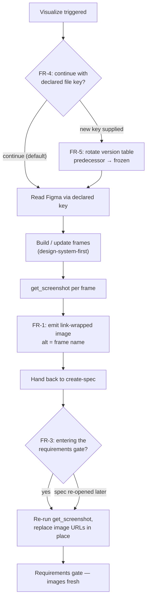

# IMP-20260820-figma-screenshot-durability-and-file-versioning
*Last updated: 2026-08-20*
## Summary
- **Goal:** Make a spec's Figma evidence survive both URL expiry and later design edits, without storing any image in a repository.
- **Scope:** The Visualize sub-step and its Figma reference doc in `ai-dotfiles`: a link-wrapped screenshot format that degrades into a working node link, screenshot regeneration at the requirements gate, a mandatory per-run question about adopting a new Figma file key, and a freeze procedure that keeps superseded files immutable. Plus the single-declaration version table in `tobevisit-content`, a project template carrying it, and an ADR.
- **Out of scope:** Repairing existing archived specs, and any form of image storage (repository, object storage, CDN).
## Current State
Figma screenshot URLs are short-lived by design: `get_screenshot` returns "a short-lived URL" and `download_assets` states "URLs are temporary — download promptly". [`visualize-spec.prompt.md:12`](../../../framework/prompts/visualize-spec.prompt.md) nonetheless instructs the agent to "embed screenshots", which produced bare `` markup.
Evidence: **49 such image links across 12 archived `tobevisit-content` specs** (`CR-20260615-admin-configuration-management.md` … `CR-20260721-canonical-geo-merge.md`). Three sampled URLs return `404 {"error":true,"status":404}`. The markup leaves no clickable fallback — a dead link renders as unrecoverable alt text, and the node URL sits on a separate line as inline code, so nothing can be clicked or regenerated from the rendered document.
Second defect, independent of expiry: node links point at a **live** file key. [`design-system.md:11`](../../../../../src/github.com/tobeverse/tobevisit-content/docs/architecture/design-system.md) already declares the key exactly once and forbids retro-editing archived specs, but nothing freezes the file the archived specs were written against, so their links resolve to designs that have since changed.
## Proposed Improvement
Two coupled rules. **(1) Degrade-to-link format:** the screenshot becomes a link-wrapped image whose alt text is the frame's conventional name, so an expired URL still renders as a clickable, self-describing link that carries `fileKey` + `node-id` — exactly the inputs `get_screenshot` needs to regenerate it. The gate re-runs `get_screenshot`, so the image is fresh when a reviewer reads the spec rather than when the agent wrote it. **(2) Freeze-on-version:** Visualize asks every run whether to keep the current file key or adopt a new one (a copy of the current design); adopting rotates the single declaration and freezes the predecessor, so links in already-closed specs keep resolving to the design they were written against.
Measurable benefit: bare `` occurrences in **active** specs go from the current pattern to **0**, and owned Figma file keys declared outside the version table in live project docs go from 1 (`how-to` admin-file prose) to **0** — cited foreign keys, the append-only improvements log, and archived specs are excluded — and project-specific names in `framework/prompts/` go from 6 to **0** — all three verifiable by grep at closure.
## Requirements
- FR-1: The Visualize sub-step MUST emit every Figma frame as a link-wrapped image — `[![[W-32] Countries — List](https://www.figma.com/api/mcp/asset/<uuid>)](https://www.figma.com/design/<fileKey>?node-id=<node-id>)` — where the alt text is the frame's `[<ID>] <Entity> — <View> · <state>` name, the inner URL is the `get_screenshot` result, and the outer URL carries the file key and node id.
- FR-2: The Visualize sub-step MUST NOT write a screenshot file into any repository, and MUST NOT publish one to external storage; the only image reference permitted is the Figma-served URL.
- FR-3: Before a spec is handed to the requirements gate, and whenever a spec with a dead screenshot is re-opened, the agent MUST re-run `get_screenshot` for every node URL under `## Design` and replace the image URLs in place.
- FR-4: Before its first read of a project's stored Figma file, the Visualize sub-step MUST ask the human whether to continue with the currently declared file key or adopt a new one, defaulting to continue; the question fires on every run.
- FR-5: When a new key is supplied, the agent MUST update the project's version table before any further Figma call, use only the new key for the remainder of the run, and MUST NOT retro-edit keys in already-archived specs.
- FR-6: A project's `docs/architecture/design-system.md` MUST carry a Figma version table — file key, version label, status (`current` / `frozen`), frozen-on date — as the single declaration site for every key the project **owns**, current and superseded; a key owned by another project is a citation and MUST NOT enter the table.
- FR-7: [`figma-file-organization.md`](../../../framework/prompts/references/figma-file-organization.md) MUST document the freeze procedure (duplicate as the new working file, rename the predecessor `· frozen`, move it to the archive project, update its `00 Cover` status) and the three caveats: node IDs survive duplication, a subscribed external library can still drift a frozen file, and the Figma plan caps files per team.
- FR-8: An ADR MUST record the decision and the rejected alternatives — committing exported images, hosting them on R2, and cutting the copy as an archive of the old state instead of as the new working file.
- FR-9: The project scaffold MUST ship a `docs/architecture/design-system.md` template carrying the empty version table, registered as a recommended artifact in [`scaffold-manifest.md`](../../../framework/skills/bootstrapping-project/references/scaffold-manifest.md).
- FR-10: The Figma reference doc and the Visualize prompt MUST carry project-agnostic examples only; frame, section, and entity names taken from a real project MUST be replaced with generic equivalents, per the ADR-0001 consequence that the reference doc stays project-agnostic.
## Acceptance Criteria
### AC-1: A screenshot that expires stays usable (FR-1, FR-2, FR-3)
Given a spec whose `## Design` was written by the Visualize sub-step
When its screenshot URLs have expired and a reader opens the rendered document
Then each frame renders as clickable text naming the frame and resolving to its node, no image file exists anywhere in the repository, and re-running the gate step restores the images without any input beyond the spec itself
### AC-2: Adopting a new file rotates the single declaration (FR-4, FR-5)
Given a Visualize run against a project that already declares a Figma file key
When the agent reaches its first Figma read
Then it asks whether to continue or adopt a new key, and on a new key it writes the version table first, uses only that key afterwards, and leaves archived specs untouched
### AC-3: A superseded file is frozen, not merely abandoned (FR-6, FR-7)
Given a file key that has just been superseded
When the freeze procedure runs
Then the version table shows the predecessor as `frozen` with its date and the successor as `current`, and the reference doc states the procedure and all three caveats
### AC-4: The convention is reachable from the framework and from a new project (FR-8, FR-9)
Given a fresh project scaffolded by `bootstrapping-project`
When its docs are generated
Then `docs/architecture/design-system.md` exists with an empty version table, the manifest lists it, and the ADR records the decision with its rejected alternatives
### AC-5: The framework teaches with generic examples (FR-10)
Given the Figma reference doc and the Visualize prompt after this spec
When they are grepped for the workspace's own product vocabulary
Then no match remains, and every frame/section example reads as a generic entity
## Design
The Visualize sub-step with the two new decision points (FR-3 gate regeneration, FR-4 per-run key question), from the agent's perspective.

## Out of Scope
- OS-1: The 49 dead image links in 12 archived `tobevisit-content` specs — left as-is by owner decision; archived specs are not retro-edited.
- OS-2: Any image storage — committing exports, R2, or a CDN — rejected in favour of regenerable Figma-served URLs.
- OS-3: `tobevisit-web` — no Figma file and no `design-system.md` exist there today; no-op.
- OS-4: Automated enforcement (CI check or hook) of the embed format — closure uses manual grep evidence.
- OS-5: Cutting the actual successor copy of the admin Figma file — a design act, not a framework change.
- OS-6: Verifying or lifting the Figma plan's per-team file ceiling — recorded as a caveat in FR-7, resolved outside this spec.
## Split Decision
Keep-as-one. **T3** fires (FR clusters span `ai-dotfiles` and `tobevisit-content`), but **E5 (documentation corpus)** dominates — zero behavioural code change, one shared closure metric (two greps returning 0), one shared conformance pass — and **E3** applies: the embed format and the freeze rule are one durability contract, and reverting either alone leaves specs pointing at a live file with no fallback. The human's Q2 answer confirmed both must ship together.
## Tasks
> **Before starting Task 1, set status: in-progress in the front-matter above.**

| # | Description | Files | Source files (read-only) | Depends on | Skills | Model | Status |
|---|-------------|-------|--------------------------|------------|--------|-------|--------|
| 1 | New reference section: the link-wrapped screenshot format and the no-stored-image prohibition; the versioning + freeze procedure (duplicate as successor, rename predecessor `· frozen`, move to archive project, update `00 Cover`); the three caveats (node IDs survive duplication, subscribed library still drifts, plan caps files per team). Add matching § 6 checklist rows. (FR-1, FR-2, FR-7) | `env/ai-dotfiles/framework/prompts/references/figma-file-organization.md` | `env/ai-dotfiles/docs/decisions/ADR-0001-figma-file-organization-conventions.md`, `src/github.com/tobeverse/tobevisit-content/docs/architecture/design-system.md` | — | writing-docs, writing-specs | default | ✅ done (2026-08-20) |
| 2 | Replace "embed screenshots" with the FR-1 format; add the FR-4 question (asked every run before the first Figma read, default continue) and FR-5 rotate-table-before-any-further-call to Steps; add the FR-2 prohibition and the FR-3 gate regeneration as hard rules. Align the guide's § Design paragraph with the same format. (FR-1, FR-2, FR-3, FR-4, FR-5) | `env/ai-dotfiles/framework/prompts/visualize-spec.prompt.md`, `env/ai-dotfiles/docs/spec-templates-guide.md` | `env/ai-dotfiles/framework/prompts/references/figma-file-organization.md` (T1), `env/ai-dotfiles/framework/prompts/create-spec.prompt.md`, `env/ai-dotfiles/framework/spec-workflows/spec-lifecycle.md` | 1 | writing-specs, writing-docs | default | ✅ done (2026-08-20) |
| 3 | New project-scaffold template carrying the empty Figma version table (key, version label, status, frozen-on) as the single declaration site; register it under Recommended artifacts. (FR-6, FR-9) | `env/ai-dotfiles/framework/templates/project/docs/architecture/design-system.md` *(new)*, `env/ai-dotfiles/framework/skills/bootstrapping-project/references/scaffold-manifest.md` | `src/github.com/tobeverse/tobevisit-content/docs/architecture/design-system.md`, T1 output | 1 | bootstrapping-project, writing-docs | fast | ✅ done (2026-08-20) |
| 4 | ADR recording the decision and the rejected alternatives (commit exported images, host on R2, cut the copy as an archive of the old state); consequences include the unverified per-team file ceiling. (FR-8) | `env/ai-dotfiles/docs/decisions/ADR-0002-figma-file-versioning-and-screenshot-durability.md` *(new)* | `env/ai-dotfiles/docs/decisions/ADR-0001-figma-file-organization-conventions.md`, T1 + T2 output | 1, 2 | writing-docs | default | ✅ done (2026-08-20) |
| 5 | Convert the single-key declaration into the version table (current admin file stays `current`; no freeze performed here) and repoint the how-to's Figma-references prose at the table. (FR-6) | `src/github.com/tobeverse/tobevisit-content/docs/architecture/design-system.md`, `src/github.com/tobeverse/tobevisit-content/docs/how-to/design-admin-ui-with-figma.md` | T3 template | 1, 3 | writing-docs | fast | ✅ done (2026-08-20) |
| 6 | Replace project-drawn examples with generic equivalents in the Figma reference doc and the Visualize prompt (`Countries` → `Invoice`, `Places`/`Reference Data` → `Inventory`/`Billing`, `Ingestion · Step 1` → `Import · Step 1`), restoring the ADR-0001 project-agnostic clause. Scope folded in during implementation. (FR-10) | `env/ai-dotfiles/framework/prompts/references/figma-file-organization.md`, `env/ai-dotfiles/framework/prompts/visualize-spec.prompt.md` | `env/ai-dotfiles/docs/decisions/ADR-0001-figma-file-organization-conventions.md` | 1 | writing-docs | fast | ✅ done (2026-08-20) |
| 7 | Verify AC-1…AC-5: grep all three closure metrics (bare `` in active specs = 0; owned Figma keys in live project docs outside the version table = 0; project vocabulary in `framework/prompts/` = 0), run `make check` in `env/ai-dotfiles`, record evidence in `## Closure`, append the improvements-log entry, flip `status: done`. (AC-1, AC-2, AC-3, AC-4, AC-5) | this spec, `env/ai-dotfiles/docs/improvements-log.md` | all files from T1–T6 | 1, 2, 3, 4, 5, 6 | writing-specs | default | ✅ done (2026-08-20) |
## Agent instructions
Per `<system>/boundaries.md` and `<system>/docs/agent-protocol.md`.
## Docs updates required
- `framework/prompts/visualize-spec.prompt.md` — replace "embed screenshots" with the FR-1 format; add the FR-3 gate step and the FR-4 question to Steps; add a hard rule for FR-2.
- `framework/prompts/references/figma-file-organization.md` — new section: screenshot embed format, versioning/freeze procedure, three caveats.
- `docs/spec-templates-guide.md:144` — align the Design guidance with the FR-1 format.
- `framework/templates/project/docs/architecture/design-system.md` — new template with the empty version table.
- `framework/skills/bootstrapping-project/references/scaffold-manifest.md` — register it under Recommended artifacts.
- `docs/decisions/ADR-0002-figma-file-versioning-and-screenshot-durability.md` — new ADR.
- `tobevisit-content/docs/architecture/design-system.md` — convert the single-key line into the version table.
- `tobevisit-content/docs/how-to/design-admin-ui-with-figma.md` — point at the version table.
## Rollout / migration notes
- Framework docs land before the `tobevisit-content` table, so the table is written against a published convention.
- No freeze is performed by this spec: the current admin file stays `current` in the new table, and the first rotation happens on the next real design milestone (OS-5).

## Closure Evidence

| AC | Evidence |
|---|---|
| AC-1 | Format rule lands in `visualize-spec.prompt.md` § Hard rules (`Screenshot embeds (Figma)`) and `figma-file-organization.md` § 6. Metric M1 — live bare-image embeds pointing at a `figma.com/api/mcp/asset` URL, across all four active-spec corpora: **0**. Occurrences that remain are anti-pattern illustrations inside code spans (this spec's `## Current State`, ADR-0002's Context), which the metric excludes by construction. |
| AC-2 | `visualize-spec.prompt.md` Step 2 `Confirm the Figma file` asks on every run, defaults to continue, writes the version table before any further Figma call, and skips only when no key is declared. `tobevisit-content` version table carries the invariant text (exactly one `current`, rows never deleted, archived specs never retro-edited). |
| AC-3 | `figma-file-organization.md` § 6 documents the freeze procedure (successor duplicate, predecessor renamed `· frozen`, moved to archive project, `00 Cover` updated) and all three caveats: node IDs survive duplication, a subscribed library still drifts, the plan caps files per team. |
| AC-4 | `templates/project/docs/architecture/design-system.md` *(new)* ships the empty version table; registered under Recommended artifacts in `scaffold-manifest.md`. `ADR-0002-figma-file-versioning-and-screenshot-durability.md` records the decision and seven rejected alternatives. |
| AC-5 | Metric M3 — project vocabulary (`Countries`, `Ingestion`, `Places`, `Reference Data`) in `framework/prompts/`: **0**. Examples now read `[W-01] Invoice — List`, `[W-11] Import · Step 1 — Console`, Sections `Billing` / `Inventory`. |

Metric M2 — **owned** Figma file keys in live `tobevisit-content` docs outside the version table: **0** (the admin key appears only in the version table). `tobevisit-web`'s key stays in the how-to as read-only logo provenance: a key belongs to exactly one project, and a citation is not a declaration. The append-only `improvements-log.md` and archived specs retain historical keys and are excluded as immutable.

Checks: `make check` in `ai-dotfiles` — EXIT=0 (link check 136 files, `validate-specs`, `lint-rules`, `validate-anchors`, seven self-test suites). `make sync-agents-check` in `tobevisit-content` — EXIT=0.

Scope added during implementation: **FR-10 / AC-5 / Task 6** — the pre-existing project-drawn examples in the Figma reference doc, folded in on the owner's decision rather than deferred, restoring the ADR-0001 project-agnostic clause.

Reviewer sub-step: **not run** — it is recommended (non-blocking) at `medium` risk and needs a cold, separate-context reviewer session, which this session did not launch.

