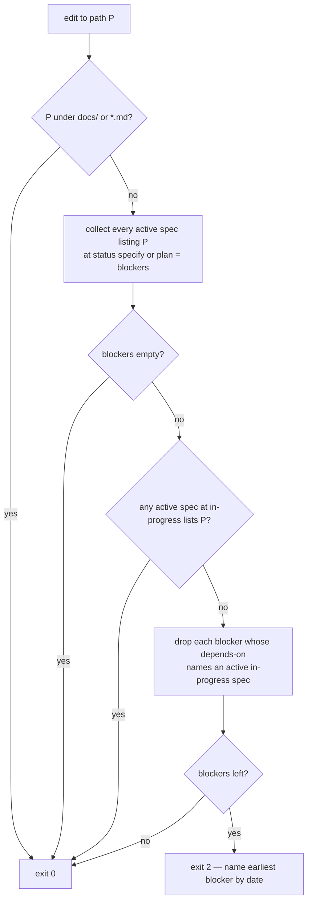

# IMP-20260826-spec-guard-and-validator-gaps
*Last updated: 2026-08-27*

## Summary
- **Goal:** Stop `spec-status-guard.sh` denying edits it has no legitimate claim to deny, and make the validator check the two fields it currently does not.
- **Scope:** Two allow conditions plus a collect-then-deny message in `spec-status-guard.sh`, with fixtures in `hooks.test.sh`; `affected-docs:` restored to `BUG-TEMPLATE.md`; `domain-refs` replacing `cites-reqs` in the validator's list-typed fields; a REQ-ID uniqueness check over `docs/domain/`.
- **Out of scope:** The Plan-gate inventory pre-check and the cross-cutting-spec lease model proposed in the same log entries.

## Current State
`improvements-log.md` records **eight** guard collisions in two days (2026-08-13 ×3, 2026-08-14 ×5). Three were `depends-on` deadlocks: a spec at `specify` blocked the very spec its own `depends-on:` named — a contradiction in the inventory, not a claim. All eight were resolved identically: the path commented out of the blocking spec's `affected-code` with a restoration note, so the workaround is now the pattern and each application leaves a debt item in Closure Evidence.

The guard denies on the first match. It never collects the other matching specs, never reads `depends-on:`, and never asks whether an `in-progress` spec already governs the path — although its own header comment already promises "spec in-progress" as an allow condition.

Two schema-conformance gaps found in the same sweep. `BUG-TEMPLATE.md` carries no `affected-docs:` while `_REQUIRED_FIELDS` in `validate-specs.py` requires it unconditionally, so a BUG spec starts invalid unless its author adds the field by hand — 8 of `tobevisit-content`'s 20 BUG specs did not, and fail `make validate-specs` today. CR, IMP and RES templates all carry it. `_LIST_FIELDS` still names `cites-reqs`, renamed to `domain-refs` on 2026-05-27 across templates, prompts, agents and docs — the field every spec now uses is type-checked nowhere. Nor is any inventory path checked against the form `spec-status-guard.sh` matches: the guard resolves paths from the project root that owns `docs/specs/active`, so a workspace-relative path silently leases nothing. Both forms are in use in this corpus.

## Proposed Improvement
The guard collects every matching blocker, then allows when either condition holds: an active spec at `in-progress` lists the path, or the blocker's `depends-on:` names an active spec at `in-progress`. The second is safe by construction — a spec with an unmet `depends-on:` cannot advance past `specify` ([Rule #10](../../../framework/spec-workflows/spec-lifecycle.md#depends-on-blocks-plan)), so it cannot hold a lease against the work it is waiting on. Otherwise deny, naming the earliest blocker by `date:`.

Measurable benefit: the eight logged collisions, replayed as fixtures, go from 8 denials to 1 — the eighth is recorded as a genuine sequencing conflict these rules deliberately do not clear (blocker at `specify`, no governing `in-progress` spec, no dependency), and still denies. Validator baselines: 8 of 20 BUG specs fail on a field their template never offered, target 0 for specs written after the fix; 0 of 22 `docs/domain/` files are checked for a REQ-ID collision today, target 22; 0 inventory paths are checked against the form the guard reads, although 2 of 24 archived `ai-dotfiles` specs write the workspace-relative form the guard cannot see (17 paths).

## Requirements
- FR-1: `spec-status-guard.sh` MUST evaluate every active spec before deciding, rather than exiting on the first `affected-code` match.
- FR-2: The guard MUST allow the edit when any active spec at `in-progress` lists the edited path in `affected-code`.
- FR-3: The guard MUST ignore a blocker whose `depends-on:` names an active spec at `in-progress`.
- FR-4: A denial MUST name the blocker with the earliest `date:` and state both allow conditions from FR-2 and FR-3.
- FR-5: `framework/hooks/README.md` MUST state the guard's allow conditions as implemented, replacing the current "spec in-progress" shorthand.
- FR-6: `BUG-TEMPLATE.md` MUST carry `affected-docs:` in its front-matter, positioned as in `CR-TEMPLATE.md`.
- FR-7: `validate-specs.py` `_LIST_FIELDS` MUST name `domain-refs` and MUST NOT name `cites-reqs`.
- FR-8: `validate-specs.py` MUST report a REQ-ID that appears as a definition more than once within one `docs/domain/` baseline file, naming file and ID.
- FR-9: `validate-specs.py` MUST report an `affected-code:` or `affected-docs:` path in an **active** spec that does not resolve from the spec's own project root, since `spec-status-guard.sh` matches paths in exactly that form and a path written any other way is a lease the guard cannot see. Archived specs are out of scope: the guard reads `docs/specs/active/` only, so their inventories are inert. *(Scope corrected after closure — see Closure Evidence.)*

## Acceptance Criteria
### AC-1: A dependent spec no longer blocks the spec it waits on (FR-1, FR-3)
Given spec B at `specify` lists `src/x.ts` in `affected-code` and its `depends-on:` names spec A
And spec A is active at `in-progress`
When the guard receives an edit to `src/x.ts`
Then it exits 0

### AC-2: A governing in-progress spec admits the edit (FR-1, FR-2)
Given spec B at `plan` lists `src/x.ts` and spec C at `in-progress` also lists `src/x.ts`
When the guard receives an edit to `src/x.ts`
Then it exits 0

### AC-3: A genuine collision still denies, naming the earliest blocker (FR-4)
Given two specs at `specify` dated 2026-08-01 and 2026-08-10 both list `src/x.ts`, and no active spec at `in-progress` lists it or is named by either `depends-on:`
When the guard receives an edit to `src/x.ts`
Then it exits 2 and stderr names the 2026-08-01 spec and both allow conditions

### AC-4: A BUG spec written from the template validates (FR-6)
Given a BUG spec created by copying `BUG-TEMPLATE.md` and filling its placeholders
When `make validate-specs` runs
Then no finding names a missing `affected-docs`

### AC-5: The renamed field is type-checked and baselines are checked for collisions (FR-7, FR-8)
Given a spec whose `domain-refs:` holds a bare string, and a `docs/domain/` file defining one REQ-ID twice
When `make validate-specs` runs
Then it reports both, and exits non-zero

### AC-6: An inventory the guard cannot read fails validation (FR-9)
Given a spec in `ai-dotfiles` listing `env/ai-dotfiles/framework/hooks/spec-status-guard.sh` — the workspace-relative form, which the guard resolves as `framework/hooks/spec-status-guard.sh`
When `make validate-specs` runs
Then it reports the path as unresolvable from the spec's project root, and exits non-zero

## Design

Nodes C, E and F are new; the rest is the guard as it stands. `docs/` and `*.md` short-circuit before any spec is read, unchanged.

## Out of Scope
- OS-1: Plan-gate inventory pre-check (proposed 2026-08-13) — it belongs to the Plan prompt, not the hook, and would land in the sibling procedures IMP.
- OS-2: A cross-cutting-spec lease model (proposed 2026-08-14) — needs a front-matter field this spec does not add.
- OS-3: Restoring the paths commented out of the eight blocking specs' inventories — those specs are archived; re-adding is a docs edit with no reader.
- OS-4: Ordering blockers by `risk`/`severity` (proposed 2026-08-13) — superseded by FR-2/FR-3, which resolve the recorded cases without a judgement call.

## Split Decision
`split-recommended` by **T1** — the guard cluster (FR-1…FR-5) and the schema-conformance cluster (FR-6…FR-9) are independently testable, share no AC, and touch disjoint files. No § 4 exception applies: E1 (no shared write path), E2 (no FR overlap), E3 (independent reverts), E4 (the second cluster is 4 FRs across 2 files), E5 (this spec ships code).

Recorded as an **override**: the human elected the four-spec shape at the Specify question round with both clusters named, which places them here. **P3 fired at Plan** — T1…T3 and T4…T7 are two zero-dependency groups — and the human confirmed the override at the plan gate (2026-08-27) rather than take the sibling stub `imp-validator-schema-conformance` (FR-6…FR-9). T8 closes every AC across both groups.

## Tasks

> **Before starting Task T1, set `status: in-progress` in the front-matter above.**

Plan-stage safety net (`splitting-rules.md § 3`): P1 clear (8 tasks ≤ 12); P2 clear (one repo, no bounded contexts); **P3 fires** — T1→T3 (guard) and T5→T7 (validator) share no dependency, and T4 stands alone. Table stands under the `## Split Decision` override confirmed at the plan gate; T8 closes every AC across both groups.

| # | Description | Files | Source files (read-only) | Depends on | Skills | Model | Status |
|---|---|---|---|---|---|---|---|
| T1 | Guard collects instead of short-circuiting (FR-1, FR-2, FR-4; AC-2, AC-3): walk every active spec, gather each `specify`/`plan` spec listing the edited path as a blocker, allow when any active `in-progress` spec lists it, otherwise exit 2 naming the earliest blocker by `date:` and stating both allow conditions. Path normalization (`(new)`, `/...`, trailing slash) and the `docs/`/`*.md` short-circuit are unchanged. Tests first. | `framework/hooks/spec-status-guard.sh`; `framework/scripts/test/hooks.test.sh` | `framework/spec-workflows/spec-lifecycle.md § Status transitions`; this spec § Design | — | test-driven-development | deep | ☑ done |
| T2 | Dependency deadlock cleared (FR-3; AC-1): drop each surviving blocker whose `depends-on:` names an active `in-progress` spec — safe because Rule #10 keeps a spec with an unmet `depends-on:` at `specify`. Replay all eight logged collisions (2026-08-13 ×3, 2026-08-14 ×5) as fixtures; assert 0 denials where the log records 8, and that AC-3's genuine collision still denies. | `framework/hooks/spec-status-guard.sh`; `framework/scripts/test/hooks.test.sh` | `docs/improvements-log.md` *(the eight entries)*; `framework/spec-workflows/spec-lifecycle.md#depends-on-blocks-plan` | T1 | test-driven-development | default | ☑ done |
| T3 | Hook contract states what it enforces (FR-5): replace the `spec-status-guard.sh` row's "spec in-progress" shorthand and the trailing Markdown/`docs/` note with the two allow conditions as implemented, plus the earliest-blocker denial. Bump `*Last updated:*`. | `framework/hooks/README.md` | `framework/hooks/spec-status-guard.sh` *(post-T2)* | T2 | writing-docs | fast | ☑ done |
| T4 | BUG template stops emitting invalid specs (FR-6; AC-4): add `affected-docs:` between `affected-repos:` and `affected-code:`, matching `CR-TEMPLATE.md`'s position and placeholder. Fixes new specs only — the 8 existing `tobevisit-content` BUG specs are that repo's repair. | `framework/spec-workflows/templates/BUG-TEMPLATE.md` | `framework/spec-workflows/templates/CR-TEMPLATE.md`; `scripts/validate-specs.py` *(`_REQUIRED_FIELDS`)* | — | writing-docs | fast | ☑ done |
| T5 | Validator gains a test harness, proven by the smallest fix (FR-7; AC-5 first half): new fixture-based `validate-specs.test.sh` in `hooks.test.sh`'s style — build a temp project under `$TMP`, invoke the validator's existing optional path argument against it, assert findings and exit code; wire into `make tests`. First assertion: `_LIST_FIELDS` names `domain-refs`, not `cites-reqs`, so a bare-string `domain-refs:` is reported. | `scripts/test/validate-specs.test.sh` *(new)*; `Makefile`; `scripts/validate-specs.py` | `framework/scripts/test/hooks.test.sh` *(fixture idiom)*; `scripts/validate-specs.py` `main()` *(path argument)* | — | test-driven-development | default | ☑ done |
| T6 | REQ-ID collisions surface (FR-8; closes AC-5): new corpus discovery over `docs/domain/*.md` plus a check registered alongside `check_agent_front_matter`, reporting file and ID. **A definition is the trailing `*(REQ-…)*` annotation on a requirement bullet** — not an inline citation, and not a retired/superseded annotation; the naive rule miscounts `place-search-and-link.md`'s retired halves. Absent `docs/domain/` is a no-op, as `ai-dotfiles` has none. | `scripts/validate-specs.py`; `scripts/test/validate-specs.test.sh` | `docs/req-id-lifecycle.md`; `docs/baseline-citations.md`; `../../src/github.com/tobeverse/tobevisit-content/docs/domain/` *(shape corpus)* | T5 | test-driven-development | deep | ☑ done |
| T7 | Inventories the guard can read (FR-9; AC-6): report an `affected-code:`/`affected-docs:` entry whose **first path segment does not exist under the spec's project root**, applying the guard's own normalization. Form, not staleness — an archived spec naming a since-deleted `framework/…` file stays clean, while `env/ai-dotfiles/…` is flagged. Repair the 17 workspace-relative paths in the two archived specs the check finds. | `scripts/validate-specs.py`; `scripts/test/validate-specs.test.sh`; `docs/specs/archived/IMP-20260617-rename-architecture-section-to-design.md`; `docs/specs/archived/IMP-20260820-figma-screenshot-durability-and-file-versioning.md` | `framework/hooks/spec-status-guard.sh` *(the matching form)* | T6 | test-driven-development | default | ☑ done |
| T8 | Closure (AC-1…AC-6): run `make check`, naming any pre-existing unrelated failure in Closure Evidence; record before/after for each baseline — 8 replayed collisions → 0 denials, `docs/domain/` files checked 0 → all, guard-invisible inventory paths 17 → 0; bump `*Last updated:*` on every modified file; log to `docs/improvements-log.md` that P3 was overridden and what the two-group table cost. | `docs/improvements-log.md`; this spec; all previously edited files *(stamp verify)* | HEAD after T7 | T3; T4; T7 | writing-specs | default | ☑ done |

## Closure Evidence
| AC | Evidence | Verdict |
|---|---|---|
| AC-1 | `hooks.test.sh` fixture `ac1`: spec B at `specify` leases `src/x.ts` with `depends-on: BUG-20260901-spec-a`, spec A active at `in-progress` and leasing nothing — guard exits 0. Paired negative: re-flipping A to `specify` restores the denial, so FR-3 is not a blanket pass. | met |
| AC-2 | `hooks.test.sh` fixture `ac2`: `IMP-20260805-blocker` at `plan` and `IMP-20260806-governing` at `in-progress` both lease `src/x.ts`; guard exits 0. The blocker sorts first, so the old first-match loop denied this — the assertion failed before the change. | met |
| AC-3 | `hooks.test.sh` fixture `ac3`: two `specify` specs dated 2026-08-01 / 2026-08-10 lease `src/x.ts`; guard exits 2, stderr names `IMP-20260801-early` and both allow conditions. **Added beyond the AC:** re-dating the alphabetically-first fixture past the other moves the blame to `IMP-20260810-late` — AC-3 as written cannot distinguish reading `date:` from glob order, since well-formed spec filenames sort in date order. | met |
| AC-4 | `validate-specs.test.sh` fills `BUG-TEMPLATE.md`'s placeholders and asserts no `required field 'affected-docs' missing`. Verified non-vacuous: the same corpus built from the pre-T4 template reports that finding at line 17. | met |
| AC-5 | `validate-specs.test.sh`: a bare-string `domain-refs:` is reported as `field 'domain-refs' must be a list` and exits 1; `cites-reqs` is no longer type-checked; a baseline defining `REQ-DEMO-001` twice is reported with file and ID. Citations and superseded annotations are proven not to count. Against the real `tobevisit-content` corpus: **15 collisions across 7 of 22 baselines.** | met |
| AC-6 | `validate-specs.test.sh`: `env/ai-dotfiles/framework/hooks/spec-status-guard.sh` in an active `ai-dotfiles` spec is reported as unresolvable and exits 1; annotated / elliptical / trailing-slash paths under an existing tree stay clean; an archived spec's inventory is not judged. The pre-closure run over `ai-dotfiles` surfaced 17 workspace-relative paths in 2 archived specs; 15 were rewritten to project-root form and the repair stands, though the shipped check no longer examines archived specs. | met |

**Benefit metrics (before → after).** Eight logged guard collisions replayed as fixtures: 8 denials → 1, the survivor being the occurrence the log itself records as a genuine sequencing conflict "the two proposed hook rules would not fix". `docs/domain/` files checked for REQ-ID collisions: 0 → all. Workspace-relative inventory paths repaired in `ai-dotfiles`: 15 (in archived specs, now out of the check's scope). Registered validator checks: 11 → 13.

**Post-closure correction (FR-9).** The version shipped at closure exempted a cross-repo entry by probing ancestor directories for the sibling repo — which passed here only because `tobevisit-content` sits next to `ai-dotfiles` in this workspace. CI checks out `ai-dotfiles` alone, the probe could not fire, and `make validate-specs` failed with the two cross-repo findings the exemption existed to suppress. The exemption is removed. The check now judges **active specs only**, which is what the guard reads: an archived spec's inventory leases nothing, so testing it for guard-visibility tests something that cannot matter, and cross-repo entries — which have no project-root-relative form — fall out of scope without any dependency on what is on disk. Verified against a copy of the repo with no sibling present: exit 0. Corrected in place rather than under a reopened spec or a new BUG spec; say the word if you want that paper trail instead.

**Corrections to this spec made during implementation.** Two baseline claims in the body were wrong and are now measured: the FR-8 rollout note asserted `tobevisit-content` was clean (it has 15 collisions), and the archived-corpus figure read "24 of 28" (the corpus is 24 archived specs, 2 of which used the workspace-relative form). The measurable-benefit line said 8 denials → 0; the log's eighth entry is explicitly not a false positive, so the target is 8 → 1.

`make check` → exit 0: `links-check` (140 files), `ai-install --check`, `validate-specs` (28 specs, 13 checks), `lint-rules`, `validate-anchors` (70 fragment links), and seven self-test suites including the new `validate-specs.test.sh`. No pre-existing unrelated failures.

Reviewer sub-step (`spec-lifecycle.md § Reviewer sub-step`) not run — recommended and non-blocking for `risk: medium`, and this session is configured not to spawn sub-agents unbidden. Available on request before the closure gate.

## Agent instructions
Per `<system>/boundaries.md` and `<system>/docs/agent-protocol.md`.

## Docs updates required
- `framework/hooks/README.md` — allow conditions per FR-5.
- `framework/spec-workflows/templates/BUG-TEMPLATE.md` — `affected-docs:` per FR-6.

## Rollout / migration notes
- The guard relaxes rather than tightens: no spec currently allowed becomes blocked, so no coordination is needed.
- FR-9 lands on a corpus that already disagrees with itself; expect findings in `ai-dotfiles` on the first run and repair them in the same task.
- FR-8 runs over `docs/domain/` in whichever project the validator is pointed at. `tobevisit-content` is **not** clean — a definition scan finds 15 collisions across 7 of its 22 baselines (e.g. `REQ-INGEST-018` claimed by two FRs in `place-ingestion.md`), so the check lands red there. Repairing them is that repo's work, outside `affected-repos`.
