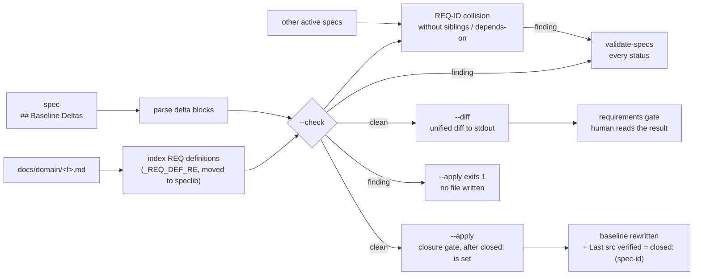

# IMP-20260914-baseline-deltas-and-merge

*Last updated: 2026-09-16*

<!-- Body over the 120-line budget: 10 FRs across format, tool and rule, which the Split Decision argues must ship
     together; the human kept FR-4/FR-5 in at the 2026-09-16 gate round. -->

## Summary

- **Goal:** Change a baseline by writing a delta against it and merging that delta at closure with a tool, so the
  description of the system as built is maintained by a command rather than by a rule.
- **Scope:** A `## Baseline Deltas` section (ADDED / MODIFIED / REMOVED / RENAMED keyed by REQ-ID); an explicit
  `baseline-impact: none` marker; scenarios on new or modified REQs; behaviour-only REQ text; `baseline-merge` with
  preflight, diff and apply; Rule 13 rewritten around it.
- **Out of scope:** Rewriting existing REQs; multi-repository baselines.

## Current State

**Re-verified 2026-09-16 (Rule 10 — `depends-on` closed; siblings touching `spec-lifecycle.md`, `validate-specs.py`
and `Makefile` closed after this spec's date).**

Rule 13 asks the closing agent to hand-edit `docs/domain/<feature>.md`. It works when followed —
`CR-20260831-geo-availability-flag` produced `REQ-GEO-CAN-020` – `REQ-GEO-CAN-023` with FR citations — and nothing
checks the body when it is not. ~~13 of 21 `tobevisit-content` baselines carry a stale verification date.~~
Superseded by `IMP-20260914-baseline-verification-freshness` (`check_baseline_freshness`, `closed:` field) and
`BUG-20260914-baseline-last-verified-stale` (rows bumped by hand): the validator reports no `baseline_stale` in
`tobevisit-content` today. It does report two pre-existing `domain_req_id_duplicate` findings
(`place-catalog-enrichment.md`, `REQ-PCE-004`, `REQ-PCE-017`) — a `--check` against that baseline must name them. The row is now enforced; the body it vouches for is still hand-maintained.

No step shows the human, at the requirements gate, how the baseline will read afterwards; a MODIFIED target that
does not exist is found at closure; two active specs rewriting one REQ collide only if they share a path in
`affected-code` (`check_active_spec_overlap`). REQs are one-line bullets whose trailing `*(REQ-…)*` annotation
defines the ID (`_REQ_DEF_RE` in `validate-specs.py`); amendments are already written in that annotation as
`; amended by <spec-id> — <why>` (`ai-provider-abstraction.md`, `REQ-AIP-004`). Of 21 baselines, 19 use IDs;
`admin-ui.md` and `place-image-aggregation.md` use none. Existing REQs mix behaviour with implementation
(`REQ-GEO-CAN-021` names `shared/domain/effective-review-status.ts`), so a refactor ages them without a behaviour
change. No REQ carries a scenario; `baseline-citations.md § Optional Verification Pointers` allows a
`*(Verified by: <test>)*` suffix. `scripts/speclib.py` is the shared read-only corpus reader. OpenSpec solves the
maintenance half with delta specs merged at archive (`tobevisit-docs/research/ai-framework-vs-openspec.md`).

## Proposed Improvement

Adopt the delta mechanic, keep the framework's richer baseline format (Why, header table, amendment trail).
Measurable benefit: `baseline_stale` stays at zero because `--apply` writes the row, not the closing agent; a REQ
collision between active specs is reported at `specify`, not at closure.

## Requirements

- FR-1: CR, IMP and BUG templates MUST carry `## Baseline Deltas`, one sub-heading per baseline file, with
  `ADDED`, `MODIFIED`, `REMOVED` and `RENAMED` blocks keyed by REQ-ID.
- FR-2: A MODIFIED block MUST carry the full replacement requirement; REMOVED MUST carry `Reason` and `Migration`;
  RENAMED MUST carry FROM and TO; ADDED MUST name the baseline heading it lands under, and its IDs MUST follow
  `req-id-lifecycle.md § Numbering`. In a baseline with no REQ-IDs, ADDED starts at `001` and MODIFIED / REMOVED /
  RENAMED are reported — an un-ID'd bullet is changed by hand at the spec's closure (FR-9).
- FR-3: A spec dated after closure MUST carry either `## Baseline Deltas` or front-matter
  `baseline-impact: none — <reason>`; the validator reports a spec with neither. A BUG that restores documented
  behaviour without changing a REQ's text uses the marker.
- FR-4: A new or modified REQ MUST carry at least one verification scenario (Given / When / Then, or a pointer to the
  test asserting it); unmodified REQs are not required to.
- FR-5: REQ text in a delta MUST state externally observable behaviour; file paths and symbol names belong in the
  baseline header's `Source files read` or the module map — authoring guidance and a reviewer Contract check, since
  the validator cannot judge it.
- FR-6: `baseline-merge --check` MUST report a MODIFIED / REMOVED / RENAMED target absent from the baseline, an ADDED
  ID already present, and two active specs naming one REQ-ID with no `siblings:` / `depends-on:` between them; the
  validator runs it at every status.
- FR-7: `baseline-merge --diff <spec>` MUST print, per baseline, the unified diff the merge would produce.
- FR-8: `baseline-merge --apply <spec>` MUST write the deltas, add `amended by <spec-id>` to each touched REQ's
  annotation in the corpus's existing form, set `Last src verified` to the spec's `closed:` date with the spec ID, and
  write nothing when `--check` fails.
- FR-9: Rule 13 MUST require `--apply` at the closure gate for every change a delta can express; a spec's closure
  edits by hand only what no delta can address (an un-numbered entry, a duplicated ID), citing it in Closure Evidence.
  A baseline body is never edited outside a spec — the Direct lane keeps excluding it.
- FR-10: Archived specs MUST NOT be rewritten; the checks judge only specs dated after closure.

## Acceptance Criteria

### AC-1: A delta round-trips into the baseline (FR-1, FR-2, FR-8)

Given a fixture baseline with REQ-X-001 – REQ-X-003 and a spec that ADDs REQ-X-004, MODIFIES REQ-X-002 and REMOVES
REQ-X-003 with reason and migration
When `baseline-merge --apply` runs on the spec at `closed: 2026-10-01`
Then the baseline holds REQ-X-001, the new REQ-X-002 text with its amendment marker, REQ-X-004, a removal tombstone
per `req-id-lifecycle.md § Deletion`, and `Last src verified | 2026-10-01 (<spec-id>)`
Evidence: `baseline-merge.test.sh` golden file

### AC-2: Bad deltas are refused before anything is written (FR-6, FR-8)

Given a spec MODIFYING REQ-X-009, which does not exist, and a second active spec modifying REQ-X-002 unrelated to a
first
When `--check` runs, then `--apply`
Then `--check` reports both conditions and `--apply` exits non-zero leaving the baseline byte-identical
Evidence: `baseline-merge.test.sh`

### AC-3: The gate can see the result (FR-7)

Given the AC-1 spec
When `baseline-merge --diff` runs
Then it prints a unified diff for that baseline and writes no file
Evidence: `baseline-merge.test.sh` snapshot

### AC-4: Every new spec states its baseline impact (FR-3, FR-4, FR-10)

Given one post-cut-off fixture with neither deltas nor marker, one whose ADDED REQ has no scenario, and the live
archived corpora
When the validator runs
Then the two fixtures produce one finding each and the archived corpora produce none from these checks
Evidence: `validate-specs.test.sh` + `make validate-specs` in both corpora

### AC-5: A real spec closes through the tool (FR-5, FR-9)

Given the first `tobevisit-content` CR, IMP or BUG opened after this IMP reaches `plan`
When it closes
Then its baseline changes arrive through `--apply`, and its reviewer `Review` row records the Contract check on
behaviour-only REQ text
Evidence: the pilot spec's Closure Evidence, cited here at closure

## Design

The data flow after this IMP, from the author's spec to the baseline file, as `baseline-merge` walks one project root.



The delta block an author writes, one `###` per baseline file.

```markdown
## Baseline Deltas

### docs/domain/geo-canonicalization.md

#### ADDED
- Under `### Review status on the canonical layer (CR-20260831)`:
  - **MUST** <behaviour>. *(REQ-GEO-CAN-024)*
    - Scenario: Given <state> When <action> Then <observable result>

#### MODIFIED
- REQ-GEO-CAN-022 — Why: <one line>
  - **MUST** <full replacement text>. *(REQ-GEO-CAN-022)*
    - Verified by: `<test path>`

#### REMOVED
- REQ-GEO-CAN-011 — Reason: <why> — Migration: <what replaces it>

#### RENAMED
- FROM REQ-GEO-CAN-005 TO REQ-GEO-CAN-025 — Why: <one line>
```

How `--apply` writes each block into the baseline's existing grammar.

| Block | Written to the baseline |
|---|---|
| ADDED | Bullet appended to the named heading's list; ID checked against `max(existing) + 1` |
| MODIFIED | Defining bullet and its nested scenario lines replaced; annotation becomes `*(ID<trail>; amended by <spec-id> — <why>)*`, where `<trail>` is the replacement's own text after the ID or, when it has none, the baseline's |
| REMOVED | `- ~~ID~~ deleted — Why: <Reason>. Migration: <Migration>.` (`req-id-lifecycle.md § Deletion`) |
| RENAMED | `- ~~FROM~~ superseded by TO — Why: …` in place; TO takes FROM's text (`§ Supersession`) |
| Header | `Last src verified` → `<closed:> (<spec-id>)`; `*Last updated:*` → `<closed:>` |

The cut-off for FR-3 / FR-4 / FR-10 is pinned to the date the checks land (T11), not to this IMP's `closed:`: closure
waits on the AC-5 pilot, and a cut-off at closure would leave the pilot itself unjudged.

## Out of Scope

- OS-1: Rewriting existing REQs into behaviour-only form, or back-filling scenarios — candidate consolidation IMPs
  per baseline.
- OS-2: Parsing prose FRs into deltas automatically.
- OS-3: Baselines shared across repositories.
- OS-4: Adopting OpenSpec's four-file change folder — the one-file spec is kept (audit § 6).

## Open Questions

- Q1: Does a BUG that restores documented behaviour need a delta, or always `baseline-impact: none`?
  **Resolved (2026-09-16):** marker when no REQ's text changes; a delta when the BUG corrects the REQ itself — per
  owner, folded into FR-3.
- Q2: Pilot spec for AC-5 — the next `tobevisit-content` CR, or a chosen one?
  **Resolved (2026-09-16):** the next CR or IMP opened there after this IMP reaches `plan` — per owner, as AC-5 reads.
  **Amended (2026-09-16):** a BUG counts too — FR-3 already binds BUGs; per owner, AC-5 widened.
- Q3: Should `--apply` run as the last task of Plan's table, or as a closure-gate action outside the table?
  **Resolved (2026-09-16):** closure-gate action — `closed:`, which FR-8 writes, exists only at the gate; per owner,
  folded into FR-9.
- Q4: A baseline with no REQ-IDs (`admin-ui.md`, `place-image-aggregation.md`) cannot be targeted by MODIFIED /
  REMOVED. **Resolved (2026-09-16):** ADDED introduces IDs from `001`; changing an un-ID'd bullet goes through the
  Direct lane until a consolidation IMP numbers that baseline (OS-1) — per owner, folded into FR-2. **Amended
  (2026-09-16):** the Direct lane excludes baseline bodies (`spec-lifecycle.md § Direct lane`), so an un-ID'd bullet is
  instead edited by hand at the closure of the spec changing it — per owner, folded into FR-2 and FR-9.

## Split Decision

**Specify (2026-09-14) — human decision needed at the gate.** Three clusters: C1 format (FR-1 – FR-3, FR-10), C2
authoring rules (FR-4, FR-5), C3 tool + rule (FR-6 – FR-9). C1 and C3 are not independently testable — the tool has
nothing to parse without the format, and the format without the tool is Rule 13 as it is today — so T1 does not fire
between them. T1 fires for C2, which verifies on templates and guidance alone. Recommendation: keep C2 in — its
scenarios and behaviour-only text live inside the delta blocks C1 defines, so a split leaves C2 describing a section
that does not yet exist (E2 by reference). T3 fires on `affected-repos` by the letter; the only `tobevisit-content`
change is the AC-5 pilot.

**Keep-as-one — elected by the human (2026-09-16).**

**Re-check at Visualize (2026-09-16): unchanged.** File surface: 6 code (`baseline-merge.py`, its test, `speclib.py`,
`validate-specs.py`, its test, `Makefile`) and 8 docs, all in ai-dotfiles. The REQ parser moving to `speclib.py` joins
C1's validator check and C3's tool on one grammar, which strengthens the C1–C3 coupling. T2 `unknown` (no module map
for ai-dotfiles); T4–T6 do not fire. Plan safety net: P1 is borderline (~12 tasks estimated); if it fires, C2 splits
out.

**Plan (2026-09-16): P1 does not fire (12 tasks).** P2 `unknown` (no module map); P3 does not fire — the chain is
linear from T1, and T12 waits on the pilot, an external spec, not on a separate task group.

## Tasks

> **Before starting Task T1, set status: in-progress in the front-matter above.**

| # | Description | Files | Source files (read-only) | Depends on | Skills | Model | Status |
|---|---|---|---|---|---|---|---|
| T1 | Refactor: move the REQ grammar out of `validate-specs.py` into `speclib.py` — `_REQ_DEF_RE`, `_REQ_HISTORY_RE`, and a baseline index (REQ-ID → defining line span incl. nested lines, owning heading, max ID); `check_domain_req_ids` reads it; existing suite green, no behaviour change (prepares FR-6, FR-8) | `scripts/speclib.py`, `scripts/validate-specs.py`, `scripts/test/baseline-merge.test.sh` *(new)* | `../../src/github.com/tobeverse/tobevisit-content/docs/domain/geo-canonicalization.md`, `../../src/github.com/tobeverse/tobevisit-content/docs/domain/ai-provider-abstraction.md` | — | test-driven-development | default | ☑ done |
| T2 | Test-first: delta parser in `speclib.py` — `## Baseline Deltas` → per-baseline ADDED (heading + bullets with nested lines) / MODIFIED (ID, Why, replacement) / REMOVED (ID, Reason, Migration) / RENAMED (FROM, TO, Why); malformed-block findings for each missing part (FR-1, FR-2) | `scripts/speclib.py`, `scripts/test/baseline-merge.test.sh` | — | T1 | test-driven-development | deep | ☑ done |
| T3 | Test-first: `baseline-merge.py --check <spec>` and `--check` over all active specs — absent MODIFIED / REMOVED / RENAMED target, ADDED ID present or not `max + 1`, missing baseline file, un-ID'd baseline rules, REQ-ID named by two active specs with no `siblings:` / `depends-on:`; check logic in `speclib.py` for T6 to reuse; `Makefile` `tests` + help entry (FR-2, FR-6; AC-2 check half) | `scripts/baseline-merge.py` *(new)*, `scripts/speclib.py`, `scripts/validate-specs.py` (`_spec_id` / `_declared_relations` moved to speclib), `scripts/test/baseline-merge.test.sh`, `Makefile` (`baseline-check`) | — | T2 | test-driven-development | deep | ☑ done |
| T4 | Test-first: merge renderer + `--apply <spec>` — pure `(baseline text, deltas, spec-id, closed) → text` per the Design table (ADDED append, MODIFIED replace + `amended by` annotation, REMOVED / RENAMED tombstones, `Last src verified` + `Last updated` rows); refuses without `closed:` or on any `--check` finding, baseline byte-identical; AC-1 golden file (FR-8; AC-1, AC-2 apply half) | `scripts/baseline-merge.py`, `scripts/speclib.py` (index keeps heading lines), `scripts/test/baseline-merge.test.sh` | `docs/req-id-lifecycle.md` | T3 | test-driven-development | deep | ☑ done |
| T5 | Test-first: `--diff <spec>` — renderer output against the file as a unified diff per baseline (`difflib`), no write, no `closed:` needed (placeholder date in the row); AC-3 snapshot (FR-7; AC-3) | `scripts/baseline-merge.py`, `scripts/test/baseline-merge.test.sh` | — | T4 | test-driven-development | default | ☑ done |
| T6 | Test-first: validator — `baseline-impact:` in the front-matter schema; `check_baseline_deltas` runs the T3 check at every status; `baseline_impact_missing` (neither section nor marker) and `baseline_delta_scenario_missing` (ADDED / MODIFIED REQ with no `Scenario:` or `Verified by:`) for specs at `plan` or later dated after `_DELTA_CUTOFF` (exclusive); archived specs' deltas never re-checked (FR-3, FR-4, FR-6, FR-10; AC-4 fixture half) | `scripts/validate-specs.py`, `scripts/test/validate-specs.test.sh` | `scripts/speclib.py` | T5 | test-driven-development | default | ☑ done |
| T7 | Templates: CR / IMP / BUG gain `## Baseline Deltas` with the four-block skeleton as a comment, and the `baseline-impact: none — <reason>` alternative in front-matter, incl. the BUG-restores-behaviour case (FR-1, FR-3, FR-4, FR-5) | `framework/spec-workflows/templates/CR-TEMPLATE.md`, `framework/spec-workflows/templates/IMP-TEMPLATE.md`, `framework/spec-workflows/templates/BUG-TEMPLATE.md`, `scripts/speclib.py` (HTML comments in the section are guidance), `scripts/test/baseline-merge.test.sh`, `scripts/test/validate-specs.test.sh` | `framework/spec-workflows/templates/RES-TEMPLATE.md` | T6 | writing-specs, writing-docs | fast | ☑ done |
| T8 | Docs: `spec-lifecycle.md` — schema `baseline-impact:`; Rule 13 names the tool and `--apply` at the closure gate **alongside** its prose form (rollout); `baseline_impact_missing` / `baseline_delta_*` as enforcement; rule map entries for new rule sentences (FR-3, FR-6, FR-9 staged) | `framework/spec-workflows/spec-lifecycle.md`, `docs/rule-canonical-map.md` | `scripts/lint-rules.py` | T7 | writing-docs | default | ☑ done |
| T9 | Docs: `req-id-lifecycle.md` (amendment annotation form, RENAMED = supersession, `001` in un-ID'd baselines); `baseline-citations.md` (scenarios on new / modified REQs, behaviour-only text, `Verified by:` counts as a scenario pointer) (FR-2, FR-4, FR-5) | `docs/req-id-lifecycle.md`, `docs/baseline-citations.md` | — | T8 | writing-docs | default | ☑ done |
| T10 | Docs: authoring — `authoring-steps.md § A` and `docs/writing-specs.md` (how to write a delta, when the marker); `create-spec.prompt.md` runs `--diff` into the requirements-gate summary; `reviewing-changes` Contract item checks behaviour-only REQ text in deltas (FR-3, FR-5, FR-7) | `framework/skills/writing-specs/references/authoring-steps.md`, `docs/writing-specs.md`, `framework/prompts/create-spec.prompt.md`, `framework/skills/reviewing-changes/SKILL.md`, `docs/spec-templates-guide.md` (§ Baseline Deltas — format, commands, merge table) | — | T9 | writing-specs, writing-docs | default | ☑ done |
| T11 | Verification: `baseline-merge --check` and `make validate-specs` in ai-dotfiles and `tobevisit-content` — 0 new findings, archived corpora silent (AC-4 live half); pin `_DELTA_CUTOFF` to this date; `make lint-rules`, `make check` green; improvements-log entry (FR-10; AC-4) | `scripts/validate-specs.py`, `docs/improvements-log.md` | `../../src/github.com/tobeverse/tobevisit-content/docs/specs/` | T10 | test-driven-development | fast | ☑ done |
| T12 | Pilot + rule flip + closure: once the first `tobevisit-content` CR / IMP / BUG opened after `plan` closes through `--apply` with a reviewer Contract row, cite its Closure Evidence (AC-5); flip Rule 13 to require `--apply`, closure hand-edits only what no delta can address (FR-9 as amended); mandatory reviewer sub-step (`risk: high`); `closed:`, Closure Evidence (FR-5, FR-9; AC-5) | `framework/spec-workflows/spec-lifecycle.md`, `docs/rule-canonical-map.md`, `docs/improvements-log.md` | `../../src/github.com/tobeverse/tobevisit-content/docs/specs/archived/` | T11 | writing-specs, writing-docs | default | ☑ done |

## Closure Evidence

All twelve tasks done; closed 2026-09-16, synchronous gate (`risk: high`), review waived by the owner (below).
No process was left running.

| AC | Evidence |
| --- | --- |
| AC-1 | `scripts/test/baseline-merge.test.sh` — "AC-1 the baseline matches the golden file": a fixture baseline with REQ-X-001 – 003 and a spec ADDING 004, MODIFYING 002, REMOVING 003 merges at `closed: 2026-10-01` into the inline golden text (amendment marker, `~~REQ-X-003~~ deleted` tombstone, `Last src verified \| 2026-10-01 (IMP-20261001-ac1)`); the merged file then validates with no `domain_req_id_duplicate`. Suite green in `make tests`. |
| AC-2 | Same suite: `--check` reports `baseline_delta_target_missing` for REQ-X-009 and `baseline_delta_collision` on both unrelated specs changing REQ-X-002; `--apply` on the failing spec exits 1 with the findings and `cmp` finds the baseline byte-identical; a spec without `closed:` is refused the same way. |
| AC-3 | Same suite: "AC-3 --diff prints the snapshot unified diff" matches the literal hunk and `cmp` shows no file written. On a live spec, `BUG-20260916-seed-defaults-diverge-from-schema`'s requirements gate carried the `--diff` output. |
| AC-4 | `scripts/test/validate-specs.test.sh` T6 block: a post-cut-off spec at `plan` with neither deltas nor marker → one `baseline_impact_missing`; an ADDED REQ with no scenario → one `baseline_delta_scenario_missing`; a reasonless marker → `baseline_impact_malformed`; pre-cut-off, cut-off-day and `specify` specs silent; an archived spec's merged delta not re-checked. Live corpora on 2026-09-16: ai-dotfiles `OK (47 spec(s); 22 check(s))`; `tobevisit-content` and `tobevisit-web` report no `baseline_*` finding and `baseline-merge --check` OK; their other findings are pre-existing and unchanged against the HEAD validator. |
| AC-5 | `tobevisit-content` `docs/specs/archived/BUG-20260916-seed-defaults-diverge-from-schema.md` § Closure Evidence AC-3: `--check` OK, `--apply` → `applied 1 baseline(s)`, the applied change to `pipeline-init.md` byte-identical to `--diff`, no hand edit. Its `### Review` records the Contract check on behaviour-only REQ text — PASS, run inline by the implementing agent rather than cold. Rule 13 now requires `--apply` (`spec-lifecycle.md § Rules #13`, R30 second phrase). |

### Review

RESULT: WAIVED — by alexvolsh 2026-09-16: the owner chose the waiver when the gate offered a cold `reviewer` run over the uncommitted working tree of ai-dotfiles and tobevisit-content. No reviewer run.

The gate request presented the waiver as an option beside the run, which `spec-lifecycle.md § Reviewer sub-step`
says the agent must not do — it should have emitted the hand-off prompt and recorded a waiver only if given unprompted.
Logged in `docs/improvements-log.md`.

## Agent instructions

Per `<system>/boundaries.md` and `<system>/docs/agent-protocol.md`. Changes spec templates and workflow definitions
— `boundaries.md § Ask first #3` applies at every gate.

## Docs updates required

- `framework/spec-workflows/spec-lifecycle.md` — schema (`baseline-impact:`), Rule 13, closure transition.
- Three templates — `## Baseline Deltas`.
- `docs/baseline-citations.md`, `docs/req-id-lifecycle.md` — delta semantics, amendment markers, scenarios.
- `authoring-steps.md § A`, `docs/writing-specs.md` — how to write a delta and when to use the marker.

## Rollout / migration notes

- Ships after `IMP-20260914-baseline-verification-freshness` (declares `closed:`, which FR-8 writes from) — done
  2026-09-16.
- The rule flip (FR-9) lands only after AC-5's pilot closes through the tool; until then Rule 13 keeps its prose form
  alongside the tool. **Landed 2026-09-16** after `BUG-20260916-seed-defaults-diverge-from-schema` closed through
  `--apply`; specs dated on or before the cut-off and still open may close under the old hand-edit form.
