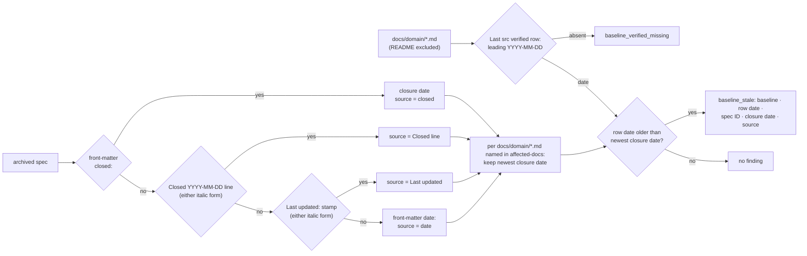
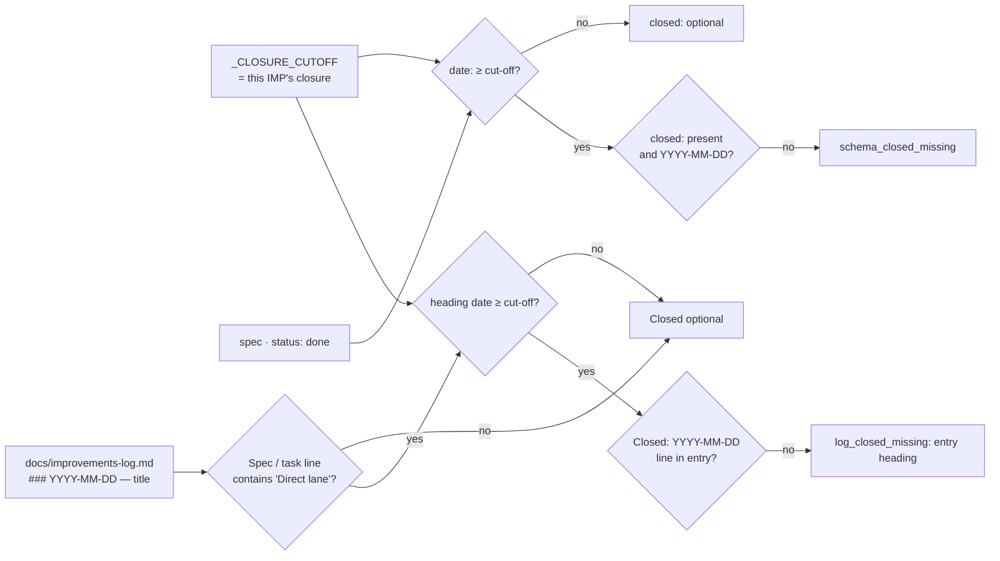

# IMP-20260914-baseline-verification-freshness

*Last updated: 2026-09-16*

## Summary

- **Goal:** Make the `Last src verified` obligation of Rule 13 mechanically checked, so a closing spec cannot update
  a baseline's body and leave its verification date behind.
- **Scope:** A validator check comparing each baseline's `Last src verified` date with the closure date of the
  newest archived spec naming it; a declared `closed:` front-matter field so that date is read, not inferred; the
  same closure field on Direct-lane improvements-log entries, so every closed unit of work carries one.
- **Out of scope:** Repairing the current drift — `tobevisit-content` `BUG-20260914-baseline-last-verified-stale`.

## Current State

Rule 13 requires the bump at closure. In `tobevisit-content` **13 of 21** baselines carried a date older than the
newest archived spec that lists them in `affected-docs` (comparison run 2026-09-14); the BUG repaired them — re-run
2026-09-16: 0 stale, 0 without a row. The project's
`verify-baselines.sh` checks the row exists; of `docs/domain/`, `validate-specs.py` checks only duplicate REQ-IDs
(re-verified 2026-09-16 after `IMP-20260914-spec-traceability-checks` and `…-mandatory-review-for-high-risk` closed
over the same file — both add spec-body checks, neither reads baselines or the log). Closure dates have
no field: the comparison had to fall back from a `*Closed*` body line to the `*Last updated:*` stamp, which can
postdate closure — so today the check could only be written as a heuristic.

## Proposed Improvement

Record closure as data, then compare. Measurable benefit: stale-baseline count is reported by `make validate-specs`
in any project with `docs/domain/`, and stays at zero after the BUG closes.

## Requirements

- FR-1: The front-matter schema MUST gain `closed: YYYY-MM-DD`, required at `status: done` for specs dated after this
  IMP's closure and optional before it.
- FR-2: For each baseline under the project's `docs/domain/`, the validator MUST report a `Last src verified` date
  older than the closure date of the newest archived spec listing that baseline in `affected-docs`.
- FR-3: Where a spec has no `closed:`, the check MUST fall back to its `Closed YYYY-MM-DD` line, then to its
  `Last updated:` stamp (either italic form), then to front-matter `date:`, and name the fallback used in the finding.
- FR-4: A finding MUST name the baseline, its row date, the spec ID and the closure date.
- FR-5: A baseline with no `Last src verified` row MUST be reported.
- FR-6: The check MUST be a no-op in a corpus without `docs/domain/`.
- FR-7: Rule 13 MUST name the check as its enforcement instead of restating the obligation, and the Direct-lane
  eligibility MUST state that a baseline body under `docs/domain/` is excluded, not only its schema.
- FR-8: The improvements-log entry template MUST gain a `- **Closed:** YYYY-MM-DD` line, required on Direct-lane
  entries dated after this IMP's closure and optional before it and on entries of any other kind.
- FR-9: The validator MUST report a post-cut-off Direct-lane entry in the project's `docs/improvements-log.md`
  without a `Closed` line, naming the entry heading; a project without that file is a no-op.

## Acceptance Criteria

### AC-1: A stale baseline is reported with its cause (FR-2, FR-4)

Given a fixture project with a baseline verified 2026-08-01 and an archived spec with `closed: 2026-08-10` naming it
When the validator runs on the project
Then one finding names the baseline, 2026-08-01, the spec ID and 2026-08-10; bumping the row clears it
Evidence: `validate-specs.test.sh` fixture

### AC-2: Closure date is read in declared order (FR-1, FR-3)

Given four archived specs — one with `closed:`, one with only a `Closed` line, one with only `_Last updated:_`, one
with only `date:`
When the validator runs
Then each finding names the source of the date it used, and a post-cut-off `done` spec without `closed:` is reported
Evidence: `validate-specs.test.sh` fixtures

### AC-3: Missing row and absent corpus (FR-5, FR-6)

Given a baseline with no `Last src verified` row, and separately a corpus with no `docs/domain/`
When the validator runs
Then the first produces one finding and the second none
Evidence: `validate-specs.test.sh` fixtures

### AC-4: The live corpus is green after the repair (FR-2, FR-7)

Given `tobevisit-content` after `BUG-20260914-baseline-last-verified-stale` closes
When `make validate-specs` runs there
Then no `baseline_stale` finding is raised, and Rule 13 links the check
Evidence: command output + `spec-lifecycle.md` diff

### AC-5: Direct-lane log entries carry a closure date (FR-8, FR-9)

Given a fixture log with a post-cut-off Direct-lane entry without `Closed`, one with it, a pre-cut-off Direct-lane
entry without it, and a post-cut-off `ad-hoc` entry without it
When the validator runs
Then exactly one finding is raised, naming the first entry's heading; adding its `Closed` line clears it
Evidence: `validate-specs.test.sh` fixtures + `improvements-log-format.md` diff

## Design

Closure-date resolution and the baseline comparison, as the validator walks one project's corpus
(`check_baseline_freshness(root, specs)`, a root-level check beside `check_domain_req_ids`).

The two closure-field obligations and the single cut-off they share, pinned as `_CLOSURE_CUTOFF` to this IMP's closure
date (same pattern as `_TRACEABILITY_CUTOFF`, `_REVIEW_CUTOFF`).

Findings and where they surface:

| Check class | Source | Anchored at | FR |
|---|---|---|---|
| `baseline_stale` | `docs/domain/<b>.md` | `Last src verified` row | FR-2, FR-3, FR-4 |
| `baseline_verified_missing` | `docs/domain/<b>.md` | line 1 | FR-5 |
| `schema_closed_missing` | spec front-matter | front-matter end | FR-1 |
| `log_closed_missing` | `docs/improvements-log.md` | entry heading | FR-9 |

Decisions:

- Leading date only — the row's parenthetical (`2026-09-14 (coordinates: …)`) is prose and not parsed.
- Both emphasis forms (`*…*`, `_…_`) count for FR-3 fallbacks: the live corpus writes `_Last updated: …_`
  (`IMP-20260820-admin-review-surface`, which names `admin-ui.md`).
- Final fallback is front-matter `date:` — 14 archived specs in `tobevisit-content` carry no stamp at all; without it
  FR-3 has no defined result for them. Prototype on the live corpus (2026-09-16): 0 `baseline_stale`, 0 missing rows.
- Direct-lane entries are recognised by `Direct lane` anywhere on the `Spec / task` line — the corpus writes both
  `Direct lane (owner-approved …)` and `ad-hoc (Direct lane), …`.
- `make validate-specs` in `tobevisit-content` is red today on unrelated classes (`figma_frame_id`,
  `domain_req_id_duplicate`); AC-4 is judged on the absence of `baseline_stale`, not on exit code.

## Out of Scope

- OS-1: Checking that the baseline body matches source — only a person or an agent reading source can.
- OS-2: Verification scenarios per REQ — `IMP-20260914-baseline-deltas-and-merge`.
- OS-3: Back-filling `closed:` into archived specs — history is not rewritten; FR-3 covers them.
- OS-4: Feeding Direct-lane `Closed` dates into the FR-2 comparison — the lane cannot touch a baseline, so no entry
  is ever the newest change FR-2 looks for.
- OS-5: Back-filling `Closed` into existing log entries — past entries are never edited.

## Open Questions

- Q1: Should `closed:` also be required on the Direct-lane improvements-log entry format, for symmetry?
  **Resolved (2026-09-16):** yes, per owner — FR-8 adds the field, FR-9 checks it; it does not feed FR-2 (OS-4).

## Split Decision

**Specify (2026-09-14): kept as one — E4.** FR-1 (the field) is a ≤1-FR extension whose only consumer is FR-2; FR-5 is the same parse.
FR-8/FR-9 are the same closure field and the same cut-off applied to the other closure record — splitting them
would ship two cut-off dates for one rule.

**Re-check at Visualize (2026-09-16) — human decision needed at the gate.** With FR-8/FR-9 added, E4 no longer
holds for them (2 FRs, 3 files). T1 fires: the log field (FR-8, FR-9, AC-5) is testable without the baseline check,
and vice versa. File surface: 2 code (`validate-specs.py`, its test), 4 docs, all in ai-dotfiles. No E1–E5 exception
applies cleanly. Recommendation: keep as one by election — one `_CLOSURE_CUTOFF`, one field name, one test harness;
a split ships the cut-off twice. T2 `unknown`; T3 by the letter only (see above); T4–T6 do not fire.

**Specify gate (2026-09-16): keep-as-one — elected by the human.** Plan safety net: P1 (6 tasks), P2 (`unknown`, no
module map in ai-dotfiles), P3 (linear chain) do not fire.
T3 fires on `affected-repos` by the letter, but every changed file is in ai-dotfiles — `tobevisit-content` is
listed because its corpus is where AC-4 is observed, not where code changes. T2 `unknown`.

## Tasks

> **Before starting Task T1, set status: in-progress in the front-matter above.**

| # | Description | Files | Source files (read-only) | Depends on | Skills | Model | Status |
|---|---|---|---|---|---|---|---|
| T1 | Test-first: closure-date resolver (`closed:` → `Closed` line → `Last updated:` stamp, both italic forms → `date:`, returning date + source) and `check_baseline_freshness(root, specs)` — newest archived spec per `docs/domain/*.md` named in `affected-docs`, leading date of the `Last src verified` row, `baseline_stale` naming baseline · row date · spec ID · closure date · source, `baseline_verified_missing`, no-op without `docs/domain/`; registered in `main` beside `check_domain_req_ids` (FR-2 – FR-6; AC-1, AC-3, AC-2 fallback order) | `scripts/validate-specs.py`, `scripts/test/validate-specs.test.sh` | `../../src/github.com/tobeverse/tobevisit-content/docs/domain/admin-ui.md`, `../../src/github.com/tobeverse/tobevisit-content/docs/specs/archived/IMP-20260820-admin-review-surface.md` | — | test-driven-development | default | ☑ done |
| T2 | Test-first: `closed:` in the front-matter schema — `_CLOSURE_CUTOFF` (provisional, pinned in T6), malformed `closed:` reported, `schema_closed_missing` for a `done` spec dated on or after the cut-off; pre-cut-off `done` specs and non-`done` specs silent (FR-1; AC-2 cut-off half) | `scripts/validate-specs.py`, `scripts/test/validate-specs.test.sh` | — | T1 | test-driven-development | default | ☑ done |
| T3 | Test-first: `check_log_closed(root)` — split `docs/improvements-log.md` on `### YYYY-MM-DD — …` headings, Direct-lane entry = `Direct lane` on its `Spec / task` line, `log_closed_missing` naming the heading when dated on or after `_CLOSURE_CUTOFF` and no `- **Closed:** YYYY-MM-DD` line; no-op without the file; registered in `main` (FR-9; AC-5) | `scripts/validate-specs.py`, `scripts/test/validate-specs.test.sh` | `docs/improvements-log.md` | T2 | test-driven-development | default | ☑ done |
| T4 | Docs: `spec-lifecycle.md` — front-matter schema gains `closed:` and when it is required; Rule 13 names `baseline_stale` / `baseline_verified_missing` as its enforcement instead of restating the bump; § Direct lane eligibility excludes baseline bodies under `docs/domain/`; obligation 2 requires `Closed` on the log entry (FR-1, FR-7, FR-8) | `framework/spec-workflows/spec-lifecycle.md` | `docs/rule-canonical-map.md` | T3 | writing-docs | default | ☑ done |
| T5 | Docs: `improvements-log-format.md` entry template gains `- **Closed:** YYYY-MM-DD` with when it is required; `baseline-citations.md` — `Last src verified` row is checked, against the newest archived spec's closure date; `agent-protocol.md` post-task checklist — the baseline item names the row bump and the `closed:` field (FR-8, FR-7; AC-4 doc half) | `docs/improvements-log-format.md`, `docs/baseline-citations.md`, `docs/agent-protocol.md` | `framework/spec-workflows/spec-lifecycle.md` | T4 | writing-docs | fast | ☑ done |
| T6 | Verification + closure: finding counts before/after on ai-dotfiles and `tobevisit-content` (0 `baseline_stale`, 0 `baseline_verified_missing`, pre-existing findings unchanged — AC-4); pin `_CLOSURE_CUTOFF` to the closure date and set this spec's own `closed:`; `make lint-rules` / rule map for new rule sentences; improvements-log entry; `make check` green; reviewer sub-step (recommended at `risk: medium`) (FR-1, FR-2, FR-7; AC-4) | `scripts/validate-specs.py`, `docs/improvements-log.md`, `docs/rule-canonical-map.md` | `../../src/github.com/tobeverse/tobevisit-content/docs/specs/` | T5 | test-driven-development | fast | ☑ done |

## Closure Evidence

Closed 2026-09-16, synchronous gate (`risk: medium`). `_CLOSURE_CUTOFF = 2026-09-16`
(`scripts/validate-specs.py:219`); no spec in either corpus is dated on or after it, so FR-1 and FR-9 judge only
records written from here on.

| AC | Evidence |
|---|---|
| AC-1 | `validate-specs.test.sh:952`: baseline row `2026-08-01`, archived `IMP-20260805-demo` with `closed: 2026-08-10` → exactly one `docs/domain/demo.md:4:baseline_stale:` naming `2026-08-01`, the spec ID and `2026-08-10`; the row rewritten to `2026-08-10` → silent. Two closing specs → the newer (`2026-08-09`) is compared; an active spec naming the baseline is not a closure. Red before T1 (9 failures), green after. |
| AC-2 | `validate-specs.test.sh:985`: five specs, each the only closure for its baseline — `closed:` beside a later `Closed` line and stamp → `source: closed:`; `*Closed …*` beside a later stamp → `Closed line`; `_Closed …_` → `Closed line`; `_Last updated: …_` only → `Last updated stamp`; nothing but `date:` → `date:`. `:1033`: post-cut-off `done` without `closed:` → `schema_closed_missing`; with it, pre-cut-off, and at `specify` → silent; `closed: soon` → `schema_date_format`. Red before T2, green after. |
| AC-3 | `validate-specs.test.sh:1012`: baseline without the row → exactly one `norow.md:1:baseline_verified_missing:`; `README.md` under `docs/domain/` → silent. `:1027`: corpus with an archived spec naming a baseline but no `docs/domain/` → no `baseline_` finding. Red before T1, green after. |
| AC-4 | `tobevisit-content` HEAD: `validate-specs.py` before (`git show HEAD:`) and after produce byte-identical output — the 7 pre-existing findings (`domain_req_id_duplicate` ×2, `figma_frame_id` ×2, `link_broken`, `english_only`, `deps_dangling`), 0 `baseline_` / `log_closed_missing`. Could-fail proof: `git archive 9c21b94 docs` (before the BUG repair) → 13 `baseline_stale`, the Current State figure; a HEAD copy with `admin-ui.md` lowered to `2026-09-01` → one finding citing `BUG-20260914-baseline-last-verified-stale closed 2026-09-14 (source: Closed line)`. Rule 13 links the check: `spec-lifecycle.md:155` (§ Enforcement — `Last src verified`); `baseline-citations.md` § Current-state authority points there. |
| AC-5 | `validate-specs.test.sh:1050`: log with a post-cut-off Direct-lane entry lacking `Closed`, one with it (`ad-hoc (Direct lane)` form), a pre-cut-off one, a post-cut-off finding-only entry, and a fenced example → exactly one `docs/improvements-log.md:3:log_closed_missing:` naming the heading; `Closed` added → silent; no log file → silent. Format: `improvements-log-format.md` template + § `Closed`; `spec-lifecycle.md:349` (Direct lane obligation 2) and `:335` (baseline bodies excluded). Red before T3, green after. |
| Corpora | `make check` green (21 checks, was 19). ai-dotfiles 0 findings; `tobevisit-web` and workspace `docs/` 0 `baseline_` / `log_closed_missing`. |

### Review

RESULT: 4 findings / 3 applied / 1 rejected — run 2026-09-16 against the uncommitted working tree, sub-agent.

| # | Finding | Disposition |
|---|---|---|
| 1 | framework/spec-workflows/spec-lifecycle.md:150 → FR-7 violated: Rule 13 still restates the `Last src verified` bump in its obligation sentence; the Enforcement paragraph was added beside it rather than instead, and never names `closed:` — contract | applied — `spec-lifecycle.md:143` obligation sentence trimmed; `:155` Enforcement carries the bump and `closed:` |
| 2 | docs/specs/active/IMP-20260914-quality-gates-contract.md:5 → Scope violated: the working tree also carries edits to an unrelated spec, which a commit of the reviewed range would mix in — scope | rejected — changed by a concurrent session, not by this IMP; excluded from its commit |
| 3 | scripts/test/validate-specs.test.sh:1016 → AC-3 violated: the missing-row case asserts presence, not "one finding"; the `_Closed …_` italic form has no fixture — coverage | applied — `validate-specs.test.sh:1012` counts exactly one; `b5` fixture for `_Closed …_` |
| 4 | docs/improvements-log-format.md:38 → FR-8 violated: "Omit it on entries that record a finding" forbids what FR-8 makes optional — contract | applied — `improvements-log-format.md` § `Closed`: optional on any other entry |

Two cycles; cycle 2 returned `PASS` on the same working tree with the rejected file excluded.

## Agent instructions

Per `<system>/boundaries.md` and `<system>/docs/agent-protocol.md`.

## Docs updates required

- `framework/spec-workflows/spec-lifecycle.md` — schema gains `closed:`; Rule 13 names the check; § Direct lane
  eligibility names baseline bodies under `docs/domain/` as excluded.
- `docs/baseline-citations.md` — `Last src verified` row: checked, and against what.
- `docs/agent-protocol.md` — post-task checklist: the baseline item names the bump explicitly.
- `docs/improvements-log-format.md` — entry template gains `Closed`, with when it is required.
- `framework/spec-workflows/spec-lifecycle.md` § Direct lane obligation 2 — the log entry carries `Closed`.

## Rollout / migration notes

- Cross-repo order: `tobevisit-content` `BUG-20260914-baseline-last-verified-stale` closes first, otherwise
  AC-4 ships red. The dependency is stated here because `depends-on:` cannot resolve across corpora.
- Shares `scripts/validate-specs.py` with `IMP-20260914-mandatory-review-for-high-risk`; implement after it.
