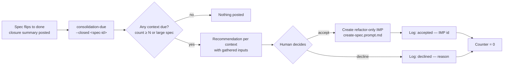
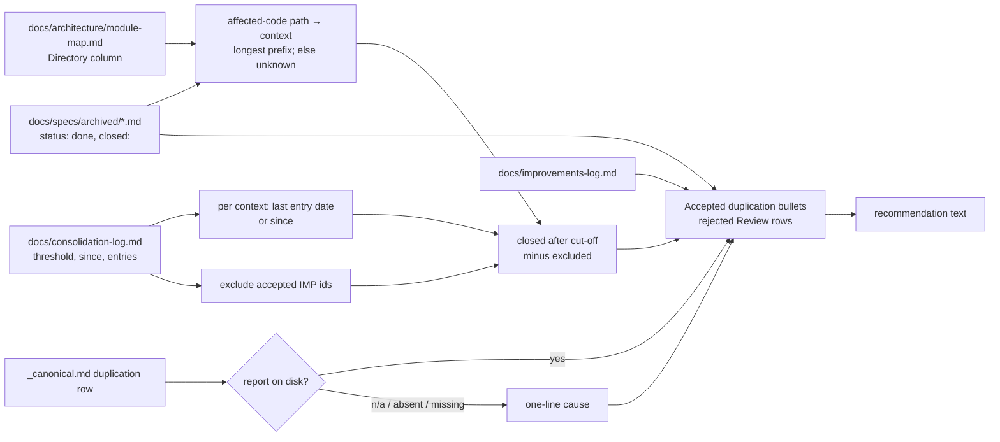
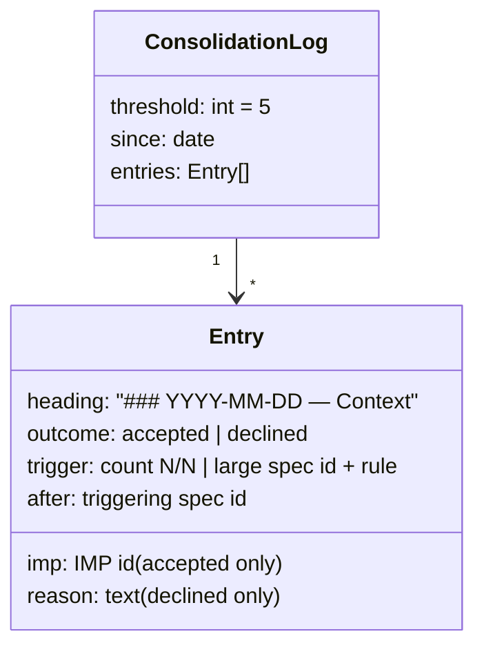

# IMP-20260914-consolidation-checkpoint

*Last updated: 2026-09-16*

## Summary

- **Goal:** Schedule the refactoring that "never mix refactoring and feature work" defers, by recommending a
  refactor-only IMP per bounded context after enough change has accumulated there or after one large change.
- **Scope:** A per-context counter, the trigger rules, the inputs a recommendation must gather, persistence of
  accepted-duplication decisions, and a recorded accept/decline outcome that resets the counter.
- **Out of scope:** Performing refactors automatically.

## Current State

`boundaries.md § Never do #5` pushes refactoring out of feature tasks and nothing brings it back: refactor IMPs arise
after defects (e.g. `IMP-20260813-unify-ai-batch-adapters`, `IMP-20260813-dedup-admin-run-gateways`, both in the
week of the 2026-08-13 BUG wave). `Always do #16` records "accepted duplication" decisions only in the Bottom Line,
which is chat — no later tool can read them. A global "every 5–10 specs" counter would fire 6–12 times in a month
like August 2026 (61 closures in `tobevisit-content`).

Re-verified 2026-09-16 at Plan against the four overlapping specs closed since 2026-09-14
(`machine-readable-spec-reports`, `quality-gates-contract`, `quality-gates-check`, `baseline-verification-freshness`):
the above still holds — `boundaries.md` #16 and `avoiding-duplication/SKILL.md` still send the decision to the Bottom
Line. They add what this IMP reads: `spec-status.py` already counts `## Tasks` rows, `validate-quality-gates.py`
already parses the `duplication` row and its report path.

## Proposed Improvement

Count where the debt accumulates — per bounded context — and make each recommendation carry its evidence.
Decided in chat on 2026-09-14: per-context counter plus a large-spec trigger. Measurable benefit: every context
receives a consolidation decision (accepted or declined with reason) at most N closures after its last one.

## Requirements

- FR-1: `consolidation-due` MUST count, per bounded context, archived specs closed since that context's last
  checkpoint, mapping a spec to contexts by its `affected-code` paths through the project's `module-map.md`.
- FR-2: A recommendation MUST fire when a context's count reaches N, or at the closure of any spec with
  `risk: high`, more than 8 tasks, or more than 15 `affected-code` entries.
- FR-9: N MUST default to 5 and MUST be overridable per project by `threshold:` in the front-matter of
  `docs/consolidation-log.md`; the same front-matter's `since:` date MUST bound counting for a context with no
  checkpoint yet (Q1, added 2026-09-16).
- FR-3: A recommendation MUST gather for the context: accepted-duplication decisions, reviewer findings rejected in
  `Review` rows, improvements-log entries naming it, and the context's figures from the report file named by the
  project's `duplication` row.
- FR-8: When the project's `duplication` row is `n/a`, absent, or its report file is missing, the recommendation MUST
  say so in one line naming the cause, instead of omitting the duplication input silently (added 2026-09-16).
- FR-4: An accepted-duplication decision under `Always do #16` MUST be recorded in the spec's Closure Evidence, not
  only in the Bottom Line.
- FR-5: The agent MUST post the recommendation after the triggering spec's closure summary and MUST NOT create the
  IMP without the human accepting it.
- FR-6: The outcome MUST be logged per context in the project's `docs/consolidation-log.md` — accepted with the new
  IMP ID, or declined with a reason — and either resets that context's counter (Q2, amended 2026-09-16).
- FR-10: A spec named as the accepted IMP of any log entry MUST NOT count toward any context's counter, nor fire the
  large-spec trigger (Q3, added 2026-09-16).
- FR-7: A recommended IMP MUST be refactor-only (`Never do #5`) and cite the gathered inputs in `## Current State`.

## Acceptance Criteria

### AC-1: The counter and triggers fire where they should (FR-1, FR-2)

Given a fixture project with a module map of two contexts, five closures touching context A and two touching B
When `consolidation-due` runs
Then A is due and B is not; adding one `risk: high` closure in B makes B due as well
Evidence: `consolidation-due.test.sh`

### AC-2: The recommendation carries its evidence (FR-3, FR-4)

Given context A's closures include one Closure Evidence accepted-duplication entry, one rejected reviewer finding
and one improvements-log entry naming A
When the recommendation for A is produced
Then all three appear with their source paths
Evidence: `consolidation-due.test.sh`

### AC-4: A missing duplication input is stated, not skipped (FR-3, FR-8)

Given three fixture projects — a `duplication` row with a report on disk, the same row with the file deleted, and an
`n/a — <reason>` row
When the recommendation for a due context is produced in each
Then the first carries that context's duplicated lines and clones, the second states the report is missing at its
path, the third states the `n/a` reason
Evidence: `consolidation-due.test.sh`

### AC-3: A decision resets the counter (FR-5, FR-6)

Given A is due
When a declined outcome with a reason is logged for A
Then `consolidation-due` reports A at count 0 and the reason is retrievable from the log
Evidence: `consolidation-due.test.sh`

### AC-5: Threshold override and the refactor IMP itself (FR-9, FR-10)

Given a fixture log with `threshold: 3`, context A with three closures, and an accepted entry for A naming
IMP-X, after which IMP-X closes touching A
When `consolidation-due` runs before and after IMP-X's closure
Then A is due at 3/3 before the entry, and at 0/3 after both the entry and IMP-X's closure
Evidence: `consolidation-due.test.sh`

## Design

Where the recommendation sits in the closure flow, from the agent's perspective (FR-2, FR-5, FR-6).

How `consolidation-due` derives a context's count and its recommendation inputs, from the script's perspective
(FR-1, FR-3, FR-8 – FR-10).

The checkpoint log's shape (FR-6, FR-9, FR-10); its authoring rules live in `docs/consolidation-log-format.md`.

Decisions the diagrams rest on:

- **Cut-off is a date, counted strictly after.** A closure on the checkpoint's own day is treated as before it; the
  triggering spec closes that day, so this is what resets it to 0.
- **Context names come from module-map's `Context` column**, bold stripped; the log heading and improvements-log
  matching use the same name, and improvements-log also matches on the context's directory.
- **Large-spec trigger fires for every context the spec maps to**, not only the largest.
- **Accepted duplication (FR-4)** is the existing `- **Accepted duplication:** …` bullet under `## Closure Evidence`
  (already used in `tobevisit-content`), codified rather than invented.
- **Duplication figures** filter the jscpd report's `duplicates[]` to pairs with either file under the context's
  directory, report paths resolved against the scan root the `duplication` row runs from; output is clone count and
  duplicated lines.
- **The script only reads.** Log entries are written by the agent after the human's answer; the script never
  appends (OS-2).

## Out of Scope

- OS-1: A global counter — declined 2026-09-14.
- OS-2: Automatic refactoring or auto-drafted IMPs without acceptance.
- OS-3: Contexts in repositories without `module-map.md` — reported as `unknown`, same as Split trigger T2.

## Open Questions

- Q1: Default N — 5, or derived from each context's closure rate? **Resolved (2026-09-16):** fixed 5, overridable
  per project — FR-9 added.
- Q2: Where the checkpoint log lives — tagged entries in `docs/improvements-log.md`, or a dedicated
  `docs/consolidation-log.md` per project? **Resolved (2026-09-16):** dedicated file — FR-6 amended; the
  improvements-log format is untouched.
- Q3: Does FR-7's IMP count toward the next checkpoint of the context it refactors? **Resolved (2026-09-16):** no —
  FR-10 added.

## Split Decision

**Kept as one — E2.** Two clusters appear — recording decisions (FR-4) and the checkpoint (FR-1 – FR-3, FR-5 – FR-7)
— but FR-4 exists only to feed FR-3 and shares its acceptance surface; split would be cosmetic. T2 `unknown` for
ai-dotfiles itself; T3–T6 do not fire.

**Re-checked after Visualize (2026-09-16) — still kept as one, E2.** File surface: one script, one test, `Makefile`,
three edited docs and one new format doc; FR-9 and FR-10 extend the same counter rather than open a cluster.

**Plan safety net (2026-09-16) — no signal fires.** Five tasks, none over five decisions; two repos, but
`tobevisit-content` receives one seeded file and no code.

## Tasks

> **Before starting Task T1, set status: in-progress in the front-matter above.**

| # | Description | Files | Source files (read-only) | Depends on | Skills | Model | Status |
|---|---|---|---|---|---|---|---|
| T1 | Counter, test-first: fixture projects built inline in the test (module map of two contexts, archived specs, a `consolidation-log.md`); script maps `affected-code` to contexts by longest `Directory` prefix (else `unknown`), counts closures strictly after the context's last entry or `since:`, reads `threshold:` (default 5), fires the large-spec trigger, excludes accepted IMP ids, prints per-context `count/N`, due flag and last outcome with its reason; `--json` like `spec-status`; hooked into `make tests` plus a `consolidation-due` target taking `PROJECT` (FR-1, FR-2, FR-6, FR-9, FR-10; AC-1, AC-3, AC-5) | `scripts/consolidation-due.py` *(new)*, `scripts/test/consolidation-due.test.sh` *(new)*, `Makefile`, `scripts/speclib.py` (`task_counts` moved here from `spec-status.py` so both read tasks one way), `scripts/spec-status.py` | `scripts/test/spec-status.test.sh`, `tobevisit-content/docs/architecture/module-map.md` | — | test-driven-development, avoiding-duplication | default | ☑ done |
| T2 | Recommendation inputs, test-first: `--recommend <context>` gathers `Accepted duplication` bullets from Closure Evidence, `rejected` rows from `### Review` whose path maps to the context, improvements-log entries naming the context or its directory — each with source `path:line` — and the jscpd figures (clones, duplicated lines) through the `duplication` row, or one line naming why they are absent (`n/a` reason, no row, report missing at path); output is ready to paste into an IMP's `## Current State` (FR-3, FR-7, FR-8; AC-2, AC-4) | `scripts/consolidation-due.py`, `scripts/test/consolidation-due.test.sh` | `scripts/validate-quality-gates.py`, `scripts/report-duplication.js`, `tobevisit-content/.duplication-report/jscpd-report.json` | T1 | test-driven-development, avoiding-duplication | default | ☑ done |
| T3 | Record accepted duplication where tools read it: new `docs/consolidation-log-format.md` (front-matter `threshold`/`since`, entry heading and fields from § Design, script only reads); `boundaries.md` #16 and `avoiding-duplication` send the decision to a `- **Accepted duplication:**` bullet under `## Closure Evidence` as well as the Bottom Line (FR-4, FR-6, FR-9) | `docs/consolidation-log-format.md` *(new)*, `framework/boundaries.md`, `framework/skills/avoiding-duplication/SKILL.md` | `docs/improvements-log-format.md`, `scripts/consolidation-due.py` | T1 | writing-docs, avoiding-duplication | fast | ☑ done |
| T4 | Closure sub-step: `spec-lifecycle.md` gains a Consolidation sub-step after closure (run `make consolidation-due`, post each due context's recommendation after the closure summary, never create the IMP unaccepted, append the log entry on either answer, recommended IMP refactor-only citing the inputs); `agent-protocol.md` post-task checklist and closure summary point at it (FR-5, FR-6, FR-7) | `framework/spec-workflows/spec-lifecycle.md`, `docs/agent-protocol.md` | `docs/consolidation-log-format.md`, `framework/boundaries.md` | T2, T3 | writing-specs, writing-docs | default | ☑ done |
| T5 | Seed `tobevisit-content`: `docs/consolidation-log.md` with `since: 2026-09-14` and no entries; run `make consolidation-due PROJECT=…` and `--recommend` for one context, recording both outputs as rollout evidence (Rollout) | `tobevisit-content/docs/consolidation-log.md` *(new)* | `docs/consolidation-log-format.md`, `scripts/consolidation-due.py` | T4 | writing-docs | fast | ☑ done |

## Agent instructions

Per `<system>/boundaries.md` and `<system>/docs/agent-protocol.md`.

## Docs updates required

- `framework/spec-workflows/spec-lifecycle.md` — consolidation sub-step after closure.
- `framework/skills/avoiding-duplication/SKILL.md` — where accepted duplication is recorded.
- `docs/agent-protocol.md` — post-task checklist and closure summary.
- `docs/consolidation-log-format.md` (new) — front-matter (`threshold`, `since`) and entry format.

## Rollout / migration notes

- Reads the duplication report through the project's `duplication` row: `tobevisit-content`
  (`IMP-20260914-duplicate-report-and-format-scope`, report at `.duplication-report/jscpd-report.json`) and
  `tobevisit-web` (`IMP-20260916-quality-gates-adoption`). Without one it runs and says so (FR-8); the row itself is
  enforced by `IMP-20260916-quality-gates-check`.
- First run on `tobevisit-content` counts from 2026-09-14, not from history, so it does not open with every context due:
  its `docs/consolidation-log.md` is seeded with `since: 2026-09-14` and no entries, in this IMP (kept in one spec
  per the cross-repo rule; decided 2026-09-16). Not listed in `affected-docs`: a path in another repository
  has no form that resolves from this project's root (`inventory_path_unresolvable`). A project without the file
  counts from this IMP's closure date (FR-9 default).

## Closure Evidence

| AC | Evidence |
|---|---|
| AC-1 | `scripts/test/consolidation-due.test.sh` (new, in `make tests`): red before the script existed (`can't open file … consolidation-due.py`); green after. Alpha 5/5 due, Beta 2/5 not due, then due on a `risk: high` closure; >15 `affected-code` entries and >8 tasks each fire; a closure before `since:` is ignored; an unmapped path counts under `unknown`; `--closed` scopes the report |
| AC-2 | Same test: `--recommend Alpha` returns the `Accepted duplication` bullet (`IMP-20260905-a-5.md:20`), only the rejected finding whose path is in Alpha (`:28`; the Beta-path one excluded), and only the improvements-log entry after the cut-off naming Alpha (`improvements-log.md:8`); the text form names all three sources and says `refactor-only`; an unknown context exits 2 naming it |
| AC-3 | Same test: after a `declined — <reason>` entry Alpha reports 0/5 with `lastOutcome` carrying the reason, text prints `declined 2026-09-15 — …`; Beta keeps 3/5; the fixture tree is byte-identical and no `__pycache__` is written |
| AC-4 | Same test, one project in three states: report on disk → `2 clones, 27 duplicated lines` (a Beta-only clone excluded, paths resolved against the scan root); report deleted → `report missing at .duplication-report/jscpd-report.json`; `n/a — <reason>` row → the reason; no row → `no duplication row` (FR-8) |
| AC-5 | Same test: `threshold: 3` → Alpha due at 3/3; after an `accepted — IMP-20260905-refactor-alpha` entry and that IMP's closure (`risk: high`, 16 entries) Alpha is 0/3 with no trigger |
| Mutation check | Each removed in turn, the suite fails: FR-10 exclusion (1 failure), strictly-after cut-off (1), rejected-finding path filter (1), improvements-log cut-off (1), scan-root prefix (2) |
| Suites | `make tests` exit 0 (incl. `spec-status.test.sh` after `task_counts` moved into `speclib.py`); `make check` exit 0; `make validate-specs` OK |
| Rollout | `tobevisit-content` (branch `TBV-101-ai-refactoring`): `docs/consolidation-log.md` seeded with `since: 2026-09-14`; `make consolidation-due PROJECT=…` → all seven contexts 0/5, `unknown` 1/5, `counting since 2026-09-14`; `CONTEXT="Place Content Generation"` → `84 clones, 899 duplicated lines (…, row _canonical.md:115)`. Its `make docs-check` exit 0 — a first draft naming `make consolidation-due` failed that project's make-target audit and was reworded to the script path |
| Docs | `docs/consolidation-log-format.md` (new); `boundaries.md` #16 and `avoiding-duplication/SKILL.md` add the Closure Evidence bullet; `spec-lifecycle.md` § Consolidation sub-step; `agent-protocol.md` post-task checklist gains two items |

- **Accepted duplication:** none — the Build and Run row parser is imported from `validate-quality-gates.py`, and the task counter moved into `speclib.py` rather than copied.

### Review

Not run — `risk: medium` is below the high tier that requires one; closure approved by the owner in chat on 2026-09-16.
