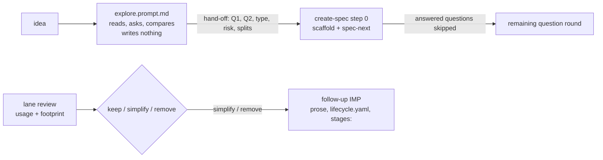

# IMP-20260914-explore-mode-and-lane-review

*Last updated: 2026-09-17*

## Summary

- **Goal:** Add a no-artifact thinking mode that feeds its conclusions into spec creation, then decide with evidence
  whether the RES and Trivial lanes earn what they cost to maintain.
- **Scope:** `explore.prompt.md` with a hand-off mapped to create-spec's inputs; a measured usage-and-footprint review
  of the RES, Trivial and Direct lanes ending in keep / simplify / remove per lane.
- **Out of scope:** Changing the standard lane.

## Current State

Re-verified 2026-09-17 (Rule #10: six specs naming `create-spec.prompt.md` / `spec-lifecycle.md` closed since).
Across 160 archived specs (111 `tobevisit-content`, 49 `ai-dotfiles`) the RES lane was used twice — the dry-run
`RES-20260520-trivial-lane-applicability` and `RES-20260914-declarative-lifecycle-schema`, an 8-hour spike that closed
`confirmed` and fed two IMPs — and the Trivial lane once (`CR-20260728-dedup-dismiss-note-inline`). Direct-lane use
is visible after all: 8 improvements-log entries (4 per corpus) carry `Spec / task: Direct lane`. Each lane now lives
in prose, templates, question lists, validator plug-ins and tests, and since 2026-09-17 also in `lifecycle.yaml`
(`lanes:`, lane rules, `stages:` read by `spec-next`). `create-spec` step 0 scaffolds the spec and runs `spec-next`,
which prints the question round. Exploration happens as free chat before it and its conclusions are not carried into
Q1 / Q2. OpenSpec's `explore` writes nothing and hands off to `propose` with the settled context.

## Proposed Improvement

Give exploration a shape so the heavy RES lane is only for spikes that run code, then measure every non-standard
lane. Measurable benefit: each lane has a recorded keep / simplify / remove decision citing usage count and
maintenance footprint in lines.

## Requirements

- FR-1: `explore.prompt.md` MUST read code and docs, ask questions and compare options, and MUST NOT write files or
  code.
- FR-2: Its hand-off MUST produce a summary mapped to create-spec inputs — Q1 scope, Q2 separability, candidate type,
  candidate risk, candidate splits — which `create-spec.prompt.md` MUST treat as answered rather than re-ask, including
  when `spec-next` lists those questions.
- FR-3: The lane review MUST count RES, Trivial and Direct usage across all corpora, Direct from improvements-log
  entries, and measure each lane's footprint: lifecycle prose, template, question-list, `lifecycle.yaml` (lanes, rules,
  `stages:`), plug-in and test lines.
- FR-4: The review MUST record one decision per lane — keep, simplify or remove — with its evidence in
  `spec-lifecycle.md` or the improvements log.
- FR-5: Removing or simplifying a lane MUST keep archived specs valid — the validator keeps accepting the old field
  values on specs dated before the change — and MUST update `stages:` so `spec-next` never offers the removed path.
- FR-6: The experience of `RES-20260914-declarative-lifecycle-schema` MUST be an input to the RES decision.

## Acceptance Criteria

### AC-1: Explore writes nothing and hands off (FR-1, FR-2)

Given a session that runs the explore prompt on a feature idea and then create-spec
When the file tree is compared before and after exploring, and the create-spec question round is read
Then exploring changed no file, and create-spec asks neither Q1 nor Q2 when the hand-off answered them
Evidence: recorded worked example

### AC-2: Every lane is measured and decided (FR-3, FR-4, FR-6)

Given the corpora on the review date
When the review is written
Then each of RES, Trivial and Direct has a usage count, a footprint in lines, and one decision with reasons
Evidence: review section + counts reproducible by a stated command

### AC-3: History survives a lane change (FR-5)

Given a decision that removes or simplifies a lane
When `make validate-specs` runs on both corpora
Then no archived spec gains a finding
Evidence: command output

## Design

### Decisions

Skipped — no Design Decisions trigger: no bounded context, schema or external dependency; `risk: medium` alone.

## Out of Scope

- OS-1: Executing a removal — a follow-up IMP carries it if FR-4 decides so.
- OS-2: Changing the standard lane's gates.

## Split Decision

**Kept as one — no trigger.** C1 (explore, FR-1, FR-2) and C2 (lane review, FR-3 – FR-6) look separable, but the
RES decision in C2 depends on whether C1 absorbs the exploratory use RES was built for, so C2's AC cannot be signed
off without C1 — T1 does not fire. T2 `unknown`; T3–T6 do not fire.

## Tasks

> **Before starting Task T1, set status: in-progress in the front-matter above.**

| # | Description | Files | Source files (read-only) | Depends on | Skills | Model | Status |
|---|---|---|---|---|---|---|---|
| T1 | Explore prompt (FR-1, FR-2 hand-off side): read code and docs, ask, compare options, write nothing; ends in a fixed hand-off block — Q1 scope, Q2 separability, candidate type, risk and splits; routed from the system workflow table ("explore", "think through", "compare options") and listed with the other prompts | `framework/prompts/explore.prompt.md` *(new)*, `framework/templates/system/_canonical.md` (+ its three rendered files via `make sync-system-templates`), `framework/templates/project/_canonical.md`, `docs/spec-workflow-guide.md`, `README.md` (same command table), `docs/ai-agent-framework.md` | `framework/prompts/research-spec.prompt.md`, `framework/prompts/create-spec.prompt.md`, `framework/spec-workflows/questions/imp-questions.md` | — | writing-specs | default | ☑ done |
| T2 | Create-spec intake (FR-2 intake side; AC-1): step 0 reads a hand-off block when present, records its answers as given, and skips those questions even when `spec-next` lists them; a worked example — explore on one idea, file-tree snapshot before/after, then create-spec's question round — recorded as the AC-1 evidence | `framework/prompts/create-spec.prompt.md`, `docs/specs/archived/artifacts/IMP-20260914-explore-mode-and-lane-review-worked-example.md` *(new)* | `scripts/spec-next.py` | T1 | writing-specs | default | ☑ done |
| T3 | Lane review, measurement (FR-3, FR-6; AC-2 counts): usage of RES, Trivial and Direct across both corpora and footprint in lines per lane (prose, templates, question lists, `lifecycle.yaml` lanes / rules / `stages:`, plug-ins, tests), each number with the command that reproduces it; the RES-20260914 experience written up as an input | `docs/specs/archived/artifacts/IMP-20260914-explore-mode-and-lane-review-lane-review.md` *(new)* | `framework/spec-workflows/spec-lifecycle.md`, `framework/spec-workflows/lifecycle.yaml`, `scripts/validate-specs.py`, `scripts/test/`, `docs/improvements-log.md`, `docs/specs/archived/RES-20260914-declarative-lifecycle-schema.md` | T2 | writing-specs | default | ☑ done |
| T4 | Lane decisions (FR-4, FR-5): propose keep / simplify / remove per lane from T3's evidence and put the three to the human; record the approved decisions in `spec-lifecycle.md` beside each lane and in the improvements log; any simplify / remove becomes a follow-up IMP stub whose requirements carry FR-5 (archived specs stay valid, `stages:` updated) — nothing is removed here (OS-1) | `framework/spec-workflows/spec-lifecycle.md`, `framework/spec-workflows/spec-types.md`, `docs/improvements-log.md`, `docs/specs/active/IMP-20260917-remove-trivial-lane.md` *(new)*, `docs/specs/archived/artifacts/IMP-20260914-explore-mode-and-lane-review-lane-review.md` | `framework/spec-workflows/lifecycle.yaml` | T3 | writing-specs | deep | ☑ done |
| T5 | Closure (AC-1–AC-3): `make check`; `make validate-specs` on both corpora shows no new finding on archived specs; `## Closure Evidence` per AC | `docs/specs/active/IMP-20260914-explore-mode-and-lane-review.md` | `docs/specs/archived/artifacts/IMP-20260914-explore-mode-and-lane-review-worked-example.md`, `docs/specs/archived/artifacts/IMP-20260914-explore-mode-and-lane-review-lane-review.md` | T4 | writing-specs | default | ☑ done |

## Closure Evidence

| AC | Evidence |
|---|---|
| AC-1 | `docs/specs/archived/artifacts/IMP-20260914-explore-mode-and-lane-review-worked-example.md`: file-tree fingerprint `89ceac79…` identical before and after an explore session (read-only `grep` only); its hand-off block answered IMP Q1, Q2 and Q7, and create-spec step 2 dropped them although `spec-next` listed Q1 and Q2 as mandatory. The example is a scripted run in this session with hand-off lines standing in for user confirmation, not a user session. |
| AC-2 | `docs/specs/archived/artifacts/IMP-20260914-explore-mode-and-lane-review-lane-review.md`: usage RES 2 / Trivial 1 / Direct 8 over 160 archived specs, footprint RES 524 / Trivial 328 / Direct 122 lines, both reproducible by the commands and script in the artifact; RES-20260914 written up as the FR-6 input; decisions keep / remove / keep approved by the owner 2026-09-17 and recorded beside each lane in `spec-lifecycle.md` and in `docs/improvements-log.md`. |
| AC-3 | No lane was removed here (OS-1): `make validate-specs` on ai-dotfiles 0 findings and on tobevisit-content the same 3 archived-spec findings as before this spec. The removal and its history guarantee move to `IMP-20260917-remove-trivial-lane` (FR-2, AC-1). `make check` rc=0 on 2026-09-17. |

## Agent instructions

Per `<system>/boundaries.md` and `<system>/docs/agent-protocol.md`. Adds a framework prompt and may change lane
definitions — `boundaries.md § Ask first #3/#4` applies.

## Docs updates required

- New `explore.prompt.md`; `create-spec.prompt.md` hand-off intake.
- `spec-lifecycle.md`, `spec-types.md`, `docs/ai-agent-framework.md` — per the FR-4 decisions.

## Rollout / migration notes

- The RES closed `confirmed` on 2026-09-17, so FR-6's input exists; a lane removal ships as its own IMP (OS-1).
