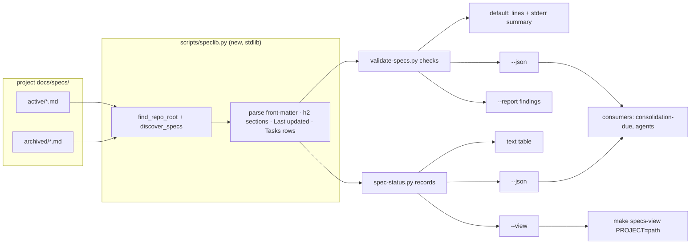
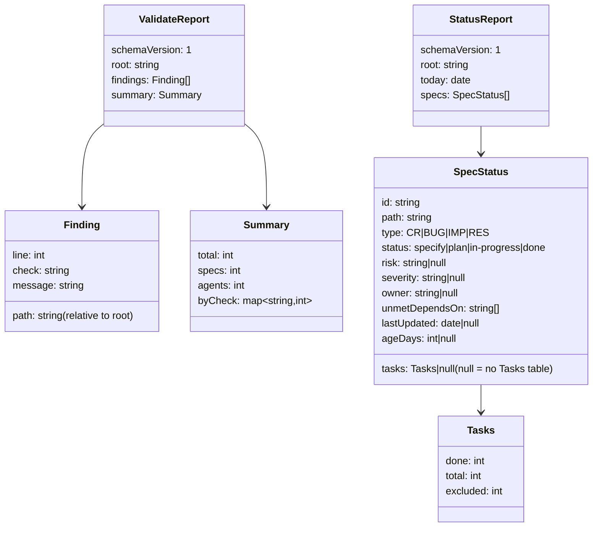

# IMP-20260914-machine-readable-spec-reports

*Last updated: 2026-09-16*

## Summary

- **Goal:** Let tools and agents read the spec corpus's state — findings, statuses, task progress, unmet
  dependencies — as data, and let a person see it on one screen.
- **Scope:** `--json` and a findings-only report on `validate-specs`; a new read-only `spec-status` command with text
  and JSON output; `make specs-view` dashboard.
- **Out of scope:** Aggregating several repositories into one view.

## Current State

`validate-specs.py` prints `path:line:check:message` lines and a count; `spec-metrics.py` prints one table. There is
no command answering "what is active, at which status, how far along, blocked on what" — a reader lists
`docs/specs/active/` and opens each file. `tobevisit-content/Makefile` documents that `validate-specs` is kept out of
`docs-check` because its output cannot be filtered by check; the consolidation checkpoint
(`IMP-20260914-consolidation-checkpoint`) needs spec inventories and closure data as input.

## Proposed Improvement

Structured output first, dashboard on top of it. Measurable benefit: one command replaces opening every active spec,
and downstream scripts consume JSON instead of re-parsing Markdown.

## Requirements

- FR-1: `validate-specs --json` MUST emit `{findings: [{path, line, check, message}], summary: {total, byCheck}}` with
  the current exit-code semantics unchanged.
- FR-2: `validate-specs --report findings` MUST print only finding lines and the summary.
- FR-3: `spec-status` MUST list every active spec with ID, type, status, risk or severity, owner, tasks done/total
  (parsed from `## Tasks` rows), unmet `depends-on:` IDs, and days since `*Last updated:*`, as text or `--json`.
- FR-4: `make specs-view` MUST print the `spec-status` data grouped by status with unmet dependencies flagged.
- FR-5: Both commands MUST accept a project path argument, as `validate-specs.py` does, and MUST NOT write any file.

## Acceptance Criteria

### AC-1: Validator output is data (FR-1, FR-2)

Given a fixture corpus with two findings of different checks
When the validator runs with `--json`, then with `--report findings`
Then the JSON parses with two findings and `byCheck` counts of 1 and 1; the findings report has two lines plus the
summary; both exit 1
Evidence: `validate-specs.test.sh`

### AC-2: Status reads the corpus (FR-3, FR-5)

Given a fixture with an `in-progress` spec at 3 of 5 tasks and a `specify` spec with one unmet `depends-on:`
When `spec-status --json <fixture>` runs
Then both appear with `3/5` and the unmet ID, and the fixture tree is byte-identical afterwards
Evidence: `spec-status.test.sh`

### AC-3: The dashboard groups by status (FR-4)

Given the same fixture
When `make specs-view` runs
Then specs appear under their status headings and the blocked one is flagged
Evidence: `spec-status.test.sh` snapshot

## Design

Where the data comes from and who reads it, from the perspective of one run of either command (read-only end to end).

The two JSON output contracts, from the perspective of a consuming script; `schemaVersion` changes only on a breaking change.

Design decisions:

- **Shared parser, extracted.** `Spec`, `_parse_front_matter`, `find_repo_root`, `discover_specs`, `_h2_section_lines`,
  `_TABLE_SEP_RE` and `_LAST_UPDATED_RE` move to `scripts/speclib.py`; `validate-specs.py` imports them unchanged, so
  every existing test is the regression net. A hyphenated script cannot be imported by name, and loading it through
  `importlib` would couple `spec-status` to 2 000 lines of checks.
- **Task progress.** The Tasks table's `Status` column is located by header, not position. A cell whose first word,
  after an optional glyph (`☑ ✅ ☐ ⬜`), is `done` (any case) counts as done; `descoped` / `cancelled` count as
  `excluded` and leave `total`; anything else is open. Corpus today: `☑ done`, `✅ done`, `Done`, `☐ pending`,
  `⊘ descoped`, `☒ cancelled`, often with a trailing `— note` or `(date)`.
- **Unmet dependency.** A `depends-on:` ID is unmet unless a spec with that ID, in `active/` or `archived/`, has
  `status: done`; an ID that resolves to nothing is unmet too (the validator separately reports it as dangling).
- **Determinism.** `spec-status --today YYYY-MM-DD` pins `ageDays` so the AC-3 snapshot is stable. Rows sort by
  lifecycle order (`specify` → `plan` → `in-progress` → `done`), then `id`.
- **Streams.** With `--json` or `--report findings`, stdout carries the whole report and stderr stays empty; the
  default output is byte-identical to today. Exit codes are unchanged (1 on any finding).
- **Arguments.** `argparse` replaces `argv[1]`; the optional positional project path keeps its current walk-up
  meaning, so `python3 validate-specs.py .` in consuming Makefiles keeps working. `make specs-view` takes
  `PROJECT` (default `.`).

## Out of Scope

- OS-1: Multi-repository aggregation — deferred with OpenSpec Stores until `tobevisit-web` carries specs.
- OS-2: Per-check suppression in `validate-specs` — a separate decision about the English-only rule's data
  exemption.
- OS-3: A web or TUI dashboard.

## Split Decision

**Split check: T1 fires, recommendation keep as one by election — human decision at the gate.** FR-1/FR-2 and
FR-3/FR-4 are independently testable. No exception applies. Both are small read-only reporting surfaces sharing a
Markdown parser that the second would otherwise duplicate (`boundaries.md § Always do #16`).

**Re-check after Visualize (2026-09-16): unchanged — keep as one by election (T1 fires, no exception applies).** The file
surface is now known: 7 files (`speclib.py` new, `validate-specs.py`, `spec-status.py` new, two test scripts,
`Makefile`, `docs/ai-agent-framework.md`). The extracted `speclib.py` is the shared surface both clusters build on, so
splitting would ship the extraction in one spec and its second consumer in another.

**Requirements gate (2026-09-16): approved as recommended.** Kept as one. FR-2 kept as the single-stream report defined
under Design. FR-3 stays active-only: `IMP-20260914-consolidation-checkpoint` reads archived closure data through
`scripts/speclib.py` rather than through `spec-status`. Design approved.

**Plan safety net (2026-09-16): no signal.** 5 tasks (P1 ≤12); one bounded context, the framework's spec tooling (P2);
every task after T1 depends on it (P3).

## Tasks

> **Before starting Task T1, set status: in-progress in the front-matter above.**

| # | Description | Files | Source files (read-only) | Depends on | Skills | Model | Status |
|---|---|---|---|---|---|---|---|
| T1 | Extract the shared parser (Design § shared parser): move `Spec`, `_parse_front_matter`, `find_repo_root`, `discover_specs`, `_h2_section_lines`, `_TABLE_SEP_RE`, `_LAST_UPDATED_RE` into a stdlib module that `validate-specs.py` imports by path from its own directory. Behaviour-preserving refactor: `validate-specs.test.sh` green before and after, and `make validate-specs` output byte-identical on this corpus (FR-3, FR-5 groundwork) | `scripts/speclib.py` *(new)*, `scripts/validate-specs.py` | `scripts/test/validate-specs.test.sh` | — | test-driven-development | default | ☑ done |
| T2 | Test-first: `argparse` with the optional positional project path unchanged; `--json` emits `ValidateReport` (Design class diagram) to stdout with stderr empty; `--report findings` prints finding lines plus one `summary` line with `byCheck` counts to stdout; default output byte-identical; exit codes unchanged; fixture with two findings of different checks (FR-1, FR-2, FR-5; AC-1) | `scripts/validate-specs.py`, `scripts/test/validate-specs.test.sh` | `scripts/speclib.py` | T1 | test-driven-development | default | ☑ done |
| T3 | Test-first: `spec-status.py [path] [--json] [--today]` over active specs — `SpecStatus` records, Tasks counted by the `Status` header column (done / excluded / open per Design), unmet `depends-on` resolved against active + archived, `ageDays` from `--today`, lifecycle-then-ID ordering, aligned text table; test asserts `3/5` and the unmet ID, and a before/after checksum of the fixture tree; hooked into `make tests` (FR-3, FR-5; AC-2) | `scripts/spec-status.py` *(new)*, `scripts/test/spec-status.test.sh` *(new)*, `Makefile` | `scripts/speclib.py`, `scripts/validate-specs.py` (`check_dependency_graph`) | T1 | test-driven-development | default | ☑ done |
| T4 | Test-first: `--view` groups records under status headings in lifecycle order and flags each spec with unmet dependencies as blocked on the named IDs; `make specs-view PROJECT=<path>` (default `.`) calls it and appears in `make help`; snapshot test with `--today` pinned (FR-4; AC-3) | `scripts/spec-status.py`, `scripts/test/spec-status.test.sh`, `Makefile` | — | T3 | test-driven-development | default | ☑ done |
| T5 | Docs: sync-workflow cheat sheet in `docs/ai-agent-framework.md` gains `make specs-view`, `spec-status --json` and `validate-specs --json` / `--report findings` rows beside `make validate-specs` (Docs updates required) | `docs/ai-agent-framework.md` | `Makefile` | T2, T4 | writing-docs | fast | ☑ done |

## Closure Evidence

| AC | Evidence |
|---|---|
| AC-1 | `scripts/test/validate-specs.test.sh` § AC-1 (fixture: one `schema_type` and one `link_broken` finding): red before T2 — 12 failures, the flags read as a path; green after — `--json` parses with 2 findings and `byCheck` `{schema_type: 1, link_broken: 1}`, `--report findings` prints 2 finding lines plus one summary line, both exit 1 with stderr empty; default output asserted unchanged. Default output of `validate-specs.py` on ai-dotfiles and `tobevisit-content` byte-identical (stdout and stderr) before T1 and after T2 |
| AC-2 | `scripts/test/spec-status.test.sh` § AC-2: red before T3 (script absent); green after — `CR-20260901-progress` at `{done: 3, total: 5, excluded: 2}` across `☑ done`, `✅ done (date)`, `Done — note`, `☐ pending`, `in progress`, `⊘ descoped`, `☒ cancelled` with an escaped pipe in a description; `BUG-20260905-blocked` reports only the unmet `CR-20260901-progress`; `find` listing plus `shasum` of every fixture file identical before and after; no `scripts/__pycache__/` written (both scripts set `sys.dont_write_bytecode` — the assertion fails with it removed) |
| AC-3 | `scripts/test/spec-status.test.sh` § AC-3: `make specs-view PROJECT=<fixture> TODAY=2026-09-16` compared against a literal snapshot; red before T4 — 2 failures (no target, no `--view`); green after — `specify (1, 1 blocked)` with the `BLOCKED` row, then `in-progress (1)`. `make tests` and `make check` exit 0 |

### Review

Not run — `risk: low` is below the high tier that requires one; closed review-after per `spec-lifecycle.md § Review-after closure`.

## Agent instructions

Per `<system>/boundaries.md` and `<system>/docs/agent-protocol.md`.

## Docs updates required

- `docs/ai-agent-framework.md` — sync-workflow cheat sheet gains `spec-status` and `specs-view`.

## Rollout / migration notes

- Siblings share `scripts/validate-specs.py`; implement after them to avoid rebasing four parsers at once.
