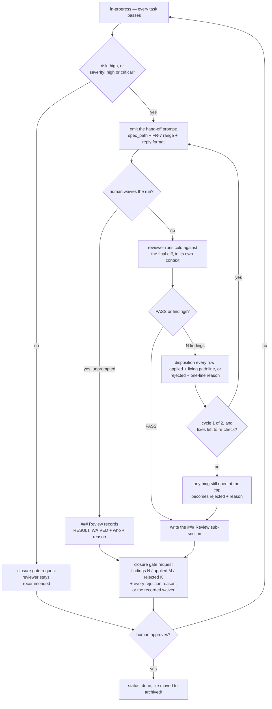

# IMP-20260914-mandatory-review-for-high-risk

*Last updated: 2026-09-16*

## Summary

- **Goal:** Make the cold review a closure precondition for high-risk work, with every finding answered — and every
  skip recorded — so the human approves an explicit disposition rather than an absence of review.
- **Scope:** `risk: high` and `severity: high | critical` specs: reviewer run required before the closure gate, a
  `### Review` sub-section in Closure Evidence with a per-finding disposition, a generated hand-off prompt for the
  empty-context reviewer with a fixed reply format, the gate summary format, and a validator check.
- **Out of scope:** Medium and low risk, which keep the recommended sub-step.

## Current State

`spec-lifecycle.md § Reviewer sub-step` makes the reviewer "recommended, non-blocking" for medium/high. In
`tobevisit-content` the word *reviewer* appears in **7 of 25** archived high-risk/severity specs and **4 of 51**
medium ones — an upper bound on runs, since a mention is not a run. Findings, when a run happens, are applied or
dropped in chat; nothing persisted records which were rejected and why, so the closure gate cannot see them.

## Proposed Improvement

Turn the sub-step into a precondition for the highest tier only, and persist its outcome where the closure gate
and later consolidation (`IMP-20260914-consolidation-checkpoint`) can read it. Measurable benefit: share of
high-tier specs closed with a recorded review goes from ≤28% to 100% for specs dated after closure.

Decided in chat on 2026-09-14: mandatory for high tier with per-finding disposition; medium stays recommended;
plan-stage cold review declined. Decided 2026-09-16: the outcome is a `### Review` sub-section with its own findings
table (Q1), and the diff reference is the first-task-commit range, asked for when ambiguous (Q2). Added 2026-09-16:
the closure step emits a ready-to-paste reviewer prompt whose reply format transcribes into that table (FR-8, FR-9).

## Requirements

- FR-1: A spec with `risk: high` or `severity: high | critical` MUST NOT flip to `done` until the reviewer has run
  against the final diff of the change (FR-7), or the human has explicitly waived the run (FR-10). The `### Review`
  sub-section is required either way — a waiver is a recorded result, never a missing one.
- FR-2: Closure Evidence MUST carry a `### Review` sub-section whose first non-blank line is a `RESULT:` line
  stating the result (`PASS`, `<N> findings / <M> applied / <K> rejected`, or `WAIVED`), the run date, the diff
  reference, and the harness path (sub-agent or empty-context session). See [§ Design](#design) for the grammar.
- FR-3: Every reviewer finding MUST occupy one row of the `### Review` findings table and carry a `Disposition`
  cell — `applied` with the fixing `path:line`, or `rejected` with a one-line reason; an empty or malformed
  `Disposition` cell blocks closure.
- FR-4: The closure gate request MUST state findings N / applied M / rejected K and list each rejection reason, or,
  for a waived review, `review waived by <who> — <reason>` in place of the counts.
- FR-5: The existing cap of two review cycles MUST remain; findings still open at the cap are dispositioned as
  `rejected` with reason, never left unrecorded.
- FR-6: The validator MUST report a high-tier spec at `done` with no `### Review` sub-section, with a findings row
  whose `Disposition` cell is empty or opens with neither `applied` nor `rejected`, or with a `WAIVED` result that
  names no human or carries no reason; specs dated before this IMP's closure are not judged.
- FR-7: The recorded diff reference MUST be the range from the spec's first task commit to the reviewed head
  (`<first task commit>^..<head>`), written as literal revisions so the run is reproducible. When that range is not
  unambiguously derivable — several specs interleaved on one branch, a rebase or a squash — the agent MUST ask the
  human for the range at the closure gate instead of inferring one.
- FR-8: When the last task passes and closure is next, a high-tier spec's agent MUST emit a ready-to-paste reviewer
  prompt for a separate empty-context session, in its own fenced block, carrying: the absolute `spec_path`, the FR-7
  diff range, the `reviewing-changes` checklist reference, the read-only constraint, and the FR-9 reply format. It
  MUST NOT paste the diff or its own reasoning into the prompt — the reviewer reads the diff itself, cold.
- FR-9: The prompt MUST require a reply of a `REVIEW <spec-id> <range>` header, a `RESULT:` line reading `PASS` or
  `<N> findings`, and — when N > 0 — exactly N numbered lines in the reviewer's existing
  `<path>:<line> → <FR/AC id> violated: <what + dimension>` form. Each numbered line MUST transcribe into one
  `### Review` findings row with no rewriting, the arbiter adding only the `Disposition` cell.
- FR-10: The human MAY waive the run for a given spec. A waived review is recorded as
  `RESULT: WAIVED — by <who> <date>: <reason>. No reviewer run.`, with no findings table. The agent MUST NOT waive on its own initiative and
  MUST NOT offer the waiver in the gate request — it records only an instruction the human gave unprompted, and it
  still emits the FR-8 prompt first, so the waiver is a choice made against a concrete offer to review.

## Acceptance Criteria

### AC-1: A high-tier closure without review is refused (FR-1, FR-2, FR-6)

Given a fixture CR with `risk: high` at `status: done` whose Closure Evidence has no `### Review` sub-section
When the validator runs
Then one finding names the missing sub-section; the same fixture at `risk: medium` produces none
Evidence: `validate-specs.test.sh` fixtures

### AC-2: Every finding is answered (FR-3, FR-5, FR-6)

Given a high-tier fixture whose `### Review` findings table lists three rows, one with an empty `Disposition` cell
When the validator runs
Then one finding names that row by number; with all three dispositioned it produces none
Evidence: `validate-specs.test.sh` fixtures

### AC-3: The gate shows the disposition (FR-4, FR-7)

Given the lifecycle and protocol docs after this change
When the closure-gate format and the reviewer sub-step are read
Then the gate requires the N / M / K counts and each rejection reason; the sub-step defines the reviewed range as
`<first task commit>^..<head>` and tells the agent to ask when it is ambiguous; and `reviewing-changes` points to the
`### Review` sub-section as where its output is recorded
Evidence: diff of `spec-lifecycle.md`, `agent-protocol.md`, `reviewing-changes/SKILL.md`

### AC-4: The hand-off prompt round-trips (FR-8, FR-9)

Given a high-tier spec whose last task has passed
When the agent reaches the closure step
Then it emits the prompt block with `spec_path`, the FR-7 range, the checklist reference and the reply format; and a
sample reply of `RESULT: 3 findings` plus three numbered lines fills three findings rows verbatim, the agent adding
only the `Disposition` cell
Evidence: diff of `spec-lifecycle.md`, `framework/agents/reviewer.md`, `framework/agents/README.md`; the worked
round-trip in [§ Design](#design)

### AC-5: A waived review is recorded, not absent (FR-1, FR-6, FR-10)

Given a high-tier fixture at `status: done` whose `### Review` reads `RESULT: WAIVED` with a named human and a reason
When the validator runs
Then it produces no finding; the same fixture with the reason removed, and the one with the sub-section deleted
outright, each produce exactly one
Evidence: `validate-specs.test.sh` fixtures

## Design

Visualize ran 2026-09-16 — triggered by `risk: medium` and by the change to the Closure Evidence contract.

### Closure flow, high tier



### Closure Evidence contract

The AC table is unchanged. High-tier specs gain one sub-section after it:

```markdown
## Closure Evidence

| AC | Evidence |
|---|---|
| AC-1 | ... |

### Review

RESULT: 3 findings / 2 applied / 1 rejected — run 2026-09-16 against `a1b2c3d^..e4f5a6b`, sub-agent.

| # | Finding | Disposition |
|---|---|---|
| 1 | `validate-specs.py:1455` → FR-6 clause | applied — `validate-specs.py:1460` |
| 2 | `reviewing-changes/SKILL.md:42` → output location | applied — `SKILL.md:47` |
| 3 | `agent-protocol.md:88` → gate format | rejected — owned by `IMP-20260914-quality-gates-contract` |
```

Rules the shape carries:

- One marker carries all three result kinds, matching the FR-9 reply format the reviewer sends back — the first
  non-blank line of the sub-section is `RESULT:` and nothing else may precede it:

  - `RESULT: PASS — run <date> against <range>, <harness>.` — no findings table follows.
  - `RESULT: <N> findings / <M> applied / <K> rejected — run <date> against <range>, <harness>.` — exactly N rows.
  - `RESULT: WAIVED — by <who> <date>: <reason>. No reviewer run.` — no findings table.

  FR-6 reads the absence of the table as valid only under `PASS` or `WAIVED`, and `<N>` must equal the row count.
- The waiver is the human's call to make and the agent's job to write down; the agent never suggests it.
- Column 3 is the machine-read field: it must open with `applied` or `rejected`. Everything after the em dash is
  free text for the human.
- Rows are numbered continuously across cycles: a re-run's findings continue the count rather than restarting, so
  `<N>` in the `RESULT:` line is the total across every cycle — the number FR-4 puts in front of the human. The
  table stays three columns wide, since the check reads the disposition positionally.
- `_closure_evidence_rows` in `validate-specs.py:1418` currently keeps parsing table rows across an `###` heading,
  so it would return the findings rows alongside the AC rows. It needs to stop at the sub-heading — harmless today
  (`AC-\d` never matches `1`/`2`/`3`) but load-bearing once FR-6 reads both tables.

### Reviewer hand-off prompt

Emitted verbatim at the closure step, in its own fenced block, for pasting into an empty-context session. The
placeholders are the only parts the agent fills:

```text
Review a change cold. You are read-only: diagnose, never edit, never fix.

spec_path:  <absolute path to the spec>
diff_range: <first task commit>^..<head>

1. Read the spec. Its `## Requirements` and `## Acceptance Criteria` are the rubric — nothing else is.
2. Run `git diff <diff_range>` yourself and read the touched files for context. Trust no summary of the change.
3. Judge it on the checklist in `framework/skills/reviewing-changes/SKILL.md`. Ignore style.

Reply with this and nothing else — no preamble, no fixes, no diff:

REVIEW <spec-id> <diff_range>
RESULT: PASS

or, when there are findings:

REVIEW <spec-id> <diff_range>
RESULT: <N> findings
1. <path>:<line> → <FR/AC id> violated: <what + dimension>
2. <path>:<line> → <FR/AC id> violated: <what + dimension>
```

The agent pastes no diff and no reasoning of its own — that is what makes the read cold.

### Round-trip

A reply in that format becomes findings rows without rewriting. Reply:

```text
REVIEW IMP-20260914-mandatory-review-for-high-risk a1b2c3d^..e4f5a6b
RESULT: 3 findings
1. scripts/validate-specs.py:1455 → FR-6 violated: reads only the AC table, so a missing `### Review` never reports — coverage
2. framework/agents/reviewer.md:42 → FR-9 violated: the output contract omits the header — contract
3. docs/agent-protocol.md:88 → FR-4 violated: the gate format omits the rejection reasons — contract
```

Transcribed — the number and the finding text copied character for character, column 3 added by the arbiter.
The reviewer's own backticks travel with the text; the arbiter adds none of its own:

```markdown
### Review

RESULT: 3 findings / 2 applied / 1 rejected — run 2026-09-16 against `a1b2c3d^..e4f5a6b`, empty-context session.

| # | Finding | Disposition |
|---|---|---|
| 1 | scripts/validate-specs.py:1455 → FR-6 violated: reads only the AC table, so a missing `### Review` never reports — coverage | applied — `scripts/validate-specs.py:1460` |
| 2 | framework/agents/reviewer.md:42 → FR-9 violated: the output contract omits the header — contract | applied — `framework/agents/reviewer.md:55` |
| 3 | docs/agent-protocol.md:88 → FR-4 violated: the gate format omits the rejection reasons — contract | rejected — owned by `IMP-20260914-quality-gates-contract` |
```

`RESULT: <N> findings` and the row count must agree; a mismatch means a truncated reply and the run is redone, not
patched by hand.

## Out of Scope

- OS-1: Mandatory review for medium risk — declined 2026-09-14 on cost.
- OS-2: Cold review of the plan before the plan gate — declined 2026-09-14.
- OS-3: Changing the reviewer checklist dimensions.
- OS-4: Running the reviewer automatically from a hook — a harness integration, not a lifecycle rule.

## Open Questions

- Q1: `Review` as one table row with an inline list, or a `### Review` sub-table under Closure Evidence?
  **Resolved (2026-09-16):** the sub-table — the disposition becomes a column the validator reads instead of prose
  it must parse, and the row scales past a handful of findings. Shape in [§ Design](#design).
- Q2: When a change spans several commits, is "final diff" the range from the spec's first task commit?
  **Resolved (2026-09-16):** yes, `<first task commit>^..<head>` recorded as literal revisions; when the range is
  not unambiguously derivable the agent asks the human rather than inferring. Written as FR-7.

## Split Decision

**Human decision needed at the gate.** T1 fires: the rule (FR-1 – FR-5, FR-7 – FR-9) is verifiable by doc diff without
check (FR-6), and the check is testable on fixtures without the rule text. No E1–E5 exception applies. Recommendation:
keep as one by election — the evidence above is precisely that the rule without a check is not followed, so
shipping the rule alone reproduces the current state. T2 `unknown`; T3–T6 do not fire.

**Elected 2026-09-16: kept as one spec.** Re-tested after FR-8 – FR-10 grew the spec from 6 FRs to 10: T1 still
fires and the recommendation is unchanged, since the added rules (hand-off prompt, reply format, waiver) all exist
to fill the same `### Review` sub-section the check reads.

## Tasks

> **Before starting Task T1, set status: in-progress in the front-matter above.**

| # | Description | Files | Source files (read-only) | Depends on | Skills | Model | Status |
|---|---|---|---|---|---|---|---|
| T1 | Test-first: `check_review_disposition` together with the `### Review` reader it needs, as one red-green cycle — the reader has no CLI surface of its own, so the check's fixtures are the only red it can have. Reader: stop `_closure_evidence_rows` at a `###` heading so AC rows and findings rows stay apart; parse result kind (`PASS` / `<N> findings` / `WAIVED`), run date, diff range, harness, and each findings row's `Disposition` cell. Check: at `done`, a high-tier spec (`risk: high` or `severity: high \| critical`) with no `### Review`, with a `Disposition` empty or opening with neither `applied` nor `rejected`, or with `WAIVED` naming no human or carrying no reason; medium/low and pre-cut-off specs silent; registered (FR-1, FR-2, FR-3, FR-6, FR-10; AC-1, AC-2, AC-5) | `scripts/validate-specs.py`, `scripts/test/validate-specs.test.sh` | `docs/specs/archived/IMP-20260914-spec-traceability-checks.md` | — | test-driven-development | deep | ☑ done |
| T2 | Docs: `spec-lifecycle.md` — Reviewer sub-step mandatory for high tier, recommended below it; the FR-7 range rule and its ask-when-ambiguous escape; the FR-8 hand-off at the closure step; the two-cycle cap wording; `in-progress → done` precondition row (FR-1, FR-5, FR-7) | `framework/spec-workflows/spec-lifecycle.md` | `docs/specs/active/IMP-20260914-mandatory-review-for-high-risk.md` | T1 | writing-docs | default | ☑ done |
| T3 | Docs: `reviewer.md` output contract gains the FR-9 reply shape (`REVIEW` header, `RESULT:` line, N numbered lines) beside the existing per-line form; `agents/README.md § Fallback` carries the hand-off prompt template verbatim (FR-8, FR-9) | `framework/agents/reviewer.md`, `framework/agents/README.md` | `framework/skills/reviewing-changes/SKILL.md` | T2 | writing-docs | default | ☑ done |
| T4 | Docs: `agent-protocol.md` closure gate format — N / M / K plus every rejection reason, and the waived variant with who and why; `reviewing-changes/SKILL.md` points at the `### Review` sub-section as where output lands; `ai-agent-framework.md` drops "recommended" for high tier (FR-4, FR-10; AC-3) | `docs/agent-protocol.md`, `framework/skills/reviewing-changes/SKILL.md`, `docs/ai-agent-framework.md` | `docs/rule-canonical-map.md` | T3 | writing-docs | fast | ☑ done |
| T5 | Verification: transcribe the Design round-trip sample end to end (AC-4); finding counts before/after on ai-dotfiles and `tobevisit-content` with zero new findings on pre-cut-off specs; pin `_REVIEW_CUTOFF` to the closure date; `make lint-rules` for any new rule sentence; improvements-log entry; `make check` green (FR-6; AC-4) | `scripts/validate-specs.py`, `docs/improvements-log.md`, `docs/rule-canonical-map.md` | `../../src/github.com/tobeverse/tobevisit-content/docs/specs/` | T4 | test-driven-development | fast | ☑ done |

## Closure Evidence

Closed 2026-09-16, synchronous gate (`risk: medium`). `_REVIEW_CUTOFF = 2026-09-16`; no spec in either corpus is
dated on or after it, so the check judges only specs written from here on.

| AC | Evidence |
|---|---|
| AC-1 | `validate-specs.test.sh`: `CR-20270101-noreview` at `risk: high` yields exactly one `review_missing`; the same body at `risk: medium` yields none; `CR-20270101-sev` (`risk: medium`, `severity: critical`) yields one, so severity alone puts a spec in the tier. At `specify` / `plan` / `in-progress`, and at `date: 2026-09-15`, all silent. Red before T1 (`no finding matching …review_missing…`), green after. |
| AC-2 | `CR-20270101-review` with three dispositioned rows yields none; the same fixture with row 2's `Disposition` emptied yields exactly one `review_no_disposition` naming finding 2 at that row's line. Red before T1, green after. |
| AC-3 | Diff of `spec-lifecycle.md` (§ Reviewer sub-step split by tier; § The reviewed range; § The hand-off; § Recording the outcome; `in-progress → done` row), `agent-protocol.md` (closure checklist item carrying N / M / K, every rejection reason, the waived variant, and the bar on offering a waiver), `reviewing-changes/SKILL.md` (§ Output contract + "Where the output lands"), `ai-agent-framework.md` (reviewer row: required at high tier). |
| AC-4 | § Design round-trip: a three-finding reply transcribed into three rows, number and finding text copied character for character, only `Disposition` added. Run end to end against a scratch high-tier spec — the transcribed `### Review` yields 0 `review_` findings, the only output being the expected `status_location` for a `done` spec in `active/`. The verbatim claim was itself a cycle-2 finding, applied. |
| AC-5 | `CR-20270101-waived` with `RESULT: WAIVED — by alexvolsh 2026-09-16: <reason>. No reviewer run.` yields none; with the reason removed, exactly one `review_waiver_incomplete`; with the sub-section deleted, exactly one `review_missing`. Red before T1, green after. |
| Corpora | `make check` green (19 checks, was 18). ai-dotfiles 0 findings. `tobevisit-content` 7 → 7, all pre-existing and identical to the baseline recorded in `IMP-20260914-spec-traceability-checks` (`domain_req_id_duplicate` ×2, `figma_frame_id` ×2, `link_broken`, `english_only`, `deps_dangling`); `review_` 0 in both, as every existing spec predates the cut-off. |

### Review

RESULT: 8 findings / 8 applied / 0 rejected — run 2026-09-16 against the uncommitted working tree, sub-agent.

| # | Finding | Disposition |
|---|---|---|
| 1 | scripts/validate-specs.py:1566 → FR-3 violated: the `Disposition` cell is read as `cells[2]` after a raw `split("\|")`, so a findings row containing an escaped `\|` shifts the columns and a correctly dispositioned row is reported `review_no_disposition`, blocking closure the spec says should pass — bugs | applied — `scripts/validate-specs.py:1497` (`_row_cells` / `_UNESCAPED_PIPE_RE`) |
| 2 | scripts/validate-specs.py:1560 → FR-2 violated: `_review_section` silently skips every non-blank line before the `RESULT:` line, so a `### Review` whose first non-blank line is prose is accepted although FR-2 requires `RESULT:` to be first — coverage | applied — `scripts/validate-specs.py:1562` (`break` on a non-`RESULT:` first line) |
| 3 | scripts/validate-specs.py:1480 → FR-1/FR-6 violated: `_REVIEW_TYPES` exempts `RES` from the check, an exemption FR-6 does not grant and FR-1 states unqualified by type — contract | applied — `_REVIEW_TYPES` removed; fixture `RES-20270101-spike` |
| 4 | docs/specs/active/IMP-20260914-mandatory-review-for-high-risk.md:246 → AC-4 violated: the § Design round-trip is a two-finding sample where AC-4 requires three — coverage | applied — sample raised to three findings |
| 5 | docs/specs/active/IMP-20260914-mandatory-review-for-high-risk.md:261 → AC-4 violated: the § Design round-trip does not round-trip verbatim — rows drop and reword text from the reply while the prose claims "columns 1 and 2 copied" — contract | applied — rows now copy the reply character for character |
| 6 | framework/spec-workflows/spec-lifecycle.md:400 → FR-9 violated: the Reviewer sub-step still describes the output as "`PASS` or `file:line → violated clause`", contradicting the three documents moved to the `REVIEW` header + `RESULT:` shape — contract | applied — `spec-lifecycle.md:397` restates the new reply shape |
| 7 | scripts/validate-specs.py:1306 → FR-6 violated: `_h2_section_lines` treats a heading inside a fenced block as structure, so this spec's own `## Design` example of `## Closure Evidence` / `### Review` is read as the section and the real record is never reached — the check passes on the example — bugs | applied — `scripts/validate-specs.py:1306` skips fenced blocks; fixture `CR-20270101-fenced` |
| 8 | docs/specs/active/IMP-20260914-mandatory-review-for-high-risk.md:301 → FR-3 violated: finding 1's cell contains a raw `\|` inside a code span, which splits the row and reports a dispositioned finding as undispositioned — the record is malformed Markdown, not a false positive — bugs | applied — the pipe escaped in the record |

Two cycles, the cap. Nothing was left open at the cap, so no finding is dispositioned `rejected` for that reason.
Findings 1–4 came from cycle 1, 5–6 from cycle 2; 7–8 were found by validating this spec's own `### Review` record
against the new check, which is what surfaced them. Numbering is continuous, per § Design.

**Self-application.** Promoted to `risk: high` with a post-cut-off date and run through `validate-specs.py`, this
spec's own record yields zero `review_` findings and zero `traceability_` findings. The first attempt at that check
reported success against the `## Design` example rather than the record (finding 7); the number above is from the
run after that was fixed.

**Divergence from FR-7.** The range recorded is the uncommitted working tree, not `<first task commit>^..<head>`:
this change has no task commits yet, so the rule's range does not exist to be written. FR-7's escape applies — the
range is not unambiguously derivable — and is raised here rather than inferred.

## Agent instructions

Per `<system>/boundaries.md` and `<system>/docs/agent-protocol.md`.

## Docs updates required

- `framework/spec-workflows/spec-lifecycle.md` — Reviewer sub-step: high tier mandatory; the FR-7 range rule; the
  FR-8 hand-off prompt at the closure step; transition table row.
- `framework/skills/reviewing-changes/SKILL.md`, `framework/agents/reviewer.md` — where output is recorded; the
  FR-9 reply format (header + `RESULT:` + numbered lines) alongside the existing per-line form.
- `framework/agents/README.md` — the fallback section carries the hand-off prompt template.
- `docs/agent-protocol.md` — closure gate format, including the waived variant.
- `docs/ai-agent-framework.md` — reviewer description no longer "recommended" for high tier.

## Rollout / migration notes

- Active high-tier specs at the moment of closure adopt the sub-section at their own closure; none are rewritten.
