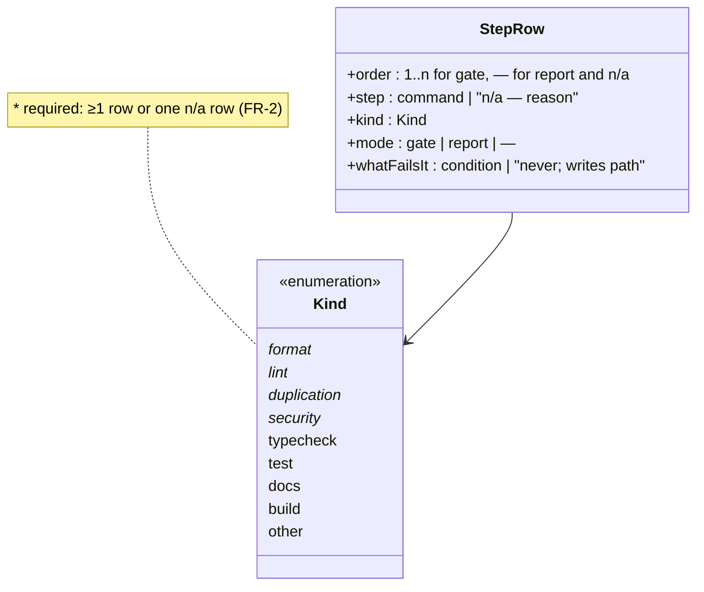
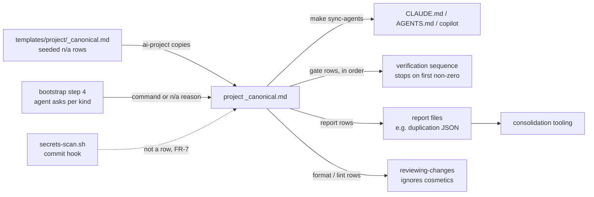

# IMP-20260914-quality-gates-contract

*Last updated: 2026-09-16*

## Summary

- **Goal:** Every project declares which code-quality checks it runs — format, lint, typecheck, duplication,
  security — and whether each is a gate or a report, so "code quality feedback" means the same kind of thing in
  every project.
- **Scope:** A `Kind` and `Mode` column on the project scaffold's `## Build and Run` table, required kinds with an
  explicit `n/a — reason`, a report-only duplication kind, a security kind, bootstrap questions, and the reviewer's
  pointer to it.
- **Out of scope:** Choosing tools for a given stack — each project's own spec (for `tobevisit-content`:
  `IMP-20260914-duplicate-report-and-format-scope`).

## Current State

`templates/project/_canonical.md § Build and Run` already requires a read-only verification sequence (Always do #21)
but its step table has no notion of *what kind* of check a step is, so nothing shows that a project has no
formatter check, no duplication signal, or no dependency audit. `reviewing-changes` tells the reviewer to ignore
formatting because "those are the linter's and formatter's job" — without anything guaranteeing such a job exists.
`tobevisit-content` runs `prettier --check` over `src/**` only and has no duplication detection; duplication is
found after the fact (six archived IMPs titled dedup / unify / simplification). The only security check anywhere is
the framework's commit-time `framework/hooks/secrets-scan.sh`; no project audits its dependencies.

`scripts/ai-project.sh` copies templates without prompting; the questions at bootstrap are asked by the agent at
step 4 of `docs/bootstrapping-project.md § Workflow`. No self-test covers the scaffold.

## Proposed Improvement

Extend the existing table instead of adding a section: one place still lists the sequence, and each row now says
what it guards. Measurable benefit: for each project, the set of missing quality kinds is visible in one read of
`_canonical.md`, and zero kinds are silently absent.

## Requirements

- FR-1: The `## Build and Run` step table MUST carry a `Kind` column with values `format | lint | typecheck | test |
  duplication | security | docs | build | other` and a `Mode` column with `gate | report`.
- FR-2: A project MUST declare at least one row for each of `format`, `lint`, `duplication` and `security`, or a
  single row per missing kind reading `n/a — <reason>`.
- FR-3: A `report` row MUST exit zero regardless of findings and MUST NOT appear in the gate sequence's stopping
  order; a `gate` row MUST.
- FR-4: A `duplication` row MUST name where its machine-readable report is written, so consolidation tooling can
  read it.
- FR-5: The project template MUST seed the four required kinds as `n/a — to be decided` rows, and the bootstrap
  workflow's placeholder step MUST ask the human for each one rather than leave the seed unexamined.
- FR-6: `reviewing-changes § What to ignore` MUST point cosmetic concerns at the project's `format` / `lint` rows.
- FR-7: A `security` row MUST check the project's third-party dependencies for known vulnerabilities; the
  framework's commit-time secret scan does not satisfy it and MUST NOT be re-declared as a row.

## Acceptance Criteria

### AC-1: The template carries the contract (FR-1 – FR-4, FR-7)

Given `templates/project/_canonical.md` after the change
When its `## Build and Run` section is read
Then the table has `Kind` and `Mode`, the four required kinds are seeded rows, and the prose states the
report/gate exit rules, the report location for `duplication`, and what a `security` row must check
Evidence: template diff

### AC-2: A new project gets the rows (FR-5)

Given a scratch directory
When `ai-project` scaffolds a project there
Then the copied `_canonical.md` contains a row for each of `format`, `lint`, `duplication` and `security`, each
reading `n/a — to be decided`
Evidence: `scripts/test/ai-project.test.sh`, run by `make tests`

### AC-3: The bootstrap asks (FR-5)

Given `docs/bootstrapping-project.md` after the change
When § Workflow step 4 is read
Then it tells the agent to ask the human for a command or an `n/a` reason for each required kind
Evidence: doc diff

### AC-4: The reviewer knows where cosmetics go (FR-6)

Given `reviewing-changes/SKILL.md` after the change
When § What to ignore is read
Then it names the `format` / `lint` rows as the owner of cosmetic findings
Evidence: skill diff

## Design

Row schema of the `## Build and Run` table — what a project author fills in per step, and which fields the rules
constrain.



The table before and after, from a reader of one project's `_canonical.md`.

```text
Before                                   After
| # | Step | What fails it |             | # | Step                  | Kind        | Mode   | What fails it                   |
|---|------|---------------|             |---|-----------------------|-------------|--------|---------------------------------|
| 1 | …    | …             |             | 1 | `<step>`              | format      | gate   | <condition>                     |
                                         | 2 | `<step>`              | lint        | gate   | <condition>                     |
                                         | — | `<step>`              | duplication | report | never; writes `<report path>`   |
                                         | — | n/a — to be decided   | security    | —      | —                               |
```

How the required kinds travel from the framework to the people and tools that rely on them.



## Out of Scope

- OS-1: Tool choice per stack — project specs.
- OS-2: A validator check that `_canonical.md` declares the kinds — deferred until the declarative lifecycle
  (`RES-20260914-declarative-lifecycle-schema`) settles where scaffold checks live.
- OS-3: Adopting the columns in `tobevisit-web` — no active spec surface there yet.
- OS-4: Gate thresholds, and whether a network-dependent audit runs as `gate` or `report` — project decisions.

## Open Questions

- ~~Q1: Is `security` (dependency audit, secrets) a required kind too, given `secrets-scan.sh` already runs at
  commit?~~ **Resolved 2026-09-16 (human):** yes — required, scoped to dependency audit (FR-7); the commit-time
  secret scan stays a framework hook.

## Split Decision

**Kept as one — no trigger.** All FRs share one acceptance surface (the Build and Run contract); T1 does not fire
because FR-5 and FR-6 verify only against the column shape FR-1 defines. T2 `unknown`; T3–T6 do not fire.

**Re-checked at Visualize, 2026-09-16 — unchanged.** File surface is six files in one repo (template, manifest,
bootstrap doc, reviewer skill, new scaffold self-test, plus a one-line `Makefile` hook-up); FR-7 joins the same table contract, so no new
cluster forms.

## Tasks

> **Before starting Task T1, set status: in-progress in the front-matter above.**

Plan-time re-check (2026-09-16): `IMP-20260914-mandatory-review-for-high-risk` closed over
`reviewing-changes/SKILL.md`; § What to ignore still reads as `## Current State` quotes it. Active
`CR-20260914-design-decisions-and-architecture-profile` also lists `scaffold-manifest.md` — T1 edits only its
`_canonical.md` row.

| # | Description | Files | Source files (read-only) | Depends on | Skills | Model | Status |
|---|---|---|---|---|---|---|---|
| T1 | Build and Run contract in the project template: `Kind` / `Mode` columns, seeded `n/a — to be decided` rows for `format`, `lint`, `duplication`, `security`, and prose for the gate/report exit rules, the duplication report location and the security scope; scaffold self-test hooked into `make tests` after checking the other Makefile-claiming specs (FR-1 – FR-5, FR-7; AC-1, AC-2) | `framework/templates/project/_canonical.md`, `framework/skills/bootstrapping-project/references/scaffold-manifest.md`, `scripts/test/ai-project.test.sh` *(new)*, `Makefile` | `scripts/ai-project.sh`, `scripts/test/profile-links.test.sh`, `<system>/boundaries.md` § Always do #21 | — | writing-docs, bootstrapping-project | default | ☑ done |
| T2 | Bootstrap workflow step 4 asks the human for a command or `n/a` reason per required kind; § table row for the verification sequence names the new columns (FR-5; AC-3) | `docs/bootstrapping-project.md` | `framework/templates/project/_canonical.md` | T1 | writing-docs, bootstrapping-project | fast | ☑ done |
| T3 | `reviewing-changes § What to ignore` points cosmetic findings at the project's `format` / `lint` rows (FR-6; AC-4) | `framework/skills/reviewing-changes/SKILL.md` | `framework/templates/project/_canonical.md` | T1 | writing-docs | fast | ☑ done |
| T4 | Verification and closure: `make tests`, `make check`, cold review against this spec, evidence per AC, status → done, move to `archived/` | `docs/specs/active/IMP-20260914-quality-gates-contract.md` | all files above | T2, T3 | writing-specs | default | ☑ done |

## Closure Evidence

| AC | Evidence |
|---|---|
| AC-1 | `framework/templates/project/_canonical.md` § Build and Run — header `\| # \| Step \| Kind \| Mode \| What fails it \|`, seeded `n/a — to be decided` rows for `format`, `lint`, `duplication`, `security`, and bullets for Kind (required set), Mode (gate numbered and stopping; report `—`, exits zero), duplication report path, security scope excluding the commit-time secret scan |
| AC-2 | `scripts/test/ai-project.test.sh` (new, in `make tests`): red before the template change — 5 failures (header + 4 kinds); green after — `ai-project.test: OK`. `make check` exits 0 |
| AC-3 | `docs/bootstrapping-project.md` § Workflow step 4 — "Ask the human about each one": command, Kind, Mode, duplication report path, or `n/a — <reason>`; § Content boundary row names the quality kind per step |
| AC-4 | `framework/skills/reviewing-changes/SKILL.md` § What to ignore — cosmetics belong to the `format` and `lint` rows of `_canonical.md` § Build and Run; an `n/a` row is the project's declared choice |

### Review

RESULT: PASS — run 2026-09-16 against working tree (this spec's 6 files + spec edits; unrelated uncommitted changes excluded), sub-agent.

## Agent instructions

Per `<system>/boundaries.md` and `<system>/docs/agent-protocol.md`. This changes a shared framework template —
`boundaries.md § Ask first #3/#4` applies at every gate.

## Docs updates required

- `framework/templates/project/_canonical.md`, `scaffold-manifest.md`, `docs/bootstrapping-project.md`.
- `framework/skills/reviewing-changes/SKILL.md` — § What to ignore.

## Rollout / migration notes

- Existing projects adopt the columns through their own spec; `tobevisit-content` does so in
  `IMP-20260914-duplicate-report-and-format-scope`, which follows this one (cross-corpus, not declarable in
  `depends-on:`). That spec now also needs a `security` row.
- Hooking the new self-test into `make tests` is a one-line `Makefile` edit. `spec-status-guard.sh` allows it only
  when this spec claims `Makefile` in `affected-code:`, and four other active specs (all at `specify`) claim it too;
  they are listed in `siblings:` solely to record that shared lease (2026-09-16). Each re-verifies its
  `## Current State` against the added `tests` line under `spec-lifecycle.md § Rules #10` when it reaches Plan.
