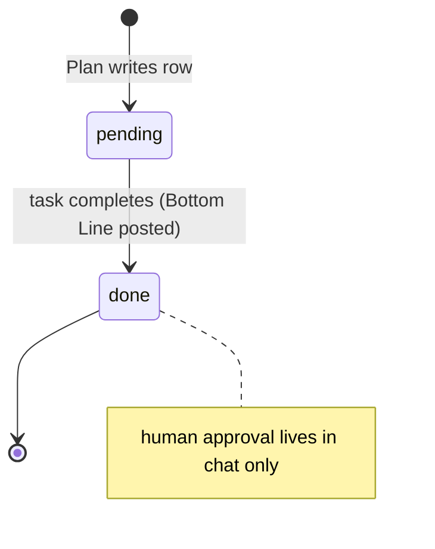
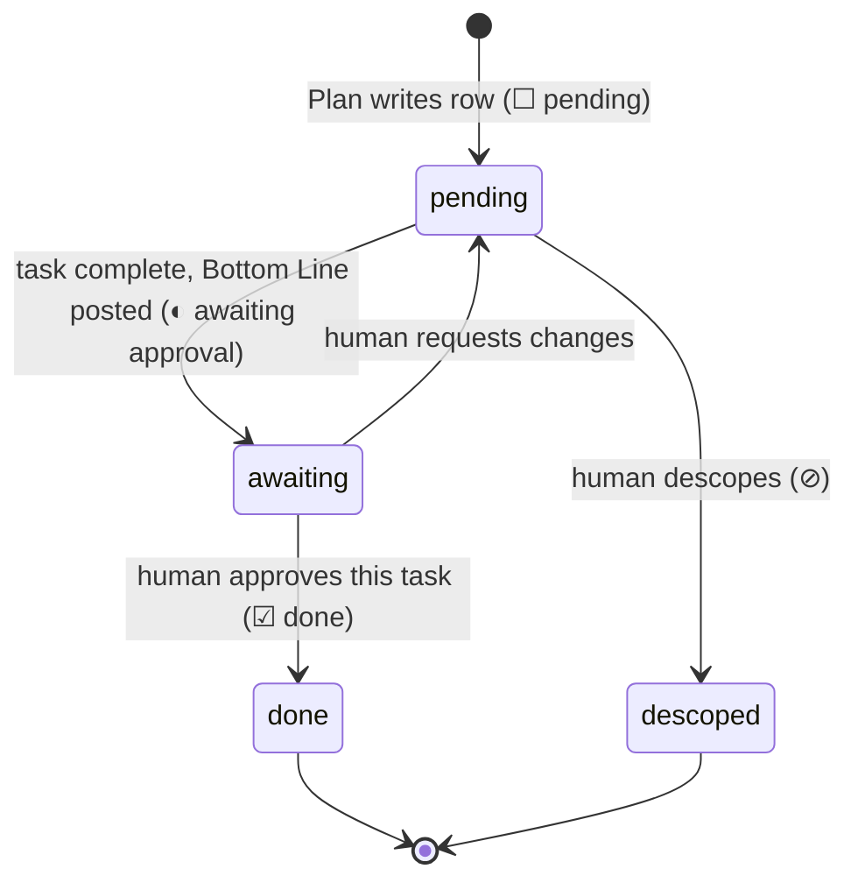
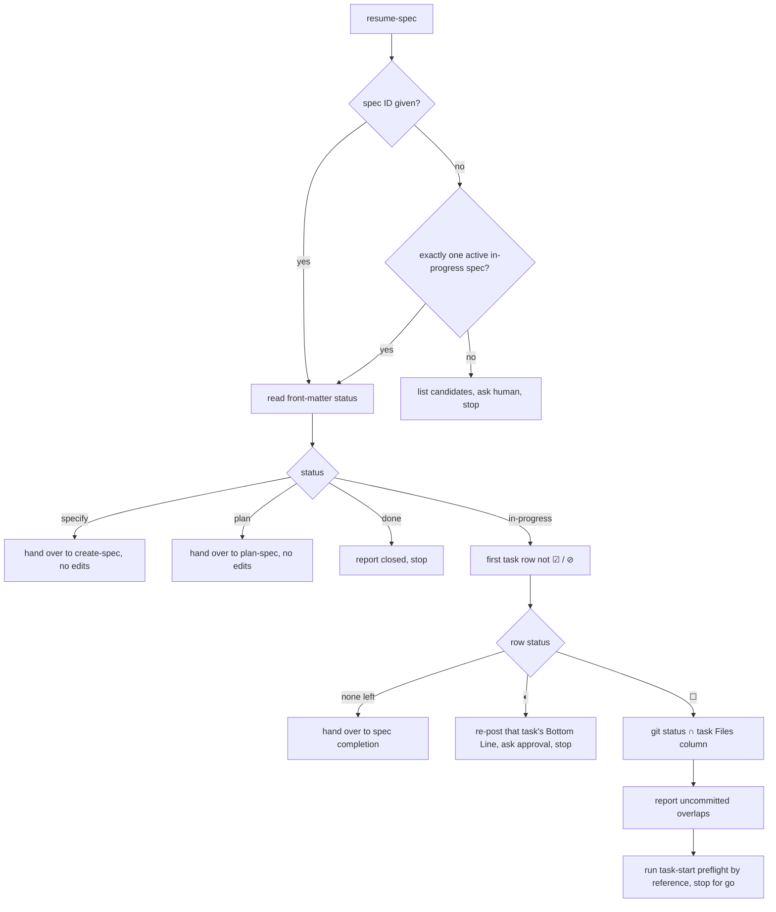

# IMP-20260914-resume-spec-prompt

*Last updated: 2026-09-16*

## Summary

- **Goal:** Let a new session pick up an in-progress spec at the right task without guessing whether the previous
  task was approved.
- **Scope:** A `resume-spec.prompt.md` procedure and a task-status value that distinguishes "done, awaiting
  approval" from "done and approved".
- **Out of scope:** Changing how approval is given.

## Current State

Progress lives in the spec — status and the task table updated in place (`boundaries.md § Always do #11`). Approval
does not: the Bottom Line and the human's "continue" live in chat, and `☑ done` is set when the task completes,
before approval. A session that starts after an interruption sees `☑` and cannot tell whether the human approved it,
while `Never do #6` makes a one-word "continue" approve only the immediately preceding task. There is no prompt for
resuming; the agent reconstructs state ad hoc. OpenSpec resumes at the first unchecked task with "no hidden state".

## Proposed Improvement

Persist the one bit that is hidden, then give resumption a procedure. Measurable benefit: a resumed session never
starts a task whose predecessor's approval is unknown.

## Requirements

- FR-1: The task Status column MUST distinguish `◐ awaiting approval` (Bottom Line posted) from `☑ done` (approved);
  the agent sets `☑` only after approval, and returns a `◐` row to `☐ pending` when the human requests changes.
- FR-2: `resume-spec.prompt.md` MUST locate the spec — by ID, or the single active `in-progress` spec — and read its
  Summary, status and first task not at `☑` or `⊘`; with no ID and zero or several candidates it MUST list them and
  stop.
- FR-3: When that task is `◐`, the prompt MUST re-post its Bottom Line and ask for approval before anything else.
- FR-4: Before editing, the prompt MUST report uncommitted changes touching the next task's Files column.
- FR-5: The prompt MUST then run the existing task-start preflight by reference, not restate it.
- FR-6: At `specify` or `plan`, the prompt MUST route to create-spec or plan-spec and make no code edit.

## Acceptance Criteria

### AC-1: An unapproved task is not skipped (FR-1, FR-3)

Given a fixture spec whose Task 2 is `◐ awaiting approval`
When a fresh session runs the resume prompt
Then it re-posts Task 2's Bottom Line and asks for approval, and starts nothing
Evidence: recorded worked example

### AC-2: A clean resume reaches preflight (FR-2, FR-4, FR-5)

Given Task 2 `☑` and Task 3 `☐`, with one uncommitted change to a Task 3 file
When the resume prompt runs
Then it names Task 3, reports the uncommitted file, and posts the standard preflight
Evidence: recorded worked example

### AC-3: Early statuses route away (FR-6)

Given a spec at `plan`
When the resume prompt runs
Then it hands over to plan-spec and edits nothing
Evidence: recorded worked example

## Design

Task-row Status today, from the agent's side — approval never reaches the file (`boundaries.md § Always do #11`).

Task-row Status after this IMP, from the agent's side — the approval bit is persisted; a change request returns the row
to `☐` so resume re-enters through preflight rather than re-posting a stale Bottom Line.

Resume procedure, from a fresh session's side — every branch ends in a stop or in the existing preflight.

**Design decisions**

- **D-1:** `◐` is a Status *word* change, not a new column — `speclib.task_counts` keys on the word after the glyph, so
  `awaiting` counts in the total and not as done with no parser change. No validator ties a spec's `done` status to
  its task rows, so `◐` needs no new check — only a fixture row pinning the count.
- **D-2:** A change request moves `◐ → ☐`, not a fourth value; the half-finished rework is then caught by FR-4's
  uncommitted-changes report on resume.
- **D-3:** Approval of `◐` is still a single-task affirmation (`Never do #6`); resume never flips more than one row.
- **D-4:** Overlap with `IMP-20260914-spec-next-instructions` — if that ships, step F–G reads `spec-next` output instead
  of parsing the table; this IMP does not wait for it.

## Out of Scope

- OS-1: Recording approvals outside the spec (for example in git notes).
- OS-2: Back-filling `◐` into archived specs.

## Split Decision

**Kept as one — E4.** FR-1 is a one-value schema extension whose only consumer is the prompt. T2 `unknown`.

**Re-check at Visualize (2026-09-16): kept as one.** File surface is ~8 files, one concern: the new prompt; `boundaries.md
§ Always do #11`; `authoring-steps.md § C` status vocabulary; `docs/agent-protocol.md`; `docs/spec-workflow-guide.md`;
the Workflows table in the system `_canonical.md` (+ rendered copies); a `◐` fixture row in `scripts/test/spec-status.test.sh`.
No independently shippable cluster.

## Tasks

> **Before starting Task T1, set status: in-progress in the front-matter above.**

| # | Description | Files | Source files (read-only) | Depends on | Skills | Model | Status |
|---|---|---|---|---|---|---|---|
| T1 | Add `◐ awaiting approval` to the task-row lifecycle: `☐ → ◐` when the Bottom Line is posted, `◐ → ☑` on approval of that task, `◐ → ☐` on a change request; pin that `◐` counts in the total but not as done (FR-1; D-1, D-2, D-3). | `framework/boundaries.md` (§ Always do #9, #11), `docs/agent-protocol.md` (post-task step 7, § Interpreting "continue"), `framework/skills/writing-specs/references/authoring-steps.md` (§ C step 5), `scripts/test/spec-status.test.sh` | `scripts/speclib.py`, `docs/rule-canonical-map.md`, `framework/spec-workflows/spec-lifecycle.md` | — | writing-specs | default | ☑ done |
| T2 | Write `resume-spec.prompt.md` per the Design flowchart — locate spec (ID / single in-progress / list-and-stop), route `specify`/`plan`/`done`, re-post Bottom Line on `◐`, report uncommitted overlaps with the task's Files, then the task-start preflight by reference; register it in the Workflows table and the guide (FR-2 – FR-6). | `framework/prompts/resume-spec.prompt.md` *(new)*, `framework/templates/system/_canonical.md`, `framework/templates/system/{claude/CLAUDE.md,codex/AGENTS.md,copilot/copilot-instructions.md}` (rendered by `make sync-system-templates`), `docs/spec-workflow-guide.md` | `framework/prompts/plan-spec.prompt.md`, `framework/prompts/create-spec.prompt.md`, `docs/agent-protocol.md` | T1 | writing-specs | default | ☑ done |
| T3 | Record the three worked examples against throwaway fixture specs — Task 2 at `◐` (AC-1), Task 2 `☑` / Task 3 `☐` with one uncommitted Task 3 file (AC-2), a spec at `plan` (AC-3) — each showing the prompt's output and that no file was edited. | `docs/specs/archived/artifacts/IMP-20260914-resume-spec-prompt-worked-examples.md` *(new)* | `framework/prompts/resume-spec.prompt.md` | T2 | writing-specs | default | ☑ done |

## Agent instructions

Per `<system>/boundaries.md` and `<system>/docs/agent-protocol.md`. Adds a framework prompt and changes a spec-format
value — `boundaries.md § Ask first #3` applies; if `IMP-20260914-spec-traceability-checks` has shipped, its
task-row parsing must accept `◐`.

## Docs updates required

- New prompt; `docs/agent-protocol.md § Interpreting "continue" in spec work`; `docs/spec-workflow-guide.md`.

## Rollout / migration notes

- Independent of the rest of the batch; can run whenever a slot is free.

## Closure Evidence

| AC | Evidence |
|---|---|
| AC-1 | [`artifacts/IMP-20260914-resume-spec-prompt-worked-examples.md § AC-1`](artifacts/IMP-20260914-resume-spec-prompt-worked-examples.md#ac-1--an-unapproved-task-is-not-skipped): fixture T2 `◐` → Bottom Line re-posted, approval asked, T3 not started; fixture hash unchanged. Walked by the implementing session, then re-run cold by a fresh sub-agent with no history (§ AC-1 cold re-run, 2026-09-16): same stop at step 5, hash unchanged |
| AC-2 | Same file § AC-2: resume row T3; `git status --porcelain` → `M src/cli.py` reported, untracked `scratch.txt` (no task's file) not reported; task-start note posted; hash unchanged |
| AC-3 | Same file § AC-3: `status: plan` → handed to `plan-spec.prompt.md`, no step past routing; hash unchanged |
| FR-1 count | `scripts/test/spec-status.test.sh`: a `◐ awaiting approval` row counts in the total, not as done (`3/6` in `--json` and the `specs-view` snapshot) |
| Suites | `make check` exit 0 (links-check, validate-specs, lint-rules, validate-anchors, all self-tests) after T3 |
| Docs | `boundaries.md § Always do #11` is the single home of the `☐ → ◐ → ☑` rule; `agent-protocol.md` post-task step 7 and § Interpreting "continue", `authoring-steps.md § C` step 5 link to it; Workflows row in system `_canonical.md` + three rendered copies; command row in `spec-workflow-guide.md` and `README.md` |

- **Divergences:** `README.md` edited outside T2's Files — the guide's command list is declared identical to README §3.
  `framework/templates/project/_canonical.md` carries the same Workflows table and did not get the `resume` row during
  T2; added after closure on the owner's go (2026-09-16), together with the row in `tobevisit-content` and
  `tobevisit-web` `_canonical.md` + `make sync-agents` (both `sync-agents-check` exit 0; content `docs-check` exit 0).
- **Accepted duplication:** none — the approval rule is stated once in `boundaries.md` and linked elsewhere.

### Review

Not run — `risk: low` is below the high tier; closed review-after per `spec-lifecycle.md § Review-after closure`, with
T1–T3 each approved by the owner in chat on 2026-09-16.
