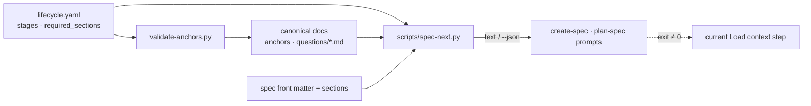

# IMP-20260914-spec-next-instructions

*Last updated: 2026-09-17*

## Summary

- **Goal:** Give an agent exactly the rules, questions and gate that apply to one spec's next step, so it stops
  reading the whole canonical corpus to find the part that applies.
- **Scope:** A read-only `spec-next <spec>` command (text and `--json`) for `specify`, `plan` and `in-progress`,
  driven by a `stages:` block in `lifecycle.yaml` that points at canonical-doc anchors; the create and plan prompts
  call it first and fall back to full loading when it fails.
- **Out of scope:** Removing or shortening canonical docs; harness integrations.

## Current State

Re-verified 2026-09-17 after both dependencies closed. Before any Specify question round `agent-protocol.md` (491
lines) routes the agent through `spec-lifecycle.md` (585), `boundaries.md` (144) and `authoring-steps.md` (97) —
1 317 lines — plus the type's question list (58–85), template (≈90) and `spec-types.md` (82), whether the spec is a
one-FR Trivial CR or a high-risk IMP. "Link, don't restate" keeps the docs consistent and makes the reader assemble
the rules for one case. `framework/spec-workflows/lifecycle.yaml` (IMP-20260917-lifecycle-schema-engine) now holds
statuses, lanes and required sections per type and status, readable through `lifecycle_engine.py`; it holds no step
sequence, gate text, question-list pointer or rule references. OpenSpec's `openspec instructions` prints only the
next artifact's template and instruction.

## Proposed Improvement

Resolve type × lane × status × filled sections to one next step and print only its subset. Rule text stays in the
canonical docs: the schema names anchors, `spec-next` reads each anchored rule's first sentence at run time.
Measurable benefit: lines loaded before the question round — baseline ≈1 560 for a Trivial CR (1 317 + question list,
template, `spec-types.md`) — target ≥50 % fewer for the Trivial CR, measured again for a high-risk IMP.

## Requirements

- FR-1: `spec-next <spec>` MUST print the next step, required sections still missing or placeholder, the step's questions (one line each, mandatory ones marked, with the round limit and the list's path), the gate to request, and the applicable rules as anchor links with one line each.
- FR-2: The output MUST contain nothing specific to another type, lane or status.
- FR-3: Steps, gates, question-list paths and rule anchors MUST be declared under `stages:` in `lifecycle.yaml`; required sections MUST come from its `required_sections`; rule and question lines MUST be read from the canonical docs at run time — no hand-kept copy.
- FR-4: `--json` MUST emit the same content structured by field.
- FR-5: `create-spec.prompt.md` and `plan-spec.prompt.md` MUST run `spec-next` first and load only its output plus the files it lists, and MUST fall back to their current loading step when it is unavailable or exits non-zero.
- FR-6: `validate-anchors.py` MUST report a `stages:` reference whose file or anchor does not resolve.
- FR-7: At `in-progress` the next step MUST be the first task row not `☑ done`, or the closure gate when none is left.

## Acceptance Criteria

### AC-1: The output is scoped to the case (FR-1, FR-2, FR-3, FR-4, FR-7)

Given fixtures: a Trivial CR at `specify`, a high-risk IMP at `plan`, and an IMP at `in-progress` with T1 done
When `spec-next` runs on each, as text and as JSON
Then the first shows the combined gate and exactly 3 questions and no Split / Visualize content; the second the
Plan-stage safety net and task-table format and no questions; the third task T2; JSON carries the same fields
Evidence: `spec-next.test.sh`

### AC-2: No second copy of the rules (FR-3, FR-6)

Given a `stages:` anchor renamed in its canonical doc, and separately a rule sentence edited there
When `validate-anchors` runs, and `spec-next` runs
Then the first reports the stale reference; the second prints the edited sentence
Evidence: `spec-next.test.sh` + `validate-anchors.py --self-test`

### AC-3: Prompts load less, and survive without the command (FR-5)

Given the two prompts after the change
When a Trivial CR and a high-risk IMP are authored with them, and once with `spec-next` failing
Then lines loaded before the question round are ≥50 % below baseline for the Trivial CR, recorded for the IMP, and
the failing run follows the fallback loading step
Evidence: measurement and transcript excerpt recorded in Closure Evidence

## Design

### Decisions

- D1: `stages:` in `lifecycle.yaml` naming step, gate, question list and rule anchors; rule lines read from the docs
  at run time — rejected: step map inside `spec-next.py` (lifecycle logic back in code); summaries written in YAML
  (a second copy, violates FR-3).
- D2: Questions as one line each (bold lead), mandatory marked, limit and path shown — rejected: full question text
  (≈60 lines per list, most of the saving lost).
- D3: `specify` sub-steps derived from filled sections (author → Split → Design Decisions / Visualize → gate); `plan`
  → decomposition; `in-progress` → next task or closure; `done` → no step — rejected: `specify` + `plan` only
  (leaves Task work on full loading).
- D4: Prompts fall back to their current loading step on failure — rejected: stop and ask (blocks projects without
  `$AI_DOTFILES` or Python).

### Risks / Trade-offs

- An anchor's first sentence may not summarise its rule → reference a sentence-level `<a id>` instead of a heading.
- A rule missing from the stage map goes unread → AC-3's IMP run is checked against `spec-lifecycle.md`.
- Sub-step detection misreads a hand-edited section → match template placeholders exactly; anything else is filled.

### Open Questions

None.

## Out of Scope

- OS-1: Rewriting or shortening canonical docs.
- OS-2: Harness-specific integrations (slash commands, hooks calling `spec-next`).
- OS-3: Prompts other than create-spec and plan-spec (bug-triage, resume, research) — follow-up once measured.

## Split Decision

**Kept as one — T1 fires, E2 applies.** The command (FR-1–FR-4, FR-6, FR-7) is testable without the prompts, but
FR-5 has no acceptance surface without the command and AC-1 / AC-2 share FR-3 across both clusters (>50 % overlap).
T2 `unknown` (no module map).

## Tasks

> **Before starting Task T1, set status: in-progress in the front-matter above.**

| # | Description | Files | Source files (read-only) | Depends on | Skills | Model | Status |
|---|---|---|---|---|---|---|---|
| T1 | Stage map and its guard (FR-3, FR-6; D1): a `stages:` block in `lifecycle.yaml` — per status and lane the sub-steps, gate, question-list path with limit and mandatory items, and rule references as `path#anchor` — plus its grammar in the header; `validate-anchors.py` resolves every `stages:` reference, with a broken one added to its self-test first (AC-2 first half) | `framework/spec-workflows/lifecycle.yaml`, `scripts/validate-anchors.py`, `framework/skills/writing-specs/references/authoring-steps.md` (`tasks-table-format` anchor), `Makefile` (anchor self-test in `make tests`) | `framework/spec-workflows/spec-lifecycle.md`, `framework/skills/writing-specs/references/authoring-steps.md`, `framework/skills/writing-specs/references/splitting-rules.md`, `framework/spec-workflows/questions/` | — | test-driven-development, writing-specs | default | ☑ done |
| T2 | `spec-next` for `specify` and `plan` (FR-1–FR-4; D2, D3): resolve type × lane × status × filled sections to one step, print missing sections, one-line questions, gate and rule lines read from the docs at run time; `--json` with the same fields; Trivial CR at `specify` and high-risk IMP at `plan` fixtures red first; wired into `make tests` | `scripts/spec-next.py` *(new)*, `scripts/test/spec-next.test.sh` *(new)*, `Makefile` | `scripts/lifecycle_engine.py`, `scripts/speclib.py`, `framework/spec-workflows/templates/` | T1 | test-driven-development, writing-specs | deep | ☑ done |
| T3 | `in-progress` and the no-copy proof (FR-7, FR-3): next task row not `☑ done`, else the closure gate; fixture for an IMP with T1 done; a fixture that edits a rule sentence in a copied doc tree and sees `spec-next` print the edit (AC-1 third case, AC-2 second half) | `scripts/spec-next.py`, `scripts/test/spec-next.test.sh` | `framework/spec-workflows/spec-lifecycle.md` | T2 | test-driven-development | default | ☑ done |
| T4 | Prompts and docs (FR-5; D4): create-spec and plan-spec run `spec-next <spec>` first and load only its output plus listed files, keeping the current Load context step as the fallback on a missing command or non-zero exit; `agent-protocol.md § Context loading order` and `writing-specs/SKILL.md` name it; `make validate-anchors`, `lint-rules` clean | `framework/prompts/create-spec.prompt.md`, `framework/prompts/plan-spec.prompt.md`, `docs/agent-protocol.md`, `framework/skills/writing-specs/SKILL.md` | `scripts/spec-next.py` | T3 | writing-specs | default | ☑ done |
| T5 | Measurement and closure (AC-3): lines loaded before the question round for a Trivial CR and a high-risk IMP, before (current prompts) and after, plus one run with `spec-next` failing; `make check`; `## Closure Evidence` per AC | `docs/specs/active/IMP-20260914-spec-next-instructions.md` | `framework/prompts/create-spec.prompt.md`, `framework/prompts/plan-spec.prompt.md` | T4 | writing-specs | default | ☑ done |

## Closure Evidence

| AC | Evidence |
|---|---|
| AC-1 | `scripts/test/spec-next.test.sh` (in `make tests`, rc=0 on 2026-09-17): Trivial CR at `specify` → combined gate, exactly 3 mandatory questions, no Split / Visualize / `cr-questions.md`; high-risk IMP at `plan` → decomposition, safety net, `tasks-table-format`, plan gate, no questions; IMP at `in-progress` with T1 `☑ done` → T2, then the closure gate once all rows are done; each case also through `--json`. |
| AC-2 | Anchor half: `validate-anchors.py --self-test` (in `make tests`) reports a `stages:` reference to a missing anchor and to a missing file (`stage_ref_missing`), red before `validate_stage_refs` existed; live run checks all 49 references. Text half: `spec-next.test.sh` copies the tree, edits the `never-flip-without-gate` sentence and sees the edit printed and the old sentence gone; removing that anchor makes `spec-next` exit 2 naming it. |
| AC-3 | Lines an agent is told to load before the question round, framework docs only (project instructions, module map and baselines excluded from both sides; `boundaries.md` counted on both). Trivial CR: before 1 592 (`agent-protocol.md` 495, `spec-lifecycle.md` 585, `boundaries.md` 144, `authoring-steps.md` 97, `spec-types.md` 82, `trivial-questions.md` 58, `CR-TEMPLATE.md` 93, `SKILL.md` 38) → after 310 (`boundaries.md` 144, `SKILL.md` 38, `spec-next` output 17, `CR-TEMPLATE.md` 93, `spec-lifecycle.md` lines 331–348) = −80.5 %. High-risk IMP: 1 611 → 324 (output 26, `IMP-TEMPLATE.md` 95, `authoring-steps.md` lines 23–43) = −79.9 %. Fallback: with `$AI_DOTFILES` unset the command exits 2 (`can't open file '/scripts/spec-next.py'`), a missing spec exits 2, a vanished anchor exits 2; `create-spec` step 0 and `plan-spec` step 2a direct a full load on any non-zero exit. Measured by counting what the prompts instruct, not from a live agent session. |

## Agent instructions

Per `<system>/boundaries.md` and `<system>/docs/agent-protocol.md`; prompts change — `§ Ask first #3/#4` applies.

## Docs updates required

- `agent-protocol.md § Context loading order` (`spec-next` first, with fallback); `writing-specs/SKILL.md`; both prompts; `lifecycle.yaml` header (`stages:` grammar).

## Rollout / migration notes

- Consuming projects run `spec-next` from `$AI_DOTFILES/scripts/`; no install step.
