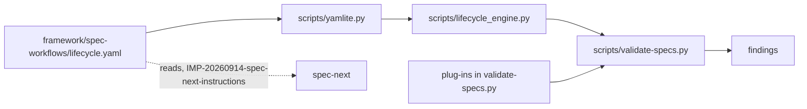

# IMP-20260917-lifecycle-schema-engine

*Last updated: 2026-09-17*

## Summary

- **Goal:** Make one declarative `lifecycle.yaml` the single source of the spec-lifecycle rules the validator enforces.
- **Scope:** Move the schema, engine and stdlib YAML loader from the RES sandbox into ai-dotfiles; `validate-specs.py`
  runs 12 checks through the engine and keeps 10 as plug-ins; fix the 7 prose↔code mismatches the RES found.
- **Out of scope:** Enforcing required sections, and `spec-next` itself.

## Current State

`validate-specs.py` (2 020 lines) encodes 22 checks in Python; the rules also live in prose in `spec-lifecycle.md`,
`spec-types.md` and the four templates. `RES-20260914-declarative-lifecycle-schema` closed `confirmed` on 2026-09-17:
a 408-line `lifecycle.yaml` plus `engine.py` (310) and `yamlite.py` (111) reproduce every finding exactly — corpora
3/3, self-tests 93/93, mutation and edge fixtures 89/89 — and replace 834 code lines with 560 (649 with the loader).
All of it sits in `research/RES-20260914-declarative-lifecycle-schema/`, outside any repo, so nothing reads it.
`IMP-20260914-spec-next-instructions` FR-3 needs that schema as its rule source. The RES also recorded 7 rules the
prose, templates and code state differently (README § Rules stated differently).

## Proposed Improvement

Promote the sandbox to production with the four single-use structural ops (`cycles`, `section_has_table`,
`table_rows`, `req_duplicates`) demoted to plug-ins, so the schema holds data-shaped rules only: 12 declarative
checks, 10 plug-ins. Required-section rules move with the schema as advisory data for `spec-next`. The 7 mismatches
are resolved in the same change, each with a fixture. Measurable benefit: tools able to read the enforced rules
from 1 (the validator, as Python) to 2 (validator + `spec-next`, as data); `validate-specs.py` from 2 020 to ≤1 420
lines; prose↔code mismatches from 7 to 0; findings unchanged outside the 7 documented resolutions.

## Requirements

- FR-1: `framework/spec-workflows/lifecycle.yaml` MUST declare the 12 declarative checks, the lanes, enums, statuses and the per-type/per-status required sections (advisory).
- FR-2: `validate-specs.py` MUST run the declarative checks through `scripts/lifecycle_engine.py` and delete the Python checks and helpers they replace.
- FR-3: The 10 plug-ins MUST be named in the schema with the finding ids they own, and the engine MUST fail loudly on a schema rule or plug-in it cannot resolve.
- FR-4: The loader MUST be stdlib-only (`scripts/yamlite.py`); the validator stays zero-dependency.
- FR-5: The 7 mismatches MUST be resolved as listed under `### Decisions` D4, each covered by a self-test fixture.
- FR-6: The RES mutation and edge fixtures MUST be ported to `scripts/test/lifecycle-mutations.test.sh` and run by `make tests`.

## Acceptance Criteria

### AC-1: Parity after the switch (FR-1, FR-2, FR-3, FR-4, FR-6)

Given the validator on the new engine, with no PyYAML installed
When `validate-specs.test.sh`, `lifecycle-mutations.test.sh` and the validator on both corpora run
Then every finding matches the pre-change validator except the D4 resolutions, and `validate-specs.py` is ≤1 420 lines
Evidence: `make tests` output + before/after finding diff recorded in Closure Evidence

### AC-2: A broken schema cannot pass silently (FR-3)

Given a schema rule naming an unknown op, or a plug-in id with no implementation
When the validator runs
Then it exits non-zero naming the rule
Evidence: `lifecycle-mutations.test.sh`

### AC-3: Mismatches resolved (FR-5)

Given one fixture per D4 item
When the validator and `make validate-anchors` run
Then each fixture yields the resolved behaviour and the edited prose and templates carry no stale anchor
Evidence: `validate-specs.test.sh` + `validate-anchors` run

## Design

### Decisions

- D1: YAML schema beside the prose in `framework/spec-workflows/`, engine and loader in `scripts/` — rejected: JSON
  (no comments, harder to read beside prose); schema in `scripts/` (hides rules from spec authors).
- D2: `cycles`, `section_has_table`, `table_rows`, `req_duplicates` become plug-ins — rejected: keep as ops (each is
  single-use Python logic dressed as vocabulary).
- D3: Hard switch, rollback by reverting one commit — rejected: `--legacy` flag (two live rule sources).
- D4: Mismatch resolutions —
  1. Add `## Closure Evidence` to all four templates; the checks keep reading that heading.
  2. Enforce "RES MUST NOT elect `risk: trivial`" as a new finding.
  3. The Tasks-table status check becomes fence-aware like every other section reader.
  4. One `*Last updated:*` grammar for both freshness checks, accepting `*…*` and `_…_`.
  5. Rule #10 prose states that the check covers `plan` and `in-progress` only.
  6. RES prose states the Tasks table lands with the `specify → in-progress` flip.
  7. `code-location` flags only a repo's top-level `src/`, matching the prose.

### Risks / Trade-offs

- Rules read as programs in YAML (`with`/`each`/`let`) → D2 removes the least data-like ops; review readability at Plan.
- ≤1 420 lines may be missed once four ops return to Python → re-Specify rather than relax parity.
- A D4 resolution flags existing specs → run both corpora before the gate of each task; fix specs in the same task.

### Open Questions

None.

## Out of Scope

- OS-1: Enforcing required sections — needs a date cut-off; separate IMP.
- OS-2: `spec-next` — `IMP-20260914-spec-next-instructions`.
- OS-3: Renaming headings in archived specs.

## Split Decision

**Kept as one — T1 fires, E3 applies.** Clusters: engine switch (FR-1–FR-4, FR-6) and mismatch fixes (FR-5) are
testable apart (T1); the owner chose one IMP reverted as one commit (Q2, Q4), and the D4 fixes are edits to the
schema the switch introduces (E3). T2 `unknown` (no module map).

## Tasks

> **Before starting Task T1, set status: in-progress in the front-matter above.**

| # | Description | Files | Source files (read-only) | Depends on | Skills | Model | Status |
|---|---|---|---|---|---|---|---|
| T1 | Safety net before any change (FR-6): port the RES mutation and edge fixtures as assertions against the **current** validator, wire them into `make tests`, and snapshot the pre-change findings of both corpora and every self-test invocation as the parity baseline for AC-1 | `scripts/test/lifecycle-mutations.test.sh` *(new)*, `Makefile`, `docs/specs/archived/artifacts/IMP-20260917-lifecycle-schema-engine-baseline.md` *(new)* | `research/RES-20260914-declarative-lifecycle-schema/fixtures.sh`, `research/RES-20260914-declarative-lifecycle-schema/parity.sh`, `research/RES-20260914-declarative-lifecycle-schema/shim.py`, `scripts/test/validate-specs.test.sh` | — | test-driven-development, writing-specs | default | ☑ done |
| T2 | Land schema, engine and loader unwired (FR-1, FR-3, FR-4; D1, D2): `lifecycle.yaml` in `framework/spec-workflows/`, engine resolving it from its own location, the four single-use ops replaced by plug-in declarations, fail-loud on an unknown op or unresolved plug-in; AC-2 fixtures red first | `framework/spec-workflows/lifecycle.yaml` *(new)*, `scripts/lifecycle_engine.py` *(new)*, `scripts/yamlite.py` *(new)*, `scripts/test/lifecycle-mutations.test.sh` | `research/RES-20260914-declarative-lifecycle-schema/lifecycle.yaml`, `research/RES-20260914-declarative-lifecycle-schema/engine.py`, `research/RES-20260914-declarative-lifecycle-schema/yamlite.py`, `scripts/speclib.py` | T1 | test-driven-development, avoiding-duplication | deep | ☑ done |
| T3 | Switch the validator (FR-2, FR-3; D3): `validate-specs.py` runs the 12 declarative checks through the engine, keeps the 10 plug-ins, deletes the replaced checks and helpers; findings equal the T1 baseline with no PyYAML on the path; `validate-specs.py` ≤1 420 lines (AC-1) | `scripts/validate-specs.py`, `scripts/test/validate-specs.test.sh` | `docs/specs/archived/artifacts/IMP-20260917-lifecycle-schema-engine-baseline.md` | T2 | test-driven-development, avoiding-duplication | deep | ☑ done |
| T4 | Behavioural D4 resolutions 2, 3, 4, 7 (FR-5): RES `risk: trivial` finding, fence-aware Tasks-table check, one `*Last updated:*` grammar, `code-location` limited to a repo's top-level `src/`; one red-then-green fixture each; both corpora re-run and any newly flagged spec fixed | `framework/spec-workflows/lifecycle.yaml`, `scripts/validate-specs.py`, `scripts/speclib.py` (shared stamp grammar), `scripts/test/validate-specs.test.sh`, `scripts/test/lifecycle-mutations.test.sh` | `framework/spec-workflows/spec-lifecycle.md`, `framework/spec-workflows/spec-types.md` | T3 | test-driven-development, writing-specs | default | ☑ done |
| T5 | Prose D4 resolutions 1, 5, 6 (FR-5): `## Closure Evidence` in the four templates and the guide; Rule #10 scope and the RES Tasks-table timing stated in `spec-lifecycle.md`, which names `lifecycle.yaml` as the enforced source; `make validate-anchors` clean (AC-3) | `framework/spec-workflows/templates/CR-TEMPLATE.md`, `framework/spec-workflows/templates/IMP-TEMPLATE.md`, `framework/spec-workflows/templates/BUG-TEMPLATE.md`, `framework/spec-workflows/templates/RES-TEMPLATE.md`, `docs/spec-templates-guide.md`, `framework/spec-workflows/spec-lifecycle.md` | `framework/spec-workflows/lifecycle.yaml` | T4 | writing-specs | default | ☑ done |
| T6 | Closure: `make check` green, before/after finding diff against the T1 baseline showing only D4 changes, line counts, reviewer sub-step (recommended at `medium`), `## Closure Evidence` per AC | `docs/specs/active/IMP-20260917-lifecycle-schema-engine.md` | `docs/specs/archived/artifacts/IMP-20260917-lifecycle-schema-engine-baseline.md` | T5 | writing-specs | default | ☑ done |

## Closure Evidence

| AC | Evidence |
|---|---|
| AC-1 | `make check` rc=0 (2026-09-17), incl. `validate-specs.test.sh` and `lifecycle-mutations.test.sh`, with no PyYAML installed (`import yaml` → `ModuleNotFoundError`). Old validator (`0a3363a`) vs final tree over 119 invocations: 113 identical in findings and exit code, 6 differ and all are D4 resolutions; both corpora identical — `docs/specs/archived/artifacts/IMP-20260917-lifecycle-schema-engine-baseline.md` § Closure diff. `validate-specs.py` 2 020 → 1 101 lines (+ `lifecycle_engine.py` 276, `yamlite.py` 111, `lifecycle.yaml` 365). |
| AC-2 | `lifecycle-mutations.test.sh` § broken schema: unknown op, unknown lane, plug-in without implementation, implemented plug-in not named — each exits 2 naming the rule; red before T3 wired the engine, green after. |
| AC-3 | `validate-specs.test.sh` § D4 fixtures (#2, #3, #4, #7) red before T4, green after; #1, #5, #6 are prose: `## Closure Evidence` in the four templates + `spec-templates-guide.md § Closure Evidence`, `spec-lifecycle.md` Rule #10 and RES rules #4, #6. `make validate-anchors` OK (117 links), `check-md-links` OK, `lint-rules` OK. |

## Agent instructions

Per `<system>/boundaries.md` and `<system>/docs/agent-protocol.md`; `§ Ask first #3/#4` applies. `research/` is read-only.

## Docs updates required

- `framework/spec-workflows/spec-lifecycle.md` — D4 items 5–6; point at `lifecycle.yaml` as the enforced source.
- Four templates — `## Closure Evidence`; `docs/spec-templates-guide.md` — describe it.

## Rollout / migration notes

- Land after `make tests` and both corpora are clean; `tobevisit-content` specs flagged by D4 are fixed in the same task.
