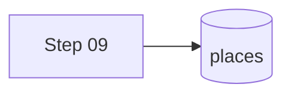
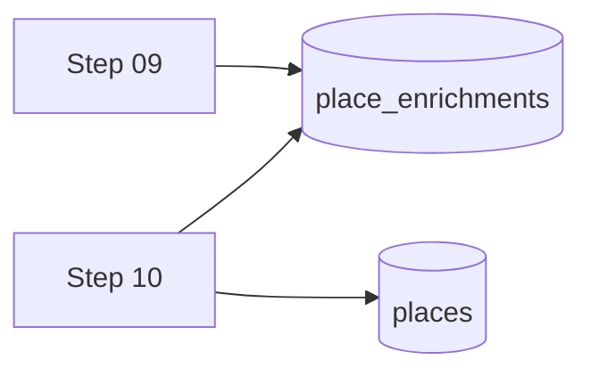

#skill:writing-specs
#skill:agent-protocol

You are running the **Visualize sub-step**. It lives inside the Specify
stage — the spec stays at `status: specify` throughout. You populate the
`## Architecture` section with Mermaid diagrams and return to the Specify
prompt for the requirements gate.

Full process: [`<root>/.github/copilot/spec-workflows/README.md`](../spec-workflows/README.md).

## Preconditions

- The spec file exists and is at `status: specify`.
- `## Requirements` and `## Acceptance Criteria` sections are drafted
  (architecture must match requirements, not the other way around).
- At least one Visualize trigger applies:
  - CR risk is `medium` or `high`, OR
  - The spec adds / removes / reshapes a bounded context, OR
  - The spec changes data flow between contexts or services, OR
  - The spec changes a schema (database, type/interface definition, API contract), OR
  - The spec adds a new pipeline step or changes step ordering.

If none apply, do **not** run this prompt. Write
`Skipped — <reason>` under `## Architecture` and move on.

## Step 1 — Load context

1. The spec file (`status` must be `specify`).
2. Target project's `docs/architecture/` (system overview, module map).
3. Relevant reference schemas cited in the spec's `affected-docs`.

## Step 2 — Choose diagram types

Pick the minimum set that communicates the change. Each diagram ≤ 30 nodes.

| Change type | Preferred diagram |
|---|---|
| New pipeline step / data flow | `flowchart` (left-to-right) |
| Multi-service interaction / async | `sequenceDiagram` |
| Schema / entity relationship | `erDiagram` or `classDiagram` |
| State change in an entity | `stateDiagram-v2` |
| Component composition (UI) | `flowchart` with subgraphs |

## Step 3 — Write the Architecture section

Replace the template placeholder under `## Architecture` with the
diagrams. Precede each diagram with a one-sentence caption: *what the
diagram shows and from whose perspective*.

Example:

```markdown
## Architecture

**Before:** Step 09 writes enrichment directly to `places` collection.



**After:** Step 09 writes enrichment to a new `place_enrichments`
collection; Step 10 joins on read.


```

## Step 4 — Update the spec

- Keep `status: specify`.
- Update `*Last updated: YYYY-MM-DD*`.
- If the architecture reveals new requirements or scope conflicts, go back
  to Specify and revise FRs/ACs before proceeding.

## Step 5 — Hand back to Specify

Post a short summary (diagram types used, key design decisions) and hand
control back to [`create-spec.prompt.md`](create-spec.prompt.md) for the
requirements gate. Do **not** write the `## Tasks` table here.

## Hard rules

- Status stays at `specify` — Visualize is not a separate status.
- Diagrams MUST match the approved requirements, not aspiration.
- Do not use prose to describe the diagram — the diagram is the
  specification. One-line captions only.
