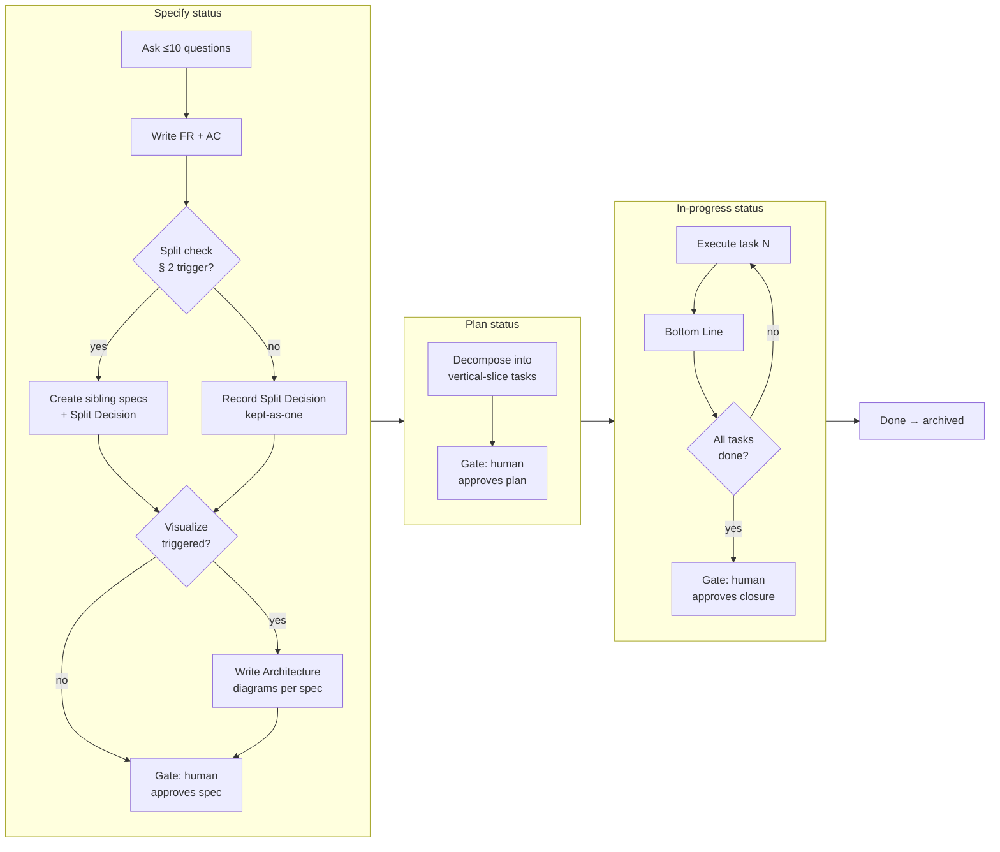

# Spec Workflows

*Last updated: 2026-04-20*

Spec-driven workflow for all work items. Every change follows four hard gates
with human approval between stages: **Specify → Plan → In-progress → Done**.

The **Visualize** sub-step runs inside Specify for any CR that changes
architecture, data flow, or schema. It is a required sub-step — not a
separate status — so that agents cannot silently skip it.

## Contents

| File | Purpose |
|------|---------|
| [spec-lifecycle.md](spec-lifecycle.md) | Status transitions, front-matter schema, gate rules |
| [spec-types.md](spec-types.md) | Type catalog, per-stage context load matrix |
| [adr-conventions.md](adr-conventions.md) | ADR naming, status values, template |
| [templates/](templates/) | Copy-ready spec templates (CR, BUG, IMP) |
| [questions/](questions/) | Per-type standard questions for the Specify step |

## Workflow diagram

## Stage summary

| # | Stage | Status | Produces | Human gate |
|---|---|---|---|---|
| 1 | **Specify** | `specify` | Requirements, Acceptance Criteria, Split Decision, Architecture (if triggered), Out of Scope | Requirements approved |
| 2 | **Plan** | `plan` | Tasks table (vertical slices, max 5 files per task) | Plan approved |
| 3 | **Task** | `in-progress` | Code + tests per task; "The Bottom Line" | Each task approved before next starts |
| 4 | **Done** | `done` → `archived/` | Evidence for every AC; file moves to `archived/` | Closure approved |

**Each stage is a separate chat turn with a fresh preflight.** The spec file
is one living document, updated in place at every stage.

## Visualize sub-step: when mandatory

Run Visualize inside Specify (before requesting the requirements gate) when
**any** of the following apply:

- CR risk is `medium` or `high`.
- The spec adds, removes, or reshapes a bounded context.
- The spec changes data flow between contexts or services.
- The spec changes a schema (database, type/interface definition, API contract).
- The spec adds a new pipeline step or modifies step ordering.

Skip Visualize **only** when all of the above are false. Record the skip
reason in the spec under `## Architecture` as a single line:
`Skipped — <reason>`.

## Split sub-step: when mandatory

Run the Split check inside Specify (after FRs + ACs, before the
requirements gate) on **every** CR, IMP, and BUG. The check itself is
never skipped; the outcome may be *"kept as one spec"* when a
[`splitting-rules.md § 4`](../skills/writing-specs/references/splitting-rules.md)
exception applies. Record the outcome in `## Split Decision`.

Triggers and exceptions live in
[`splitting-rules.md § 2`](../skills/writing-specs/references/splitting-rules.md)
(Specify) and [`§ 3`](../skills/writing-specs/references/splitting-rules.md)
(Plan safety net).

## Anti-skip rules

- Never write the `## Tasks` table while `status` is `specify`.
- Never flip `status` to `plan` without the human approving requirements
  (and architecture, if Visualize was triggered).
- Never flip `status` to `in-progress` without the human approving the plan.
- Never flip `status` to `done` with open acceptance criteria or missing evidence.
- Never request the requirements gate without completing the Split check.
- Never bundle independently-testable features into one spec — split per
  [`splitting-rules.md § 2`](../skills/writing-specs/references/splitting-rules.md).

Full rules: see [spec-lifecycle.md § Rules](spec-lifecycle.md#rules).

## When the user types "create spec"

Follow the three gated prompts in order. None may be skipped.

| User intent | Prompt | Output |
|---|---|---|
| Start a new CR / IMP | [`<root>/.github/copilot/prompts/create-spec.prompt.md`](../prompts/create-spec.prompt.md) | Spec file at `status: specify` |
| Architecture review | [`<root>/.github/copilot/prompts/visualize-spec.prompt.md`](../prompts/visualize-spec.prompt.md) | `## Architecture` section populated |
| Break into tasks | [`<root>/.github/copilot/prompts/plan-spec.prompt.md`](../prompts/plan-spec.prompt.md) | `## Tasks` table; status `plan` |
| Triage a bug | [`<root>/.github/copilot/prompts/bug-triage.prompt.md`](../prompts/bug-triage.prompt.md) | Spec file at `status: specify` |
