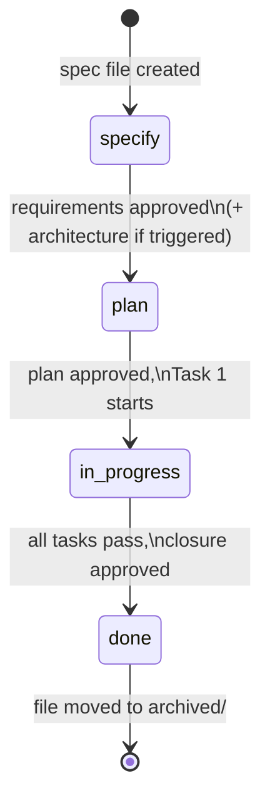

# Spec Lifecycle

*Last updated: 2026-05-14*

Single canonical source for status definitions, transitions, gates, front-matter schema, anti-skip rules, and Visualize / Split sub-step triggers. Other framework files MUST link here, not restate the rules.

## Front-matter schema

Every spec file starts with YAML front-matter. All fields below are
**required** unless marked optional.

```yaml
---
id: CR-YYYYMMDD-<kebab-case-title>     # file basename without .md
type: CR                                # CR | BUG | IMP | RES
date: YYYY-MM-DD                        # creation date
status: specify                         # specify | plan | in-progress | done
owner: <github-handle>                  # accountable human
risk: low | medium | high               # CR / IMP only; BUG uses severity
severity: low | medium | high | critical  # BUG only
affected-repos:                         # repos that will change
  - <project-name>
affected-docs:                          # docs that will change (planning inventory)
  - docs/...
affected-code:                          # code paths that will change (planning inventory)
  - src/...
skills:                                 # skills to load at every stage and task
  - writing-specs
  - <project-skill>
model-suggestion: default               # fast | default | deep (from model-selection skill)
siblings:                               # optional — sibling spec IDs produced by the Split check
  - <spec-id>
depends-on:                             # optional — specs that MUST reach `done` before this one advances to `plan`
  - <spec-id>
---
```

`siblings:` and `depends-on:` are filled during the Specify-stage Split
check (see
[`splitting-rules.md § 5`](../skills/writing-specs/references/splitting-rules.md)).
Omit the fields when the spec is autonomous.

## Status transitions



| Transition | Precondition | Agent action |
|---|---|---|
| `[start]` → `specify` | Human asked for a new spec | Copy template, fill front-matter, write title — status `specify` from birth |
| `specify` → `plan` | Human approved requirements (and architecture if Visualize triggered). All `depends-on:` siblings must be `done` | Flip status, write `## Tasks` table |
| `plan` → `in-progress` | Human approved the plan, first task begins | Flip status **before** the first file edit of Task 1 |
| `in-progress` → `done` | Every AC has evidence, tests pass, docs updated | Flip status, post closure summary |
| `done` → `archived/` | Immediately after closure | Move file from `docs/specs/active/` to `docs/specs/archived/` |

**No status is skipped. No status is revisited in place** — if the plan
must change after `in-progress` begins, stop, flip status back to `plan`,
update the table, ask for re-approval.

## Rules

1. **Never** skip the Specify stage — even for a one-line bug. Confirm
   understanding with the ≤10 questions from the relevant question list.
2. **Never** write a `## Tasks` table while `status` is `specify`.
3. **Never** flip to `plan` without explicit human approval of requirements.
4. **Never** flip to `in-progress` without explicit human approval of the
   plan.
5. **Never** flip to `done` while any acceptance criterion lacks documented
   evidence.
6. **Always** update `*Last updated: YYYY-MM-DD*` when changing the file.
7. **Always** update the task row status in-place as tasks progress.
8. Visualize is a sub-step of Specify (not a status). When triggered,
   complete it before asking for the requirements gate.
9. The **Split check** (see
   [`splitting-rules.md § 2`](../skills/writing-specs/references/splitting-rules.md))
   is a mandatory sub-step of Specify — complete it before Visualize and
   record the outcome under `## Split Decision` in every affected spec.
10. A spec with unmet `depends-on:` MUST stay at `specify` (never flip to
    `plan`) until all listed siblings reach `done`.
11. **Never** request the requirements gate without completing the Split check; record the outcome under `## Split Decision` first.
12. **Never** bundle independently-testable features into one spec — split per [`splitting-rules.md § 2`](../skills/writing-specs/references/splitting-rules.md).
13. **Baseline closure rule and Summary refresh.** Any spec that changes
    baseline behaviour in a feature with an existing
    `<project>/docs/requirements/<feature>.md` file MUST update that
    file in the same change before flipping to `done`. Baselines updated
    under this rule MUST describe the system after the spec's changes
    are applied -- not desired future behaviour -- and MUST bump the
    `Last src verified` row in the baseline's header info to the
    closure date, even when the baseline body is unchanged. The Closure
    Evidence row for the affected AC MUST cite the diff (path +
    summary). When the spec introduces baseline behaviour for a feature
    that has no baseline file yet, the closure MAY seed a new file under
    `docs/requirements/` -- recommended when the feature will likely be
    touched again. If the spec's scope changed between Plan and closure,
    refresh `## Summary` before flipping to `done` so Goal, Scope, and
    Out of scope reflect post-closure state. See the seed example at
    `tobevisit-content/docs/requirements/place-catalog-enrichment.md`.

## Visualize sub-step (Specify)

Run inside Specify before the requirements gate when **any** apply:

- Risk is `medium` or `high` (CR / IMP).
- Adds, removes, or reshapes a bounded context.
- Changes data flow between contexts or services.
- Changes a schema (database, type/interface, API contract).
- Adds or reorders a pipeline step.

Skip only when all are false. Record in `## Architecture` as a single line: `Skipped — <reason>`.

## Split sub-step (Specify)

Run on **every** CR / IMP / BUG after FRs + ACs, before the requirements gate. Never skipped; outcome may be *"kept as one spec"* per [`splitting-rules.md § 4`](../skills/writing-specs/references/splitting-rules.md). Record under `## Split Decision`. Triggers: [`§ 2`](../skills/writing-specs/references/splitting-rules.md) (Specify), [`§ 3`](../skills/writing-specs/references/splitting-rules.md) (Plan-stage safety net).

## File naming

Pattern: `<TYPE>-YYYYMMDD-<kebab-case-title>.md`

Examples:
- `CR-20260420-footer-copyright-message.md`
- `BUG-20260418-viewport-overlap.md`
- `IMP-20260409-place-catalog-ai-content.md`

## File location

```
docs/specs/
├── active/      ← specs in specify / plan / in-progress
└── archived/    ← completed specs (status: done); never deleted
```

## Deprecated: `draft` status

Earlier versions of this framework used `draft → specify → visualize →
plan → …`. Those four stages collapsed into one in practice (specs were
born fully-formed at `plan`), so the lifecycle is now:

```
specify → plan → in-progress → done
```

**Existing archived specs** keep their original status values; do not
rewrite history. **New specs** use the 4-status lifecycle.
