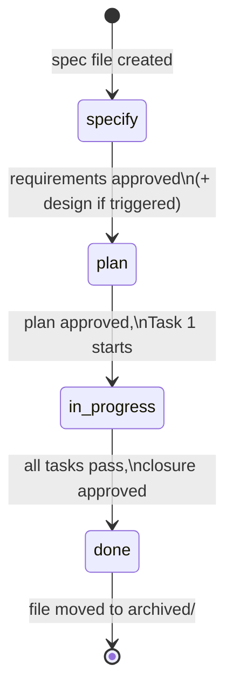

# Spec Lifecycle

*Last updated: 2026-09-18*

Single canonical source for status definitions, transitions, gates, front-matter schema, anti-skip rules, and
Design Decisions / Visualize / Split sub-step triggers. Other framework files MUST link here, not restate the rules.
The mechanical subset — front-matter schema, lanes, naming, freshness, links, inventory, traceability — is declared in
[`lifecycle.yaml`](lifecycle.yaml) and enforced by `validate-specs.py`; a rule changed here changes there in the same edit.

<!-- Anchors in this file (per `docs/rule-canonical-map.md`): R2 `never-tasks-table-at-specify` · R3 `never-flip-without-gate`, `observation-shaped-evidence` · R6 `split-check-mandatory` · R7 `depends-on-blocks-plan`, `inventory-overlap-restales` · R8 `visualize-not-a-status` · R10 `visualize-triggers` (anchor-only — see docs/specs/archived/artifacts/IMP-20260514-rule-map-narrative.md). -->

## Front-matter schema

Every spec file starts with YAML front-matter. All fields below are
**required** unless marked optional.

```yaml
---
id: CR-YYYYMMDD-<kebab-case-title>     # file basename without .md
type: CR                                # CR | BUG | IMP | RES
date: YYYY-MM-DD                        # creation date
status: specify                         # specify | plan | in-progress | done
closed: YYYY-MM-DD                      # set when status flips to done; required for specs dated on or after 2026-09-16
owner: <github-handle>                  # accountable human
risk: low | medium | high               # CR / IMP only; BUG uses severity. `trivial` is history only (see § Trivial lane).
severity: low | medium | high | critical  # BUG only
affected-repos: # repos that will change
  - <project-name>
affected-docs: # docs that will change (planning inventory)
  - docs/...
affected-code: # code paths that will change (planning inventory)
  - src/...
skills: # skills to load at every stage and task
  - writing-specs
  - <project-skill>
model-suggestion: default               # fast | default | deep (from model-selection skill)
siblings: # optional — sibling spec IDs produced by the Split check
  - <spec-id>
depends-on: # optional — specs that MUST reach `done` before this one advances to `plan`
  - <spec-id>
baseline-impact: none — <reason>        # CR / IMP / BUG — set instead of `## Baseline Deltas` when no docs/domain/ baseline changes (Rule 13)
---
```

`siblings:` and `depends-on:` are filled during the Specify-stage Split
check (see
[`splitting-rules.md § 5`](../skills/writing-specs/references/splitting-rules.md)).
Omit the fields when the spec is autonomous.

## Status transitions



| Transition             | Precondition                                                                                                     | Agent action                                                                |
|------------------------|------------------------------------------------------------------------------------------------------------------|-----------------------------------------------------------------------------|
| `[start]` → `specify`  | Human asked for a new spec                                                                                       | Copy template, fill front-matter, write title — status `specify` from birth |
| `specify` → `plan`     | Human approved requirements (and design if Design Decisions or Visualize triggered). All `depends-on:` siblings must be `done` | Flip status, write `## Tasks` table                                               |
| `plan` → `in-progress` | Human approved the plan, first task begins                                                                       | Flip status **before** the first file edit of Task 1                        |
| `in-progress` → `done` | Every AC has evidence that could have failed for it — an observation-shaped criterion needs evidence reaching its surface (see [§ Rules #5](#observation-shaped-evidence)); tests pass, docs updated. **High tier** (`risk: high`, or `severity: high \| critical`) also needs a recorded `### Review` — a run or a waiver (see [§ Reviewer sub-step](#reviewer-substep)). Closure approval is synchronous for `medium`/`high` risk; `low` may use review-after closure (see [§ Review-after closure](#review-after-closure)) | Flip status, post closure summary                                           |
| `done` → `archived/`   | Immediately after closure; every process the work started is already stopped ([§ Rules #14](#stop-processes-at-closure))                                                                                        | Move file from `docs/specs/active/` to `docs/specs/archived/`               |

**No status is skipped. No status is revisited in place** — if the plan
must change after `in-progress` begins, stop, flip status back to `plan`,
update the table, ask for re-approval. **Exception:** specs of `type: RES`
may transition `in-progress → specify` repeatedly until reaching `done` —
the iterative loop is the lane's defining feature. See [§ RES exception](#res-exception)
for the full rule set and Iteration Log mandate.

## Rules

1. Skip-protection rule lives at [`boundaries.md § Never do #2`](../boundaries.md#never-skip-specify). In lifecycle
   terms: even a one-line bug runs the ≤10-question round from its question list before requirements gate.
2. <a id="never-tasks-table-at-specify"></a>**Never** write a `## Tasks` table while `status` is `specify`.
3. <a id="never-flip-without-gate"></a>**Never** flip to `plan` without explicit human approval of requirements.
4. **Never** flip to `in-progress` without explicit human approval of the
   plan.
5. <a id="observation-shaped-evidence"></a>**Never** flip to `done` while any acceptance criterion lacks documented
   evidence, and never offer evidence that could not have failed for the
   criterion it closes.

   A criterion is **observation-shaped** when its `When` describes a person
   operating a user-facing surface — an operator opening a tab, a visitor
   submitting a form. Its claim is about what appears on screen, so:

   **An observation-shaped criterion is closed only by a test that renders its surface, or by recorded manual evidence.**
   **A suite that cannot reach the surface is not evidence for it.**

   However large or green, such a suite asserts on the layers underneath the
   claim. Criteria whose `When` names a system action — a pipeline step, an
   import, a request — are unaffected and close on the suite as before.

   **Manual evidence MUST record the observation, the surface, the observer and the date.**

   A reader who was not present can then weigh it instead of taking it on
   trust. Undated evidence, or evidence with no named observer, does not
   satisfy this rule.

   The evidence kind is declared when the criterion is written, not
   discovered here — see [`authoring-steps.md § A`](../skills/writing-specs/references/authoring-steps.md).

6. Stamp-bump rule lives at [`boundaries.md § Always do #10`](../boundaries.md#last-updated-stamp); applies to every
   change of this lifecycle file too.
7. Task-row-update rule lives at [`boundaries.md § Always do #11`](../boundaries.md#task-row-status-in-place); applies
   as tasks progress through the in-progress stage.
8. <a id="visualize-not-a-status"></a>Visualize is a sub-step of Specify (not a status). When triggered,
   complete it before asking for the requirements gate.
9. <a id="split-check-mandatory"></a>The **Split check** (see
   [`splitting-rules.md § 2`](../skills/writing-specs/references/splitting-rules.md))
   is a mandatory sub-step of Specify — complete it before Design Decisions
   and Visualize, and record the outcome under `## Split Decision` in every
   affected spec. Order: Split → [Design Decisions](#design-decisions-triggers)
   → Visualize → requirements gate.
10. <a id="depends-on-blocks-plan"></a>A spec with unmet `depends-on:` MUST stay at `specify` (never flip to `plan`) until all listed siblings reach `done`.
    `validate-specs.py` enforces this at `plan` and `in-progress` only: a `done` spec already passed the gate and is
    not re-judged when a dependency is later reopened or renamed.

    Waiting is not the only obligation the field carries. A spec written
    against a dependency goes stale the moment that dependency closes —
    the code it described is no longer the code that exists — so:

    **When the last spec in `depends-on:` reaches `done`, `## Current State` MUST be re-verified against the code before the spec advances to `plan`.**
    **A finding the closed dependency superseded is tombstoned in place, not left standing** — an FR the closed work already satisfies says so and cites the spec that closed it.

    <a id="inventory-overlap-restales"></a>Staleness has a second key.
    `depends-on:` is filled by the Split check, so it reaches only specs
    split from each other, and misses two written independently against
    one target — which is where `## Current State` rots fastest, because
    no field links them for a reader to follow:

    **When any spec naming a path in this spec's `affected-docs:` or `affected-code:` reaches `done` after this spec's `date:`, `## Current State` MUST be re-verified before this spec advances to `plan`**, and a finding that spec superseded tombstoned on the same terms as above.

    `validate-specs.py` reports an undeclared overlap while both specs are
    active; this key carries the obligation past that point, when the other
    spec has closed and moved to `archived/` where the check no longer
    looks.

    Re-verification is a read, not a rewrite: where the section still
    holds, re-date it and record what was checked, so the next reader can
    tell a verified section from an unexamined one.
11. **Never** request the requirements gate without completing the Split check; record the outcome under
    `## Split Decision` first.
12. **Never** bundle independently-testable features into one spec — split per [
    `splitting-rules.md § 2`](../skills/writing-specs/references/splitting-rules.md).
13. **Baseline closure rule and Summary refresh.** Any spec that changes
    baseline behaviour in a feature with an existing
    `<project>/docs/domain/<feature>.md` file MUST update that
    file in the same change before flipping to `done` — through
    `baseline-merge --apply` for everything a delta can express (see
    *Baseline deltas* below). Baselines updated
    under this rule MUST describe the system after the spec's changes
    are applied -- not desired future behaviour. The Closure
    Evidence row for the affected AC MUST cite the diff (path +
    summary). If the spec's scope changed between Plan and closure,
    refresh `## Summary` before flipping to `done` so Goal, Scope, and
    Out of scope reflect post-closure state.

    **Enforcement — `Last src verified`.** `make validate-specs` reports
    `baseline_stale` when a baseline's `Last src verified` date is older
    than the closure date of the newest archived spec naming it in
    `affected-docs` — read from `closed:`, else a `Closed YYYY-MM-DD` line,
    else the `Last updated:` stamp, else `date:` — and
    `baseline_verified_missing` when the row or its leading date is absent.
    At closure, set `closed:` and the row to the same date, even when the
    baseline body is unchanged after re-checking `src`.

    <a id="baseline-deltas"></a>**Baseline deltas.** A CR, IMP or BUG dated
    after 2026-09-16 states its baseline impact by the requirements gate:

    **A spec that changes a baseline carries `## Baseline Deltas`; a spec that changes none sets `baseline-impact: none — <reason>`.**

    Every new or modified REQ in a delta states externally observable
    behaviour and carries a `Scenario:` or `Verified by:` pointer.
    `scripts/baseline-merge.py` works the section: `--check` runs at every
    status inside `make validate-specs` (`baseline_delta_*`), `--diff` goes
    into the requirements-gate summary, and `--apply` merges it at the
    closure gate once `closed:` is set, writing the `Last src verified` row
    itself. From `plan` on the validator reports `baseline_impact_missing`
    and `baseline_impact_malformed`. Format and merge semantics:
    [`spec-templates-guide.md § Baseline Deltas`](../../docs/spec-templates-guide.md#baseline-deltas).

    **A closure edits a baseline by hand only where no delta can address it — an un-numbered entry or a duplicated ID — and cites that edit in `## Closure Evidence`.**

    A baseline body is never edited outside a spec: the Direct lane excludes
    it. Specs dated on or before 2026-09-16 and not yet closed may still
    close under the hand-edit form this rule had before `--apply`.

    **Baseline discovery (Plan stage).** Before flipping to `plan`, scan
    `<project>/docs/domain/` for files whose feature name matches the
    spec's scope. Any match MUST be listed under `affected-docs:` in
    front-matter. This ensures the closure rule above is enforceable —
    you cannot update a baseline you didn't know existed.

    **Seeding new baselines.** When the spec introduces baseline behaviour
    for a feature that has no baseline file yet, the closure MUST seed a
    new file under `<project>/docs/domain/<feature>.md` when **any**
    of these apply: (a) the spec is a CR introducing a user-facing
    feature; (b) ACs include observable behavior likely to be reasserted
    in future specs; (c) the feature crosses bounded contexts. Otherwise
    seeding is OPTIONAL. The schema for the new file lives at
    [`docs/baseline-citations.md`](../../docs/baseline-citations.md).

14. **Leave no process running.** <a id="stop-processes-at-closure"></a>
    Before flipping a spec to `done`, **every process the work started MUST
    be stopped** — dev and preview servers, databases and their containers,
    watchers, tunnels, background builds, and any site or emulator brought up
    to verify a surface. Stop them, then confirm the ports are free and the
    containers are down; report what was stopped in the closure summary.

    A process that outlives its spec is invisible: it holds a port the next
    session needs, it pins a database the next spec expects to seed, and its
    cost accrues to nobody's task. Diagnosis is worse than the waste — a
    stale server serving an old bundle looks exactly like a code defect, and
    a second server refused a port looks exactly like a broken config.

    Two exceptions, both explicit: a process the human started themselves is
    theirs to stop — ask, never kill it — and a process the spec's own
    deliverable is meant to leave running is named in the closure summary as
    such, with the reason.

15. **Flip the implementation badges.** <a id="flip-implementation-badges"></a>
    Before flipping a design-first spec to `done`, **every Figma frame the spec
    implemented or changed MUST have its `status/implementation` badge flipped**
    — to `Implemented` with this spec's ID for what shipped, and `00 Cover`'s
    per-screen summary regenerated. A frame drawn but not built stays
    `Designed`. Code-first projects carry no badges and skip this rule; the
    mode and the badge semantics are defined in
    [`figma-file-organization.md § 6`](../prompts/references/figma-file-organization.md#source-of-truth--code-first-or-design-first).

## RES exception <a id="res-exception"></a>

**Lane review 2026-09-17 — keep.** Two uses in 160 archived specs, one of them the spike that produced
`lifecycle.yaml`; `explore.prompt.md` takes exploration that needs no running code. Evidence:
[lane review](../../docs/specs/archived/artifacts/IMP-20260914-explore-mode-and-lane-review-lane-review.md).

The RES (Research / Spike / POC) spec type implements a fundamentally
different lifecycle from CR / BUG / IMP: the work is **iterative**, not
forward-only. A RES spec may transition `in-progress → specify` an
unlimited number of times until reaching `done`. This is the only
exception to the "No status is revisited in place" rule above.

### Status transitions (RES-only)

```
specify ⇄ in-progress → done
         ↑________|
        (loop permitted)
```

Each `in-progress → specify` backflip MUST record an entry in the spec's
`## Iteration Log` section (date + cause + decision). Without that
entry, the backflip is invalid — the validator (see
[IMP-20260514-research-lane FR-7](../../docs/specs/archived/IMP-20260514-research-lane.md)
once archived) will flag it as drift.

### Front-matter additions (RES-only)

RES specs add four front-matter fields beyond the standard schema. They
are RES-only — CR/BUG/IMP MUST NOT carry them and the validator MUST NOT
require them on those types:

- `hypothesis:` — one-sentence statement of what is being tested
- `kill-criteria:` — when to stop iterating. Required shape: time-box
  OR token-budget OR iteration-count
- `code-location:` — sandbox path for throwaway code. Default
  `research/<spec-id>/`. MUST NOT be inside `src/` of any repo
- `outcome:` — filled at `done`. One of:
  `confirmed | refuted | inconclusive | promoted-to-<spec-id>`

When `outcome: promoted-to-<spec-id>` is set, the referenced spec MUST
exist (validator-enforced). Code in `research/<spec-id>/` MUST NOT be
merged into `src/` without that explicit promotion + the sibling CR/IMP
being `done`.

### Rules for the lane

1. RES is the only spec type that may transition `in-progress → specify`.
   CR/BUG/IMP remain forward-only (see "No status is revisited in place"
   above).
2. Each backflip MUST land a row in `## Iteration Log` with date + cause
    + decision. The validator flags backflips without a corresponding log
      entry.
3. RES specs MUST NOT carry `risk: trivial` or `severity: trivial` at any
   date — the validator reports `trivial_lane_removed`
   ([§ Trivial lane](#trivial-lane)).
4. `code-location:` MUST be outside every repo's `src/`. The default
   `research/<spec-id>/` lives in the workspace `research/` directory.
   The validator rejects a top-level `src/…` or `<repo>/src/…` path; a
   folder named `src` inside the sandbox is allowed.
5. At `done`, `outcome:` MUST be filled with a valid value. Promotion
   targets (`promoted-to-<id>`) MUST resolve to an existing spec in
   `docs/specs/active/` or `docs/specs/archived/`.
6. RES has no `plan` status, and [Rule #2](#never-tasks-table-at-specify)
   forbids a Tasks table at `specify`, so the `## Tasks` table lands in
   the same edit as the `specify → in-progress` flip.

## Trivial lane <a id="trivial-lane"></a>

**Removed 2026-09-17** by `IMP-20260917-remove-trivial-lane` after the lane review (one use in 160 specs). Small
changes take the [Direct lane](#direct-lane) or the standard track with `risk: low`. Specs dated before the removal keep
`risk: trivial` / `severity: trivial` as history; on a later spec, or any RES, `make validate-specs` reports
`trivial_lane_removed`.

## Direct lane <a id="direct-lane"></a>

**Lane review 2026-09-17 — keep.** Eight improvements-log entries across both corpora at 122 lines of footprint, the
cheapest lane per use.

The Direct lane covers owner-approved changes too small for any spec — the
"owner-approved direct edit" practice the improvements log already records,
now with a canonical home (IMP-20260610-mechanize-framework-guardrails FR-4).

**Eligibility — all MUST hold:**

- ≤ 2 files and ≤ 30 changed lines in total.
- No schema change (front-matter, baseline, type system, API contract),
  and no edit to a baseline body under `docs/domain/` — a baseline change
  always runs through a spec, whose closure Rule 13 checks.
- No change to AI prompts (`framework/prompts/`, project prompt catalogs).
- No change to `framework/boundaries.md`, this file, or any project
  `_canonical.md` § Boundaries (including rendered agent files).
- Single repo; no cross-repo impact.
- The owner explicitly approved the specific change in chat **before** the edit.

**Obligations — both MUST happen:**

1. Post **The Bottom Line** for the change
   ([`agent-protocol.md § Bottom Line`](../../docs/agent-protocol.md#the-bottom-line--canonical-format)).
2. Land an entry in the project's `docs/improvements-log.md` in the same
   session (what changed, why, owner approval noted), with a
   `- **Closed:** YYYY-MM-DD` line — `make validate-specs` reports
   `log_closed_missing` on Direct-lane entries dated on or after 2026-09-16
   without one ([`improvements-log-format.md`](../../docs/improvements-log-format.md)).

Anything beyond the threshold falls back to the standard track. The Direct lane is **not** a skip of judgment — it is
the codification of the smallest unit of owner-approved work; when in doubt,
write a spec.

## Review-after closure <a id="review-after-closure"></a>

For specs with `risk: low` (BUG: `severity: low`),
the closure approval MAY run **review-after** (IMP-20260610-mechanize-framework-guardrails FR-5):

- The agent flips `in-progress → done` and archives **immediately** once
  every AC has documented evidence and the closure summary is posted —
  no synchronous wait on the owner.
- The owner reviews review-after closures **in batch**: each closure summary
  is linkable from the archived spec; the improvements log cross-references
  any review-after closure landed since the last batch review.
- **Revert path:** if batch review rejects a closure, the spec moves back to
  `docs/specs/active/` at `status: in-progress`, the rejected evidence rows
  are voided, and the offending change is reverted or re-worked under the
  reopened spec.

`medium`/`high` risk closures remain synchronous. Requirements and plan
gates remain blocking for **all** lanes — review-after applies to the
closure gate only.

## Consolidation sub-step (after closure) <a id="consolidation-substep"></a>

`Never do #5` keeps refactoring out of feature tasks; this sub-step brings it back on a schedule
(IMP-20260914-consolidation-checkpoint). It runs after **every** spec reaches `done` — any lane, any tier.

1. **Run** `make consolidation-due PROJECT=<project> CLOSED=<spec-id>` from `$AI_DOTFILES`. It lists the bounded
   contexts the closed spec maps to, each with its count since that context's last checkpoint and whether it is
   due — at the log's `threshold` (default 5), or at once when the closed spec has `risk: high`, more than 8 tasks,
   or more than 15 `affected-code` entries.
2. **Nothing due → nothing posted.** Otherwise, for each due context run
   `make consolidation-due PROJECT=<project> CONTEXT="<name>"` and post its recommendation **after** the closure
   summary: the trigger, the accepted-duplication bullets, the rejected reviewer findings, the improvements-log
   entries and the duplication figure — or the stated cause of its absence — each with its source.
3. **The human decides.** Never create the IMP without an explicit accept. The agent never declines on the human's
   behalf, and never waits on the answer to continue other work.
4. **Log either answer** by appending an entry to the project's `docs/consolidation-log.md` per
   [`docs/consolidation-log-format.md`](../../docs/consolidation-log-format.md): `accepted — <IMP id>` or
   `declined — <reason>`. Either resets that context's counter; the accepted IMP's own closure never counts.
5. **An accepted IMP is refactor-only** (`Never do #5`): no behaviour change, and its `## Current State` cites the
   recommendation's inputs by source path. It then runs the normal lifecycle from Specify.

## Design Decisions sub-step (Specify) <a id="design-decisions-triggers"></a>

Run inside Specify after the Split check and before Visualize when **any** apply (CR / IMP):

- Adds or reshapes a bounded context.
- Changes data flow between contexts or services.
- Introduces a new architectural pattern or external dependency.
- Changes a persistence or schema model.
- Departs from `docs/architecture/profile.md` or an accepted ADR.
- Risk is `high`.

Skip only when all are false: `### Decisions` under `## Design` reads `Skipped — <reason>` on one line.

**Questions.** Read the project's `docs/architecture/profile.md` and ADRs first, then ask **at most 5** from
[`design-questions.md § Spec`](questions/design-questions.md). Never ask what a profile row or an accepted ADR
already settles.

**Record** under `## Design`, before any diagram:

- `### Decisions` — each decision with the alternatives considered and why each was rejected.
- `### Risks / Trade-offs` — one line per risk: `<risk> → <mitigation>`.
- `### Open Questions` — only questions answerable later without changing a requirement, the approach or the task
  breakdown; anything else is asked now. `None.` when empty.

**Departures.** <a id="design-departure-adr"></a>A decision that departs from a profile row or sets a new project-wide
convention links a `proposed` ADR ([`docs/adr-conventions.md`](../../docs/adr-conventions.md)) before the
requirements gate is requested.

The trigger list overlaps Visualize's on purpose: Design Decisions weighs the approach, Visualize draws the one
chosen. `risk: medium` alone triggers Visualize, not Design Decisions.

## Visualize sub-step (Specify) <a id="visualize-triggers"></a>

Run inside Specify before the requirements gate when **any** apply:

- Risk is `medium` or `high` (CR / IMP).
- Adds, removes, or reshapes a bounded context.
- Changes data flow between contexts or services.
- Changes a schema (database, type/interface, API contract).
- Adds or reorders a pipeline step.
- Adds or changes a user-facing UI surface (screen, view, component).

Skip only when all are false. Record in `## Design` as a single line: `Skipped — <reason>`.

**Output format.** Use **Mermaid** for structure, data flow, schema, and step ordering. For UI surfaces use **Figma** — design-system-first rules (discover → reuse → build library when missing) and caption format: [`visualize-spec.prompt.md § Hard rules`](../prompts/visualize-spec.prompt.md).

## Split sub-step (Specify)

Run on **every** CR / IMP / BUG after FRs + ACs, before the requirements gate. Never skipped; outcome may be *"kept as
one spec"* per [`splitting-rules.md § 4`](../skills/writing-specs/references/splitting-rules.md). Record under
`## Split Decision`. Triggers: [`§ 2`](../skills/writing-specs/references/splitting-rules.md) (Specify), [
`§ 3`](../skills/writing-specs/references/splitting-rules.md) (Plan-stage safety net).

## Reviewer sub-step (in-progress) <a id="reviewer-substep"></a>

Run during `in-progress`, before requesting the closure gate.

- **High tier — `risk: high`, or `severity: high | critical` at any risk —
  the run is a closure precondition.** The spec does not flip to `done`
  until the reviewer has run against the final diff or the human has waived
  the run; either outcome is recorded under `### Review` (below).
- **Medium and low — recommended, non-blocking.** Run it when risk is
  `medium`, or on demand for any spec. Nothing is recorded.

- The [`reviewer`](../agents/reviewer.md) judges the change **cold** in a
  fresh, read-only context: inputs are the spec + the `git diff` (it reads
  the diff itself). Its reply is a `REVIEW <spec-id> <range>` header, a
  `RESULT:` line reading `PASS` or `<N> findings`, and N numbered
  `file:line → violated clause` findings, per the
  [`reviewing-changes`](../skills/reviewing-changes/SKILL.md) checklist.
- **The owner is the arbiter; the agent proposes.** After every run, at
  any tier, the agent:
  1. posts the reviewer's reply to the owner verbatim (header, `RESULT:`
     line, numbered findings) before editing any file a finding names;
  2. proposes a disposition per finding — `apply` with the intended fix,
     `apply alternative` with the alternative, or `reject` with a one-line
     reason — and marks every finding whose fix would change an approved
     Requirement, Acceptance Criterion, Design decision or an `accepted` ADR;
  3. waits. **The agent never edits a file to resolve a finding before the
     owner has decided it.** One owner reply may decide several findings
     ("apply all", "apply 1–5, reject 6");
  4. applies only what the owner decided. A marked finding is not a fix
     inside the task: it is a requirements change, taken back through the
     Specify gate like any other ([§ Status transitions](#status-transitions) —
     no status is revisited in place).

  A re-run after the fixes follows the same steps, for **at most 1–2
  cycles** — not an unbounded loop. The failure this prevents: findings
  applied before the owner saw them, some of them changing approved scope.
- This is **not a status and not a gate.** It does not replace the human
  `in-progress → done` closure gate; it informs it.
- Harness without an `Agent` tool: run the reviewer as a separate
  empty-context session per
  [`agents/README.md § Fallback`](../agents/README.md#fallback-for-harnesses-without-sub-agents).

### The reviewed range <a id="reviewed-range"></a>

The final diff is `<first task commit>^..<head>`, recorded as literal
revisions so the run can be reproduced. When that range is not
unambiguously derivable — several specs interleaved on one branch, a
rebase, a squash — **ask the human for the range at the closure gate**
rather than inferring one.

### The hand-off <a id="reviewer-handoff"></a>

When the last task passes and closure is next, a high-tier spec's agent
emits a ready-to-paste reviewer prompt in its own fenced block, per
[`agents/README.md § Fallback`](../agents/README.md#fallback-for-harnesses-without-sub-agents).
It carries the absolute `spec_path`, the range, the checklist reference,
the read-only constraint and the reply format — and no diff and no
reasoning of the agent's own, since pasting either is what stops the read
being cold.

### Recording the outcome <a id="review-record"></a>

`## Closure Evidence` gains a `### Review` sub-section whose first
non-blank line is `RESULT:`:

| Result | `RESULT:` line | Findings table |
|---|---|---|
| Pass | `PASS — run <date> against <range>, <harness>.` | none |
| Findings | `<N> findings / <M> applied / <K> rejected — run <date> against <range>, <harness>.` | exactly N rows |
| Waived | `WAIVED — by <who> <date>: <reason>. No reviewer run.` | none |

A findings row is `| <n> | <path>:<line> → <FR/AC id> violated: <what +
dimension> | <disposition> |`, the disposition opening with `applied` and
the fixing `path:line`, or `rejected` and a one-line reason. Numbering runs
continuously across cycles, so `<N>` is the total the gate sees. **Findings
still open at the cycle cap are dispositioned `rejected` with the reason,
never left unrecorded.**

The human may waive the run. The agent never suggests the waiver and never
offers it in the gate request: it emits the hand-off prompt first and
records a waiver only when the human gives one unprompted, so the skip is
a choice made against a concrete offer to review.

`validate-specs.py` reports a high-tier spec at `done` that breaks any of
this (`review_*` findings), judging specs dated 2026-09-16 or later.

## File naming

Pattern: `<TYPE>-YYYYMMDD-<kebab-case-title>.md`

Examples:

- `CR-20260420-footer-copyright-message.md`
- `BUG-20260418-viewport-overlap.md`
- `IMP-20260409-place-catalog-ai-content.md`

## File location

```
docs/specs/
├── active/      ← specs in specify / plan / in-progress
└── archived/    ← completed specs (status: done); never deleted
```

## Deprecated: `draft` status

Earlier versions of this framework used `draft → specify → visualize →
plan → …`. Those four stages collapsed into one in practice (specs were
born fully-formed at `plan`), so the lifecycle is now:

```
specify → plan → in-progress → done
```

**Existing archived specs** keep their original status values; do not
rewrite history. **New specs** use the 4-status lifecycle.
