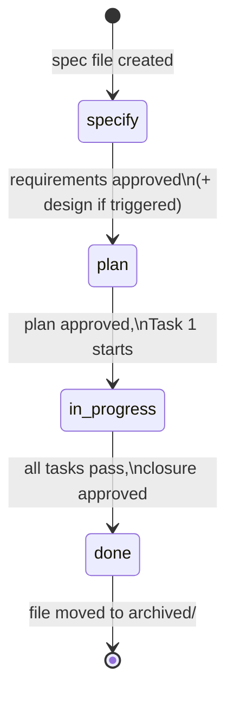

# Spec Lifecycle

*Last updated: 2026-08-31*

Single canonical source for status definitions, transitions, gates, front-matter schema, anti-skip rules, and
Visualize / Split sub-step triggers. Other framework files MUST link here, not restate the rules.

<!-- Anchors in this file (per `docs/rule-canonical-map.md`): R2 `never-tasks-table-at-specify` · R3 `never-flip-without-gate`, `observation-shaped-evidence` · R6 `split-check-mandatory` · R7 `depends-on-blocks-plan`, `inventory-overlap-restales` · R8 `visualize-not-a-status` · R10 `visualize-triggers` (anchor-only — see docs/specs/archived/artifacts/IMP-20260514-rule-map-narrative.md). -->

## Front-matter schema

Every spec file starts with YAML front-matter. All fields below are
**required** unless marked optional.

```yaml
---
id: CR-YYYYMMDD-<kebab-case-title>     # file basename without .md
type: CR                                # CR | BUG | IMP | RES
date: YYYY-MM-DD                        # creation date
status: specify                         # specify | plan | in-progress | done
owner: <github-handle>                  # accountable human
risk: low | medium | high | trivial      # CR / IMP only; BUG uses severity. `trivial` opts into the short-circuited Trivial lane (see § Trivial lane).
severity: low | medium | high | critical | trivial  # BUG only; `trivial` opts into the Trivial lane.
affected-repos: # repos that will change
  - <project-name>
affected-docs: # docs that will change (planning inventory)
  - docs/...
affected-code: # code paths that will change (planning inventory)
  - src/...
skills: # skills to load at every stage and task
  - writing-specs
  - <project-skill>
model-suggestion: default               # fast | default | deep (from model-selection skill)
siblings: # optional — sibling spec IDs produced by the Split check
  - <spec-id>
depends-on: # optional — specs that MUST reach `done` before this one advances to `plan`
  - <spec-id>
---
```

`siblings:` and `depends-on:` are filled during the Specify-stage Split
check (see
[`splitting-rules.md § 5`](../skills/writing-specs/references/splitting-rules.md)).
Omit the fields when the spec is autonomous.

## Status transitions



| Transition             | Precondition                                                                                                     | Agent action                                                                |
|------------------------|------------------------------------------------------------------------------------------------------------------|-----------------------------------------------------------------------------|
| `[start]` → `specify`  | Human asked for a new spec                                                                                       | Copy template, fill front-matter, write title — status `specify` from birth |
| `specify` → `plan`     | Human approved requirements (and design if Visualize triggered). All `depends-on:` siblings must be `done` | Flip status, write `## Tasks` table                                               |
| `plan` → `in-progress` | Human approved the plan, first task begins                                                                       | Flip status **before** the first file edit of Task 1                        |
| `in-progress` → `done` | Every AC has evidence that could have failed for it — an observation-shaped criterion needs evidence reaching its surface (see [§ Rules #5](#observation-shaped-evidence)); tests pass, docs updated. Closure approval is synchronous for `medium`/`high` risk; `low`/`trivial` may use review-after closure (see [§ Review-after closure](#review-after-closure)) | Flip status, post closure summary                                           |
| `done` → `archived/`   | Immediately after closure; every process the work started is already stopped ([§ Rules #14](#stop-processes-at-closure))                                                                                        | Move file from `docs/specs/active/` to `docs/specs/archived/`               |

**No status is skipped. No status is revisited in place** — if the plan
must change after `in-progress` begins, stop, flip status back to `plan`,
update the table, ask for re-approval. **Exception:** specs of `type: RES`
may transition `in-progress → specify` repeatedly until reaching `done` —
the iterative loop is the lane's defining feature. See [§ RES exception](#res-exception)
for the full rule set and Iteration Log mandate.

## Rules

1. Skip-protection rule lives at [`boundaries.md § Never do #2`](../boundaries.md#never-skip-specify). In lifecycle
   terms: even a one-line bug runs the ≤10-question round from its question list before requirements gate.
2. <a id="never-tasks-table-at-specify"></a>**Never** write a `## Tasks` table while `status` is `specify`.
3. <a id="never-flip-without-gate"></a>**Never** flip to `plan` without explicit human approval of requirements.
4. **Never** flip to `in-progress` without explicit human approval of the
   plan.
5. <a id="observation-shaped-evidence"></a>**Never** flip to `done` while any acceptance criterion lacks documented
   evidence, and never offer evidence that could not have failed for the
   criterion it closes.

   A criterion is **observation-shaped** when its `When` describes a person
   operating a user-facing surface — an operator opening a tab, a visitor
   submitting a form. Its claim is about what appears on screen, so:

   **An observation-shaped criterion is closed only by a test that renders its surface, or by recorded manual evidence.**
   **A suite that cannot reach the surface is not evidence for it.**

   However large or green, such a suite asserts on the layers underneath the
   claim. Criteria whose `When` names a system action — a pipeline step, an
   import, a request — are unaffected and close on the suite as before.

   **Manual evidence MUST record the observation, the surface, the observer and the date.**

   A reader who was not present can then weigh it instead of taking it on
   trust. Undated evidence, or evidence with no named observer, does not
   satisfy this rule.

   The evidence kind is declared when the criterion is written, not
   discovered here — see [`authoring-steps.md § A`](../skills/writing-specs/references/authoring-steps.md).

6. Stamp-bump rule lives at [`boundaries.md § Always do #10`](../boundaries.md#last-updated-stamp); applies to every
   change of this lifecycle file too.
7. Task-row-update rule lives at [`boundaries.md § Always do #11`](../boundaries.md#task-row-status-in-place); applies
   as tasks progress through the in-progress stage.
8. <a id="visualize-not-a-status"></a>Visualize is a sub-step of Specify (not a status). When triggered,
   complete it before asking for the requirements gate.
9. <a id="split-check-mandatory"></a>The **Split check** (see
   [`splitting-rules.md § 2`](../skills/writing-specs/references/splitting-rules.md))
   is a mandatory sub-step of Specify — complete it before Visualize and
   record the outcome under `## Split Decision` in every affected spec.
10. <a id="depends-on-blocks-plan"></a>A spec with unmet `depends-on:` MUST stay at `specify` (never flip to `plan`) until all listed siblings reach `done`.

    Waiting is not the only obligation the field carries. A spec written
    against a dependency goes stale the moment that dependency closes —
    the code it described is no longer the code that exists — so:

    **When the last spec in `depends-on:` reaches `done`, `## Current State` MUST be re-verified against the code before the spec advances to `plan`.**
    **A finding the closed dependency superseded is tombstoned in place, not left standing** — an FR the closed work already satisfies says so and cites the spec that closed it.

    <a id="inventory-overlap-restales"></a>Staleness has a second key.
    `depends-on:` is filled by the Split check, so it reaches only specs
    split from each other, and misses two written independently against
    one target — which is where `## Current State` rots fastest, because
    no field links them for a reader to follow:

    **When any spec naming a path in this spec's `affected-docs:` or `affected-code:` reaches `done` after this spec's `date:`, `## Current State` MUST be re-verified before this spec advances to `plan`**, and a finding that spec superseded tombstoned on the same terms as above.

    `validate-specs.py` reports an undeclared overlap while both specs are
    active; this key carries the obligation past that point, when the other
    spec has closed and moved to `archived/` where the check no longer
    looks.

    Re-verification is a read, not a rewrite: where the section still
    holds, re-date it and record what was checked, so the next reader can
    tell a verified section from an unexamined one.
11. **Never** request the requirements gate without completing the Split check; record the outcome under
    `## Split Decision` first.
12. **Never** bundle independently-testable features into one spec — split per [
    `splitting-rules.md § 2`](../skills/writing-specs/references/splitting-rules.md).
13. **Baseline closure rule and Summary refresh.** Any spec that changes
    baseline behaviour in a feature with an existing
    `<project>/docs/domain/<feature>.md` file MUST update that
    file in the same change before flipping to `done`. Baselines updated
    under this rule MUST describe the system after the spec's changes
    are applied -- not desired future behaviour -- and MUST bump the
    `Last src verified` row in the baseline's header info to the
    closure date, even when the baseline body is unchanged. The Closure
    Evidence row for the affected AC MUST cite the diff (path +
    summary). If the spec's scope changed between Plan and closure,
    refresh `## Summary` before flipping to `done` so Goal, Scope, and
    Out of scope reflect post-closure state.

    **Baseline discovery (Plan stage).** Before flipping to `plan`, scan
    `<project>/docs/domain/` for files whose feature name matches the
    spec's scope. Any match MUST be listed under `affected-docs:` in
    front-matter. This ensures the closure rule above is enforceable —
    you cannot update a baseline you didn't know existed.

    **Seeding new baselines.** When the spec introduces baseline behaviour
    for a feature that has no baseline file yet, the closure MUST seed a
    new file under `<project>/docs/domain/<feature>.md` when **any**
    of these apply: (a) the spec is a CR introducing a user-facing
    feature; (b) ACs include observable behavior likely to be reasserted
    in future specs; (c) the feature crosses bounded contexts. Otherwise
    seeding is OPTIONAL. The schema for the new file lives at
    [`docs/baseline-citations.md`](../../docs/baseline-citations.md).

14. **Leave no process running.** <a id="stop-processes-at-closure"></a>
    Before flipping a spec to `done`, **every process the work started MUST
    be stopped** — dev and preview servers, databases and their containers,
    watchers, tunnels, background builds, and any site or emulator brought up
    to verify a surface. Stop them, then confirm the ports are free and the
    containers are down; report what was stopped in the closure summary.

    A process that outlives its spec is invisible: it holds a port the next
    session needs, it pins a database the next spec expects to seed, and its
    cost accrues to nobody's task. Diagnosis is worse than the waste — a
    stale server serving an old bundle looks exactly like a code defect, and
    a second server refused a port looks exactly like a broken config.

    Two exceptions, both explicit: a process the human started themselves is
    theirs to stop — ask, never kill it — and a process the spec's own
    deliverable is meant to leave running is named in the closure summary as
    such, with the reason.

## RES exception <a id="res-exception"></a>

The RES (Research / Spike / POC) spec type implements a fundamentally
different lifecycle from CR / BUG / IMP: the work is **iterative**, not
forward-only. A RES spec may transition `in-progress → specify` an
unlimited number of times until reaching `done`. This is the only
exception to the "No status is revisited in place" rule above.

### Status transitions (RES-only)

```
specify ⇄ in-progress → done
         ↑________|
        (loop permitted)
```

Each `in-progress → specify` backflip MUST record an entry in the spec's
`## Iteration Log` section (date + cause + decision). Without that
entry, the backflip is invalid — the validator (see
[IMP-20260514-research-lane FR-7](../../docs/specs/archived/IMP-20260514-research-lane.md)
once archived) will flag it as drift.

### Front-matter additions (RES-only)

RES specs add four front-matter fields beyond the standard schema. They
are RES-only — CR/BUG/IMP MUST NOT carry them and the validator MUST NOT
require them on those types:

- `hypothesis:` — one-sentence statement of what is being tested
- `kill-criteria:` — when to stop iterating. Required shape: time-box
  OR token-budget OR iteration-count
- `code-location:` — sandbox path for throwaway code. Default
  `research/<spec-id>/`. MUST NOT be inside `src/` of any repo
- `outcome:` — filled at `done`. One of:
  `confirmed | refuted | inconclusive | promoted-to-<spec-id>`

When `outcome: promoted-to-<spec-id>` is set, the referenced spec MUST
exist (validator-enforced). Code in `research/<spec-id>/` MUST NOT be
merged into `src/` without that explicit promotion + the sibling CR/IMP
being `done`.

### Rules for the lane

1. RES is the only spec type that may transition `in-progress → specify`.
   CR/BUG/IMP remain forward-only (see "No status is revisited in place"
   above).
2. Each backflip MUST land a row in `## Iteration Log` with date + cause
    + decision. The validator flags backflips without a corresponding log
      entry.
3. RES specs MUST NOT elect `risk: trivial` or `severity: trivial`. The
   Trivial lane is one-shot and incompatible with the RES loop
   (documented in [`spec-types.md § Trivial lane`](spec-types.md)).
4. `code-location:` MUST be outside every repo's `src/`. The default
   `research/<spec-id>/` lives in the workspace `research/` directory.
5. At `done`, `outcome:` MUST be filled with a valid value. Promotion
   targets (`promoted-to-<id>`) MUST resolve to an existing spec in
   `docs/specs/active/` or `docs/specs/archived/`.

## Trivial lane <a id="trivial-lane"></a>

The Trivial lane is a parallel short-circuit of the standard lifecycle for changes too small to warrant the full
Specify → Plan → in-progress gate sequence. It elects in via `risk: trivial` (CR/IMP) or `severity: trivial` (BUG). The
Closure evidence requirement is **unchanged** — every AC still needs evidence; the closure approval may run
review-after per [§ Review-after closure](#review-after-closure).

### Status sequence

```
specify+plan → in-progress → done
```

Two gates instead of three. The `specify+plan` gate is a single combined approval: requirements and the (one-row) Tasks
table land together. `## Tasks` may carry exactly one row at this combined gate — this is the only exception to [
`Rule #2`](#never-tasks-table-at-specify).

### Eligibility (validator-enforced)

A spec MUST satisfy all of these to elect `trivial`:

- `affected-code` + `affected-docs` total ≤ 2 files
- Exactly one entry in `affected-repos` (no cross-repo)
- No `depends-on:` (autonomous by construction)
- No schema change (front-matter, baseline, type system, API contract)
- No new bounded context
- No change to AI prompts under `framework/prompts/` or the project's prompt catalog (`<project>/.github/copilot/prompts/`)
- No change to `framework/boundaries.md` or any `<project>/_canonical.md` § Boundaries section (including its rendered agent files)

A spec that fails any check MUST drop `trivial` and re-run Specify on the standard track. `validate-specs.py` enforces
these mechanically; the human elects the lane, the framework verifies.

### Combined gate format

A trivial spec body has the same H2 sections as a standard spec but with reduced content:

| Section                  | Trivial-lane content                                                   |
|--------------------------|------------------------------------------------------------------------|
| `## Summary`             | One-line Goal. No Scope / Out of scope paragraphs.                     |
| `## Problem Statement`   | One paragraph; no separate Current State / Proposed Improvement split. |
| `## Requirements`        | ≤3 FRs (typically 1).                                                  |
| `## Acceptance Criteria` | Exactly 1 AC.                                                          |
| `## Out of Scope`        | One line, OR `—` if Goal is self-bounding.                             |
| `## Design`              | Always `Skipped — trivial lane`.                                       |
| `## Split Decision`      | Always `Kept as one — trivial lane (E4 by elective)`.                  |
| `## Tasks`               | Exactly one row at the combined gate.                                  |

The Specify question round shrinks to ≤3 questions from a dedicated `questions/trivial-questions.md` list (introduced in
IMP-20260514-trivial-lane Task T2).

### Rules for the lane

1. `risk: trivial` / `severity: trivial` is elected by the spec author; the validator verifies eligibility. It is never
   auto-assigned.
2. The combined `specify+plan` gate requires explicit human approval before status flips to `in-progress` — same
   approval discipline as the standard track, just merged.
3. A trivial spec MUST NOT be elevated mid-flight. If complexity grows past the eligibility criteria, the spec is closed
   as `done` with `outcome: scope-grew` (one-line note) and the work re-opens as a standard-track spec.
4. **No retroactive reclassification.** Archived specs (`docs/specs/archived/`) MUST NOT have `risk:` or `severity:`
   flipped to `trivial`. The lane applies only to specs created after this rule lands.

## Direct lane <a id="direct-lane"></a>

The Direct lane covers owner-approved changes too small for any spec — the
"owner-approved direct edit" practice the improvements log already records,
now with a canonical home (IMP-20260610-mechanize-framework-guardrails FR-4).

**Eligibility — all MUST hold:**

- ≤ 2 files and ≤ 30 changed lines in total.
- No schema change (front-matter, baseline, type system, API contract).
- No change to AI prompts (`framework/prompts/`, project prompt catalogs).
- No change to `framework/boundaries.md`, this file, or any project
  `_canonical.md` § Boundaries (including rendered agent files).
- Single repo; no cross-repo impact.
- The owner explicitly approved the specific change in chat **before** the edit.

**Obligations — both MUST happen:**

1. Post **The Bottom Line** for the change
   ([`agent-protocol.md § Bottom Line`](../../docs/agent-protocol.md#the-bottom-line--canonical-format)).
2. Land an entry in the project's `docs/improvements-log.md` in the same
   session (what changed, why, owner approval noted).

Anything beyond the threshold falls back to the Trivial lane (if eligible)
or the standard track. The Direct lane is **not** a skip of judgment — it is
the codification of the smallest unit of owner-approved work; when in doubt,
write a spec.

## Review-after closure <a id="review-after-closure"></a>

For specs with `risk: low` or `risk: trivial` (BUG: `severity: low`/`trivial`),
the closure approval MAY run **review-after** (IMP-20260610-mechanize-framework-guardrails FR-5):

- The agent flips `in-progress → done` and archives **immediately** once
  every AC has documented evidence and the closure summary is posted —
  no synchronous wait on the owner.
- The owner reviews review-after closures **in batch**: each closure summary
  is linkable from the archived spec; the improvements log cross-references
  any review-after closure landed since the last batch review.
- **Revert path:** if batch review rejects a closure, the spec moves back to
  `docs/specs/active/` at `status: in-progress`, the rejected evidence rows
  are voided, and the offending change is reverted or re-worked under the
  reopened spec.

`medium`/`high` risk closures remain synchronous. Requirements and plan
gates remain blocking for **all** lanes — review-after applies to the
closure gate only.

## Visualize sub-step (Specify) <a id="visualize-triggers"></a>

Run inside Specify before the requirements gate when **any** apply:

- Risk is `medium` or `high` (CR / IMP).
- Adds, removes, or reshapes a bounded context.
- Changes data flow between contexts or services.
- Changes a schema (database, type/interface, API contract).
- Adds or reorders a pipeline step.
- Adds or changes a user-facing UI surface (screen, view, component).

Skip only when all are false. Record in `## Design` as a single line: `Skipped — <reason>`.

**Output format.** Use **Mermaid** for structure, data flow, schema, and step ordering. For UI surfaces use **Figma** — design-system-first rules (discover → reuse → build library when missing) and caption format: [`visualize-spec.prompt.md § Hard rules`](../prompts/visualize-spec.prompt.md).

## Split sub-step (Specify)

Run on **every** CR / IMP / BUG after FRs + ACs, before the requirements gate. Never skipped; outcome may be *"kept as
one spec"* per [`splitting-rules.md § 4`](../skills/writing-specs/references/splitting-rules.md). Record under
`## Split Decision`. Triggers: [`§ 2`](../skills/writing-specs/references/splitting-rules.md) (Specify), [
`§ 3`](../skills/writing-specs/references/splitting-rules.md) (Plan-stage safety net).

## Reviewer sub-step (in-progress) <a id="reviewer-substep"></a>

A **recommended, non-blocking** sub-step run during `in-progress`, before
requesting the closure gate. Run it when **risk is `medium` or `high`**,
or on demand for any spec.

- The [`reviewer`](../agents/reviewer.md) judges the change **cold** in a
  fresh, read-only context: inputs are the spec + the `git diff` (it reads
  the diff itself), output is `PASS` or `file:line → violated clause` per
  the [`reviewing-changes`](../skills/reviewing-changes/SKILL.md) checklist.
- **You are the arbiter.** Decide which findings to apply, apply them, and
  re-run for **at most 1–2 cycles** — not an unbounded loop.
- This is **not a status and not a gate.** It does not replace the human
  `in-progress → done` closure gate; it informs it.
- Harness without an `Agent` tool: run the reviewer as a separate
  empty-context session per [`agents/README.md § Fallback`](../agents/README.md).

## File naming

Pattern: `<TYPE>-YYYYMMDD-<kebab-case-title>.md`

Examples:

- `CR-20260420-footer-copyright-message.md`
- `BUG-20260418-viewport-overlap.md`
- `IMP-20260409-place-catalog-ai-content.md`

## File location

```
docs/specs/
├── active/      ← specs in specify / plan / in-progress
└── archived/    ← completed specs (status: done); never deleted
```

## Deprecated: `draft` status

Earlier versions of this framework used `draft → specify → visualize →
plan → …`. Those four stages collapsed into one in practice (specs were
born fully-formed at `plan`), so the lifecycle is now:

```
specify → plan → in-progress → done
```

**Existing archived specs** keep their original status values; do not
rewrite history. **New specs** use the 4-status lifecycle.
