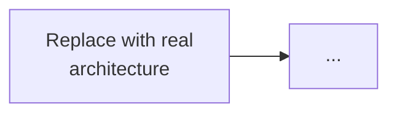

# CR-YYYYMMDD-<title>

*Last updated: YYYY-MM-DD*

## Summary

- **Goal:** <One sentence describing what this spec is trying to achieve.>
- **Scope:** <One short paragraph or bullet sentence describing the requirements and artifacts covered by this spec.>
- **Out of scope:** <One sentence describing the most important explicit exclusions.>

## Cost Estimate

<!--
Filled at Specify (create-spec.prompt.md Step 3) and refreshed at Plan
(plan-spec.prompt.md Step 5) against the approved task count. Sets
expectations consistently across specs. Re-Specify tripwire describes
the condition that forces returning the spec to Specify rather than
absorbing scope creep silently.
-->

| Estimate | Value |
|---|---|
| Token range | <e.g., 200k-400k> |
| Human attention | <N gates>: <gate list>; <minutes per gate> |
| Re-Specify tripwire | <condition(s) that force re-Specify> |

## Problem Statement

<What problem does this solve? Include evidence: current behavior, pain
point, user report, or metric. One short paragraph. If `cites-reqs:` is
omitted in the front-matter, justify here in one line (typically:
"net-new feature, no existing baseline REQ-IDs").>

## Requirements

Use RFC 2119 keywords (MUST, MUST NOT, SHOULD, MAY). One requirement per
bullet. Every FR must be testable.

- FR-1: The system MUST ...
- FR-2: The system MUST ...

## Acceptance Criteria

Given/When/Then. Every AC references at least one FR.

### AC-1: <scenario> (FR-1)

Given <precondition>
When <action>
Then <outcome>

### AC-2: <scenario> (FR-2)

Given <precondition>
When <action>
Then <outcome>

## Architecture

<!--
Fill this section during the Visualize sub-step if any of these apply:
- risk is medium or high
- the spec adds, removes, or reshapes a bounded context
- the spec changes data flow between contexts or services
- the spec changes a schema (database, type/interface definition, API contract)
- the spec adds a new pipeline step or modifies step ordering

If none apply, write a single line:
  Skipped — <reason>

Otherwise embed Mermaid diagrams (flowchart, sequenceDiagram, erDiagram).
Keep under 30 nodes per diagram.
-->

## Out of Scope

- OS-1: <item> — <reason>
- OS-2: <item> — <reason>

## Split Decision

<!--
Filled during the Specify-stage Split check. One of:
- Kept as one spec — <E1|E2|E3|E4> <reason, referencing splitting-rules.md § 4>.
- Kept as one spec — no § 2 trigger matched.
- Split into: <sibling-id-1>, <sibling-id-2>. This spec owns FRs <N, M>.
-->

<fill during Specify>

## Tasks

<!-- Filled during the Plan stage. While status is `specify`, keep this section as a single placeholder line. Replace it with the approved task table only after the spec moves to `plan`. -->

Pending — Plan stage only.

## Agent instructions

**Before each task — post in chat (mandatory before any edit):**
- Task # being implemented
- Precedent files read (paths)
- Loaded skill files (full `SKILL.md` paths — system or project scope)

**After each task — before proceeding:**
- Run build/test per project `AGENTS.md` § Build and Run.
- Post **"The Bottom Line"** using the canonical format in
  `<root>/.github/copilot/skills/agent-protocol/SKILL.md`
  § The Bottom Line — canonical format, and wait for explicit human
  approval.
- Update the task row's Status column in this spec.

## Docs updates required

- <path> — <what changes>

## Rollout / migration notes

- <Any data migration, config change, or coordination required before merge.>
